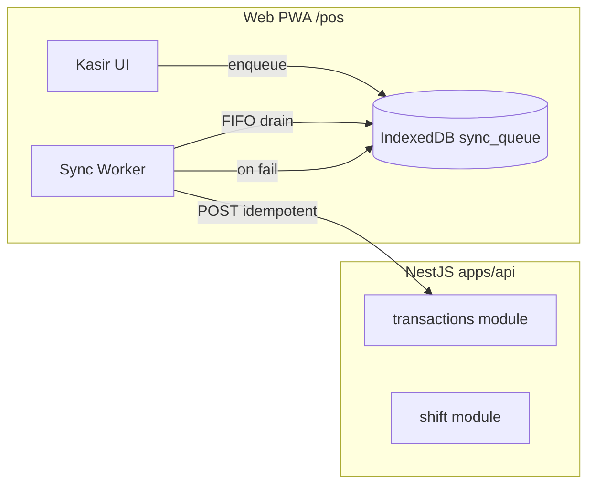
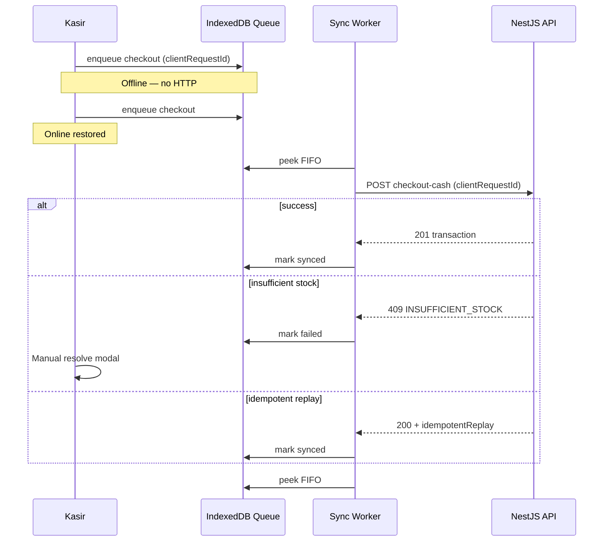

> 📚 [Indeks Dokumentasi](../INDEX.md) | Kategori: Algorithm | Audience: Pak Zaki, Eko, Fajar, Dimas, Citra

# Offline Sync — Conflict Policy & Idempotent Queue

> **Owner:** Eko Susilo (Algorithm)  
> **Status:** Approved for Sprint 11 spike (Fase 2 fondasi)  
> **Tanggal:** 2 Juni 2026  
> **Referensi:** [ADR-003](../decisions/ADR-003-SCOPE-RETAIL-ONLINE-OFFLINE.md), [SPRINT-11-PLAN](../requirements/SPRINT-11-PLAN.md), [ERROR-HANDLING-VALIDATION.md](../standards/ERROR-HANDLING-VALIDATION.md), visi Pak Zaki §8.2 / §10.5

---

## Ringkasan Keputusan (Pak Zaki)

| Domain data | Kebijakan konflik | Alasan |
|-------------|-------------------|--------|
| **Transaksi (checkout, void)** | **Idempotent replay** — bukan LWW | Duplikat transaksi = kerugian finansial; sudah ada `clientRequestId` di API |
| **Stok (deduct/restore)** | **Server wins** + **manual resolve** jika gagal | Stok tidak boleh negatif; LWW berbahaya untuk inventory |
| **Master data (produk, harga)** | **Server wins** (pull-only saat online) | Kasir tidak push harga dari offline; hindari split-brain pricing |
| **Shift (buka/tutup)** | **Sequential queue** + server validate | Satu shift OPEN per kasir; conflict → manager resolve (existing pattern) |
| **Hold bill** | **Server wins** + `CONFLICT` jika sudah direcall | Selaras Sprint 4 hold recall |
| **Preferensi UI / cache ringan** | **Last-write-wins (LWW)** | Non-financial; `updatedAt` + `deviceId` tie-break |

**Prinsip umum:** Operasi finansial dan stok **tidak** memakai LWW otomatis. LWW hanya untuk metadata non-kritis.

---

## Konteks & Scope Sprint 11

Sprint 11 membuka **spike fondasi** offline PWA toko fisik (bukan implementasi penuh omnichannel):

- Service worker + deteksi online/offline
- IndexedDB queue schema + worker sync
- Kebijakan konflik & urutan antrian (dokumen ini)
- Integrasi minimal ke endpoint existing (`checkout-cash`, `checkout-split`, `void`) via `clientRequestId`

**Di luar scope spike:** sync stok antar outlet, marketplace, master data push dari client, Expo SQLite (alternatif ADR-003).

---

## Arsitektur Antrian (Client)



### Tabel `sync_queue` (IndexedDB — konsep)

| Field | Tipe | Wajib | Keterangan |
|-------|------|-------|------------|
| `id` | UUID v4 | ✓ | Primary key lokal |
| `outletId` | UUID | ✓ | Scope tenant/outlet |
| `deviceId` | string | ✓ | Stable per browser install |
| `operation` | `SyncQueueOperation` | ✓ | Lihat `@barokah/shared` |
| `clientRequestId` | string | ✓ | Idempotency key ke API |
| `sequence` | int | ✓ | Monotonic per `deviceId` |
| `createdAt` | ISO8601 | ✓ | Urutan FIFO |
| `dependsOn` | UUID \| null | | Queue entry harus sukses dulu |
| `payload` | JSON | ✓ | Body API + metadata |
| `status` | `SyncQueueEntryStatus` | ✓ | `pending` → `syncing` → `synced` \| `failed` \| `dead` |
| `attemptCount` | int | ✓ | Retry counter |
| `lastError` | object \| null | | `{ code, message }` dari API envelope |
| `serverEntityId` | UUID \| null | | Diisi setelah sukses (e.g. `transactionId`) |

---

## Kebijakan Konflik per Entitas

### 1. Transaksi — Idempotent (bukan LWW)

**Aturan:** Setiap operasi write finansial wajib punya `clientRequestId` unik per outlet (UUID v4, generated client-side sebelum enqueue).

```
Client enqueue → offline storage → online → POST dengan clientRequestId
Server: findExistingTransactionByRequest(outletId, clientRequestId)
  → exists: return 200 + transaksi existing (replay)
  → not exists: create atomically
```

| Skenario | Perilaku |
|----------|----------|
| Retry network setelah timeout | Replay aman — tidak duplikat |
| Dua device, `clientRequestId` sama (bug) | Server return satu transaksi — log audit `SYNC_DUPLICATE_REQUEST` |
| Dua device, checkout paralel SKU terakhir | Server validasi stok saat commit — lihat § Stok |

**Void offline:** Queue `TRANSACTION_VOID` dengan `dependsOn` = entry checkout sukses. Server tolak void jika transaksi belum ada (422) — client tahan di queue sampai parent `synced`.

### 2. Stok — Server Wins + Manual Resolve

**Aturan:** Pada sync checkout, server menghitung stok real-time. Client **tidak** mengirim "stok hasil kalkulasi offline" sebagai sumber kebenaran.

| Hasil server | HTTP | `ErrorCodes` | Aksi kasir |
|--------------|------|--------------|------------|
| Stok cukup | 201 | — | Tandai `synced`, kurangi pending count |
| Stok tidak cukup | 409 | `INSUFFICIENT_STOCK` | **Manual resolve** — modal: sesuaikan qty / batalkan / eskalasi manager |
| Versi master stale | 409 | `SYNC_MASTER_STALE` | Pull master snapshot, minta kasir review keranjang |

**Bukan LWW:** Jika kasir A offline jual 5 unit dan kasir B online jual sisa 3 unit, saat A sync server menolak kelebihan — kasir A harus putuskan (bukan auto-merge qty).

**Manual resolve record (client):**

```typescript
interface SyncConflictResolution {
  queueEntryId: string;
  resolution: 'RETRY' | 'ADJUST_QTY' | 'CANCEL' | 'ESCALATE_MANAGER';
  resolvedByUserId?: string;
  resolvedAt: string; // ISO8601
  note?: string;
}
```

### 3. Master Data — Server Wins (Pull)

| Arah | Kebijakan |
|------|-----------|
| Server → Client | Saat online: `GET /catalog/snapshot?outletId=&version=` — replace cache lokal |
| Client → Server | **Tidak** di Sprint 11 spike |

**Versioning:** `catalogVersion` (int atau ISO timestamp server) disimpan di IndexedDB `meta`. Checkout offline wajib bawa `priceSnapshotVersion` di payload; server tolak jika < versi aktif (`SYNC_MASTER_STALE`).

### 4. Shift — Sequential + Existing Conflict Flow

Urutan wajib dalam queue per sesi kasir:

1. `SHIFT_OPEN` (jika belum ada shift open di server)
2. `TRANSACTION_CHECKOUT` / `TRANSACTION_CHECKOUT_SPLIT`
3. `TRANSACTION_VOID` (bergantung pada transaksi parent)
4. `SHIFT_CLOSE` (bergantung pada semua transaksi pending sesi — atau flag `forceCloseOffline`)

Conflict shift (`SHIFT_ALREADY_OPEN`) → **manual resolve manager** (selaras Sprint 2), bukan LWW.

### 5. Hold Bill — Server Wins

Recall hold yang sudah diambil sesi lain → `ErrorCodes.CONFLICT` (existing). Client tandai entry `failed` + tawarkan buang hold lokal.

### 6. Metadata Non-Kritis — LWW

Contoh: urutan tab kategori, produk favorit pin, filter grid.

```
effectiveTime = max(server.updatedAt, client.updatedAt)
tie-break: lexicographic deviceId (deterministic)
```

Tidak masuk antrian sync finansial — store terpisah `ui_prefs` di IndexedDB.

---

## Idempotent Queue — Aturan Urutan

### FIFO dasar

Antrian per `(outletId, deviceId)` diurutkan:

1. `createdAt` ascending (ISO8601, clock client — server tidak mengubah urutan)
2. `sequence` ascending (monotonic integer, increment per enqueue)

Implementasi shared: `compareSyncQueueOrder()` di `@barokah/shared`.

### Dependency graph

| Operation | `dependsOn` |
|-----------|-------------|
| `TRANSACTION_CHECKOUT` | Entry `SHIFT_OPEN` sesi sama, jika shift belum confirmed server |
| `TRANSACTION_CHECKOUT_SPLIT` | sama |
| `TRANSACTION_VOID` | Entry checkout parent (`serverEntityId` atau parent `clientRequestId`) |
| `SHIFT_CLOSE` | Semua transaksi pending sesi (optional: flag `allowCloseWithPending` = false default) |

**Aturan:** Worker **tidak** mengirim entry jika `dependsOn` belum `synced`. Tidak reorder entry yang sudah `syncing`.

### Idempotency

| Aturan | Detail |
|--------|--------|
| **Satu operasi = satu `clientRequestId`** | Generate sekali saat enqueue; reuse pada setiap retry HTTP |
| **Header opsional** | `Idempotency-Key: {clientRequestId}` (mirror body) — Fajar standardize di API gateway Sprint 11 |
| **Dedupe lokal** | Unique index `(outletId, clientRequestId)` di IndexedDB |
| **Parallel HTTP** | **Dilarang** untuk entry dengan `dependsOn` chain sama |
| **Cross-device** | Tidak ada ordering global antar device — server serializes per SKU stok |

### Retry & dead letter

| Kondisi | Perilaku |
|---------|----------|
| HTTP 5xx / network | `attemptCount++`, exponential backoff 1s → 2s → 4s → 8s → 16s (max 5) |
| HTTP 409 `INSUFFICIENT_STOCK` / `SYNC_*` | Status `failed`, **tidak** auto-retry — tunggu manual resolve |
| HTTP 422 validation | `dead` setelah 1x — log + banner "data tidak valid" |
| HTTP 401 | Pause queue, redirect login |
| `attemptCount > 5` | Status `dead` — manager dashboard (Fase 2 penuh) |

**Penting:** Retry **tidak** mengubah `sequence` atau `clientRequestId`.

### Kapasitas antrian

| Konstanta | Nilai | `ErrorCodes` |
|-----------|-------|--------------|
| `SYNC_QUEUE_MAX_PENDING` | 500 entry / outlet / device | `SYNC_QUEUE_FULL` |
| `SYNC_QUEUE_WARN_THRESHOLD` | 50 | Banner kuning (UI) |

---

## Kontrak API (Handoff Fajar)

### Endpoint yang dipakai antrian (Sprint 11)

| Operation | Method | Path | Idempotency |
|-----------|--------|------|-------------|
| `SHIFT_OPEN` | POST | `/api/v1/shifts/open` | `clientRequestId` (tambah Sprint 11) |
| `TRANSACTION_CHECKOUT` | POST | `/api/v1/transactions/checkout-cash` | `clientRequestId` ✓ existing |
| `TRANSACTION_CHECKOUT_SPLIT` | POST | `/api/v1/transactions/checkout-split` | `clientRequestId` ✓ existing |
| `TRANSACTION_VOID` | POST | `/api/v1/transactions/:id/void` | `clientRequestId` (tambah Sprint 11) |

### Response replay (sukses idempotent)

```json
{
  "success": true,
  "data": { "...": "..." },
  "meta": { "idempotentReplay": true }
}
```

Frontend: jika `meta.idempotentReplay`, update `serverEntityId` tanpa toast "transaksi baru".

### Error codes baru (`@barokah/shared`)

| Code | HTTP | Kapan |
|------|------|-------|
| `SYNC_MASTER_STALE` | 409 | `priceSnapshotVersion` < server catalog |
| `SYNC_QUEUE_FULL` | 503 | Hanya client-local (optional server echo) |
| `SYNC_CONFLICT_MANUAL` | 409 | Konflik bisnis yang butuh UI resolve generik |
| `SYNC_DEPENDENCY_BLOCKED` | 422 | Server-side guard jika API dipanggil tanpa parent |

Existing: `INSUFFICIENT_STOCK`, `CONFLICT`, `SHIFT_ALREADY_OPEN`, `TRANSACTION_ALREADY_CLOSED`.

---

## Kontrak Frontend (Handoff Dimas)

| Komponen | Tanggung jawab |
|----------|----------------|
| `useNetworkStatus()` | Online/offline + `navigator.onLine` + ping `/health` |
| `SyncQueueProvider` | Enqueue/dequeue, expose `pendingCount` |
| Header banner | Offline + `{pendingCount}` pending (visi §10.5) |
| `SyncConflictModal` | Map `INSUFFICIENT_STOCK`, `SYNC_MASTER_STALE`, `SYNC_CONFLICT_MANUAL` |
| Background Sync | `sync` event SW + fallback interval 30s saat online |

**UX copy (Indonesia):** tidak tampilkan kode error mentah — map dari `error.code`.

---

## Diagram Urutan Sync



---

## Edge Cases Wajib (Test Matrix — Citra)

| # | Skenario | Ekspektasi |
|---|----------|------------|
| E1 | Timeout setelah server commit | Replay `clientRequestId` → satu transaksi |
| E2 | Offline 10 checkout, stok cukup di cache tapi habis di server | Sync #1..N: beberapa `INSUFFICIENT_STOCK`, manual resolve |
| E3 | Void di-queue sebelum checkout parent sync | Tetap `pending` sampai parent `synced` |
| E4 | Dua tab sama browser | Shared `deviceId` + IndexedDB — dedupe `clientRequestId` |
| E5 | Clock client mundur | FIFO tetap by `sequence`; server pakai `createdAt` server untuk audit only |
| E6 | Queue > 500 | Enqueue ditolak `SYNC_QUEUE_FULL` |
| E7 | Master pull saat ada pending | Tidak hapus queue; update cache untuk transaksi **baru** |
| E8 | Shift conflict saat sync open | `SHIFT_ALREADY_OPEN` → eskalasi manager |

---

## Implementasi Shared Package

| Artifact | Path |
|----------|------|
| Types | `packages/shared/src/types/offline-sync.ts` |
| Constants | `packages/shared/src/constants/offline-sync.ts` |
| Util urutan | `packages/shared/src/utils/compare-sync-queue.ts` |
| Error codes | `packages/shared/src/types/api-types.ts` |

---

## Handoff Log

| From | To | Task | Deliverable | Parallel OK? | Next action |
|------|-----|------|-------------|--------------|-------------|
| Eko | Fajar | Review + implement idempotency shift/void + error codes | Dokumen ini + `@barokah/shared` | Ya (setelah spec) | API contract PR |
| Eko | Dimas | IndexedDB schema + Sync Worker | § Kontrak Frontend | Ya (setelah spec) | PWA spike |
| Eko | Citra | Test matrix § Edge Cases | E1–E8 | Ya (test plan) | UAT Sprint 11 |
| Eko | Fitri | INDEX entry algorithm | OFFLINE-SYNC.md | Ya | Update INDEX |

---

## Changelog

| Tanggal | Versi | Perubahan |
|---------|-------|-----------|
| 2026-06-02 | 1.0 | Initial spec Sprint 11 — conflict policy + queue ordering |

---

*Dokumen ini menggantikan catatan informal di visi Pak Zaki §8.2 untuk implementasi Barokah (NestJS + Prisma + PWA, bukan Supabase direct).*
