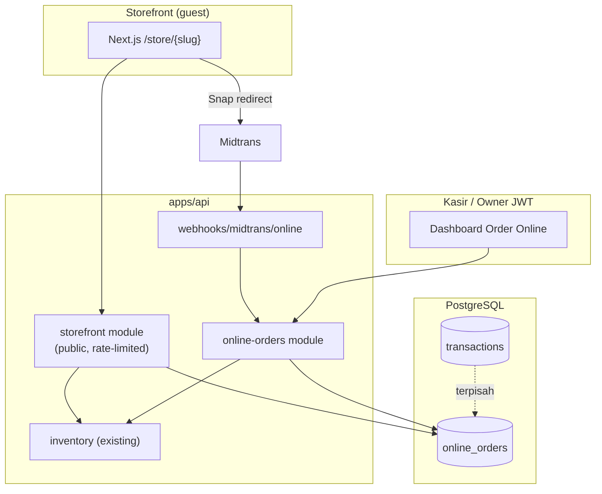
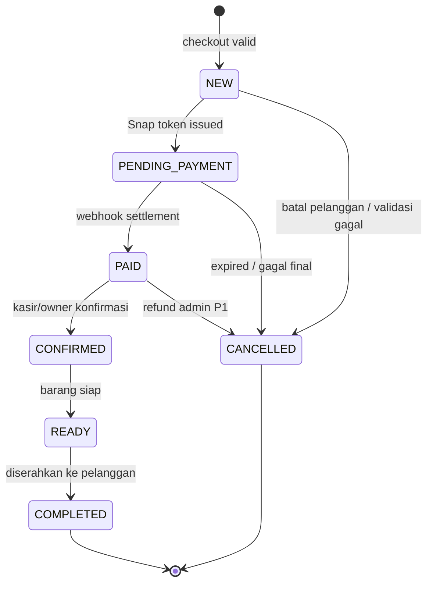

> 📚 [Indeks Dokumentasi](../INDEX.md) | Kategori: API | Audience: Fajar, Dimas, Arif, Eko, Citra, Fitri

# RFC — Online Orders API (Epic J)

> **Status:** `APPROVED` — sign-off **Eko** (stok), **Arif** (Midtrans), **Dimas** (konsumen storefront) · 5 Juni 2026  
> **Versi RFC:** 0.1  
> **Tanggal:** 2 Juni 2026  
> **Author:** Fajar Ramadhan (Senior Developer — Backend/API)  
> **Keputusan produk:** [ADR-004](../decisions/ADR-004-EPIC-J-DEFAULTS-LOCKED.md) · User stories: [EPIC-J-USER-STORIES.md](../requirements/EPIC-J-USER-STORIES.md) · Wireframe: [WIREFRAMES-STOREFRONT.md](../design/WIREFRAMES-STOREFRONT.md)

---

## Ringkasan (Bahasa Indonesia)

RFC ini mendefinisikan kontrak API **pesanan online web** (`online_orders`) untuk Epic J — terpisah dari `transactions` walk-in kasir. MVP mengikuti ADR-004:

| Fitur P0 | Ringkasan teknis |
|----------|------------------|
| **Pickup** | `fulfillmentType = PICKUP`; pelanggan pilih `outletId` di checkout |
| **Guest checkout** | Tanpa JWT pelanggan; identitas via nama + HP + `clientRequestId` |
| **Midtrans** | Snap web setelah order dibuat; webhook idempotent → status `PAID` |
| **Antrian POS** | Order `PAID`+ muncul di endpoint fulfillment kasir (scope outlet) |
| **Delivery** | **P1** — enum & kolom alamat disiapkan; endpoint checkout delivery nonaktif di MVP |

**Prisma:** draft skema di [`packages/database/prisma/draft/online-orders.rfc.prisma`](../../packages/database/prisma/draft/online-orders.rfc.prisma) — **bukan** migrasi produksi sampai review tim selesai.

---

## Tujuan & Non-Tujuan

### Tujuan

1. Kontrak API publik storefront (`/store/{tenantSlug}/…`) dan API internal POS (`/online-orders/…`).
2. Lifecycle order, pembayaran Midtrans, dan sinkronisasi ke antrian fulfillment toko.
3. Kebijakan stok omnichannel (selaras [OFFLINE-SYNC.md](../algorithm/OFFLINE-SYNC.md) — server wins).
4. Traceability AC US-J-01 … US-J-07.

### Non-Tujuan (RFC ini)

- Implementasi kode NestJS / migrasi Prisma (Sprint 14+ setelah approval).
- Promo harga beda web vs kasir (Q-J07: harga sama — Fase 2b).
- Bayar di toko saat pickup (Q-J03 P1).
- Notifikasi real-time kasir (Socket) — P1 backlog US-J-08.
- Konversi `online_order` → `transaction` walk-in otomatis — **out of scope MVP**; fulfillment manual di antrian.

---

## Arsitektur Modul



| Layer | Prefix | Auth |
|-------|--------|------|
| Storefront publik | `GET/POST /api/v1/store/:tenantSlug/…` | Tidak (tenant aktif + rate limit) |
| Status order guest | `GET /api/v1/store/:tenantSlug/orders/:orderNo/status` | Bukti lemah: `phone` query (4 digit terakhir) |
| Fulfillment POS | `GET/PATCH /api/v1/online-orders/…` | JWT + RBAC + `outletId` scope |
| Webhook Midtrans | `POST /api/v1/webhooks/midtrans/online` | Signature HMAC Midtrans |

---

## Model Data (Konsep)

### Pemisahan `online_orders` vs `transactions`

| Aspek | `transactions` | `online_orders` |
|-------|----------------|-----------------|
| Kanal | Kasir walk-in / offline PWA replay | Web storefront guest |
| Kasir | Wajib `cashierId` + shift | Tidak ada kasir pada create |
| Immutability | Header immutable setelah `COMPLETED` | Status fulfillment dapat berubah (`CONFIRMED`→`READY`→`COMPLETED`) |
| Pembayaran | `payments[]` di kasir | Midtrans web + record `online_order_payments` |
| Nomor | `receiptNo` per outlet | `orderNo` format **WEB-YYYYMMDD-####** per tenant |

Relasi opsional P2: `online_orders.transactionId` jika nanti ada “close di kasir sebagai transaksi” — **tidak** di MVP.

### Draft Prisma

Lihat file draft (belum di-merge ke `schema.prisma`):

[`packages/database/prisma/draft/online-orders.rfc.prisma`](../../packages/database/prisma/draft/online-orders.rfc.prisma)

**Migrasi terpisah yang mungkin dibutuhkan sebelum Epic J build:**

| Perubahan | Tabel | Catatan |
|-----------|-------|---------|
| `sellOnline`, `imageUrl`, `webPlaceholderKey` | `products` | Q-J06, Q-J08 — Owner/Manager |
| Model `online_orders`, `online_order_items`, `online_order_payments` | baru | RFC ini |
| Sequence / counter harian | `online_order_sequences` | nomor WEB-* |

---

## Lifecycle Status

### Status order (`OnlineOrderStatus`)



| Status | Label UI (ID) | Keterangan |
|--------|-----------------|------------|
| `NEW` | Menunggu pembayaran | Order tercatat; stok **belum** dikurangi (MVP) |
| `PENDING_PAYMENT` | Menunggu pembayaran | Snap aktif; timer TTL 60 menit |
| `PAID` | Sudah dibayar | Webhook sukses; **kurangi stok**; masuk antrian POS |
| `CONFIRMED` | Dikonfirmasi toko | Staff mulai menyiapkan |
| `READY` | Siap diambil | Pickup siap |
| `COMPLETED` | Selesai | Serah terima selesai |
| `CANCELLED` | Dibatalkan | Termasuk expired pembayaran |

> **Implementasi MVP:** `NEW` dan `PENDING_PAYMENT` dapat di-collapse ke satu status UI “Menunggu pembayaran” (wireframe SCR-J06b). Server tetap membedakan untuk idempotensi Midtrans.

### Fulfillment (`OnlineFulfillmentType`)

| Nilai | ADR-004 | MVP API |
|-------|---------|---------|
| `PICKUP` | P0 | ✅ `POST …/orders` hanya terima `PICKUP` |
| `DELIVERY` | P1 | Kolom ada; endpoint menolak dengan `ONLINE_DELIVERY_NOT_AVAILABLE` |

---

## Kebijakan Stok (Approved — Eko Susilo)

Selaras [OFFLINE-SYNC.md](../algorithm/OFFLINE-SYNC.md): **server wins**; tidak ada LWW untuk stok.

| Tahap | Kebijakan MVP | Alternatif (ditunda) |
|-------|---------------|----------------------|
| Keranjang / PDP | Baca stok `inventory_items` real-time; cache API ≤ 60 detik (Q-J05) | — |
| Pre-checkout | Validasi qty ≤ stok tersedia outlet (AC-J04-4) | — |
| Saat `POST /orders` | **Final check** dalam transaksi DB; gagal → `INSUFFICIENT_STOCK` + detail baris | Reserve stok di tabel hold (**P1 — ditolak MVP**) |
| Saat `PAID` | **Kurangi stok** (`stock_movements` reason `SALE_ONLINE`) | Kurangi saat `READY` (ditolak untuk MVP) |
| Saat `CANCELLED` / expired | **Tidak perlu** restore jika belum deduct; jika sudah `PAID` then cancel → alur refund P1 | — |
| Konflik vs kasir offline | Kasir menang jika stok habis saat replay; order web gagal final check atau webhook gagal stok → `INSUFFICIENT_STOCK` + manual resolve | — |

**Keputusan terkunci (Eko, 5 Jun 2026):**

1. Pengurangan stok pada transisi **`PAID`** — bukan `READY`, bukan saat `POST /orders`.
2. **Tidak ada reserve stok** dengan TTL di MVP — hanya final check atomik di checkout + deduct di webhook.
3. Reason code audit: **`SALE_ONLINE`** pada `stock_movements` (terpisah dari penjualan kasir).

---

## Perhitungan Harga & PPN

Selaras kasir & US-J-03 (AC-J03-5):

| Field | Aturan |
|-------|--------|
| `subtotal` | Σ (qty × unitPrice) per baris — harga dari `products.price` (Q-J07) |
| `tax` | PPN **11%** dari subtotal (exclusive display di storefront) |
| `total` | `subtotal + tax` (+ `shippingFee` P1, default 0) |
| Money API | Integer rupiah di JSON request/response (selaras `ERROR-HANDLING-VALIDATION`) |

---

## Nomor Order

Format: **`WEB-YYYYMMDD-####`** (contoh `WEB-20260602-0042`)

| Komponen | Aturan |
|----------|--------|
| Prefix | `WEB-` tetap |
| Tanggal | `createdAt` order di timezone tenant (default `Asia/Jakarta`) |
| Sequence | `####` zero-pad 4 digit; reset per tenant per hari kalender |
| Unik | `@@unique([tenantId, orderNo])` |

---

## Endpoints — Storefront Publik

Base: `/api/v1/store/:tenantSlug`

> `:tenantSlug` → resolve `tenants.slug`; tenant nonaktif → `404 NOT_FOUND`.

### `GET /store/:tenantSlug/outlets`

Daftar outlet aktif untuk picker pickup (AC-J04-1).

**Response `data`:**

```json
{
  "outlets": [
    {
      "id": "uuid",
      "name": "Cabang Pusat",
      "code": "PUSAT",
      "address": "Jl. Raya No. 12",
      "pickupHoursLabel": "Senin–Sabtu 08:00–17:00"
    }
  ]
}
```

`pickupHoursLabel` — string opsional dari konfigurasi outlet P1; MVP boleh statis dari master.

---

### `GET /store/:tenantSlug/catalog/categories`

Kategori untuk filter katalog (AC-J01-3).

**Query:** `outletId` (wajib untuk badge stok)

---

### `GET /store/:tenantSlug/catalog/products`

**Query:**

| Param | Tipe | Wajib | Keterangan |
|-------|------|-------|------------|
| `outletId` | UUID | ✓ | Konteks stok |
| `categoryId` | UUID | | Filter |
| `q` | string | | Cari nama/SKU (AC-J01-4) |
| `page` | int | | Default 1 |
| `limit` | int | | Default 20, max 50 |

**Response item (ringkas):**

```json
{
  "id": "uuid",
  "name": "Semen 40kg",
  "sku": "SMN-40",
  "unitSymbol": "sak",
  "price": 65000,
  "imageUrl": "https://…",
  "placeholderKey": "generic-building",
  "stockStatus": "AVAILABLE",
  "stockQty": null,
  "moq": 1,
  "orderStep": 1,
  "cacheHint": { "asOf": "2026-06-02T14:32:00.000Z", "ttlSeconds": 60 }
}
```

- `stockStatus`: `AVAILABLE` | `OUT_OF_STOCK` (qty detail **tidak** diekspos ke publik — AC-J01-7).
- Hanya produk `sellOnline = true` && `isActive` (AC-J01-1).

---

### `GET /store/:tenantSlug/catalog/products/:productId`

PDP (US-J-02). **Query:** `outletId` wajib. Termasuk varian aktif jika `hasVariants`.

---

### `POST /store/:tenantSlug/orders`

Membuat order pickup + memulai pembayaran Midtrans (US-J-04, US-J-06).

**Headers:**

| Header | Wajib | Keterangan |
|--------|-------|------------|
| `Idempotency-Key` | Disarankan | Mirror `clientRequestId` body |

**Body:**

```json
{
  "clientRequestId": "guest-cart-uuid-v4",
  "outletId": "uuid",
  "fulfillmentType": "PICKUP",
  "customer": {
    "name": "Budi Proyek",
    "phone": "081234567890",
    "notes": "Mobil pick-up box"
  },
  "items": [
    {
      "productId": "uuid",
      "quantity": 4
    }
  ]
}
```

**Validasi bisnis:**

1. `fulfillmentType` harus `PICKUP` di MVP.
2. MOQ / `orderStep` per produk (AC-J03-3).
3. Stok final per baris di `outletId`.
4. `clientRequestId` unik per tenant → replay mengembalikan order yang sama (idempotent).

**Response `data` (201):**

```json
{
  "order": {
    "id": "uuid",
    "orderNo": "WEB-20260602-0042",
    "status": "PENDING_PAYMENT",
    "fulfillmentType": "PICKUP",
    "outlet": { "id": "uuid", "name": "Cabang Pusat", "address": "…" },
    "customer": { "name": "Budi Proyek", "phone": "081234567890" },
    "subtotal": 260000,
    "tax": 28600,
    "total": 288600,
    "expiresAt": "2026-06-02T15:32:00.000Z"
  },
  "payment": {
    "snapToken": "midtrans-snap-token",
    "redirectUrl": "https://app.midtrans.com/snap/v2/vtweb/…"
  }
}
```

**Pesan error (ID) — contoh:**

| Code | HTTP | Pesan |
|------|------|-------|
| `INSUFFICIENT_STOCK` | 409 | Stok produk tidak mencukupi. |
| `ONLINE_DELIVERY_NOT_AVAILABLE` | 422 | Pengiriman belum tersedia. Silakan pilih ambil di toko. |
| `ONLINE_CHECKOUT_INVALID` | 422 | Data checkout tidak valid. |
| `ONLINE_ORDER_EXPIRED` | 409 | Pesanan kedaluwarsa. Silakan buat pesanan baru. |

---

### `GET /store/:tenantSlug/orders/:orderNo/status`

Status untuk guest (SCR-J06 / SCR-J07) tanpa login.

**Query:** `phone` — 4 digit terakhir atau full HP (keputusan implementasi: **full HP** dinormalisasi `62…`).

**Response `data`:**

```json
{
  "orderNo": "WEB-20260602-0042",
  "status": "PAID",
  "statusLabel": "Sudah dibayar",
  "fulfillmentType": "PICKUP",
  "outletName": "Cabang Pusat",
  "total": 288600,
  "paidAt": "2026-06-02T14:45:00.000Z",
  "canRetryPayment": false
}
```

| `status` | `statusLabel` (ID) |
|----------|-------------------|
| `NEW`, `PENDING_PAYMENT` | Menunggu pembayaran |
| `PAID` | Sudah dibayar |
| `CONFIRMED` | Dikonfirmasi toko |
| `READY` | Siap diambil |
| `COMPLETED` | Selesai |
| `CANCELLED` | Dibatalkan |

---

### `POST /store/:tenantSlug/orders/:orderNo/retry-payment`

Coba bayar ulang (AC-J06-5) jika status masih `NEW`/`PENDING_PAYMENT` dan belum `expiresAt`.

**Response:** sama seperti field `payment` pada create.

---

## Endpoints — Fulfillment POS (Antrian Kasir)

Base: `/api/v1/online-orders`  
**Auth:** JWT — role `OWNER` | `MANAGER` | `CASHIER` dengan akses `outletId` (US-J-07).

### `GET /online-orders/fulfillment`

Antrian order web untuk outlet (AC-J07-1, AC-J07-2).

**Query:**

| Param | Default | Keterangan |
|-------|---------|------------|
| `outletId` | dari context | Wajib jika user multi-outlet |
| `status` | `PAID,CONFIRMED,READY` | CSV atau repeated |
| `page` | 1 | |
| `limit` | 20 | max 50 |

**Response item:**

```json
{
  "id": "uuid",
  "orderNo": "WEB-20260602-0042",
  "status": "PAID",
  "statusLabel": "Sudah dibayar",
  "createdAt": "2026-06-02T14:30:00.000Z",
  "customerName": "Budi Proyek",
  "customerPhone": "081234567890",
  "fulfillmentType": "PICKUP",
  "fulfillmentTypeLabel": "Ambil di toko",
  "total": 288600,
  "itemCount": 2,
  "notes": "Mobil pick-up box"
}
```

---

### `GET /online-orders/:id`

Detail order + baris item (untuk persiapan barang).

---

### `PATCH /online-orders/:id/status`

Update status fulfillment (AC-J07-4).

**Body:**

```json
{
  "status": "READY",
  "note": "Sudah disiapkan di gudang"
}
```

**Transisi yang diizinkan:**

| Dari | Ke | Role min |
|------|-----|----------|
| `PAID` | `CONFIRMED` | CASHIER |
| `CONFIRMED` | `READY` | CASHIER |
| `READY` | `COMPLETED` | CASHIER |
| `PAID` … `READY` | `CANCELLED` | MANAGER (P1 refund flow) |

Transisi ilegal → `ONLINE_STATUS_TRANSITION_INVALID` (422).

---

## Webhook Midtrans (Online) — Approved (Arif Hidayat)

`POST /api/v1/webhooks/midtrans/online`

| Aspek | Aturan |
|-------|--------|
| Auth | Verifikasi signature server key Midtrans — reuse adaptor kasir (`MidtransSignatureGuard`) |
| Idempotensi | `midtransTransactionId` unik per order; replay webhook **tidak** double-`PAID`, **tidak** double-deduct stok |
| Sukses | Set `status = PAID`, `paidAt`, kurangi stok (`SALE_ONLINE`), catat `online_order_payments` |
| Gagal / deny | Tetap `PENDING_PAYMENT` atau `CANCELLED` sesuai notification |
| Expired | Notification `expire` atau job TTL → `CANCELLED`; **tidak** ada restore stok (belum deduct) |

**Keputusan terkunci (Arif, 5 Jun 2026):**

1. **Snap web P0** — bukan Core API; alur storefront: `POST /orders` → `snapToken` + `redirectUrl` (SCR-J05).
2. **Webhook idempotent** — lookup by `midtransTransactionId`; jika order sudah `PAID`, return `200` tanpa side effect.
3. **TTL pembayaran 60 menit** dari `createdAt`; field `expiresAt` pada order; **tanpa** reserve stok selama menunggu bayar.
4. Metode minimal: **QRIS, VA, e-wallet** — selaras POC kasir (AC-J06-2).
5. Mapping notification: `settlement`/`capture` → `PAID`; `expire`/`cancel`/`deny` → `CANCELLED` atau tetap `PENDING_PAYMENT` sesuai tabel adaptor kasir.

**Mapping status Midtrans → order:** detail field-level mengikuti `docs/integration/MIDTRANS.md` (reuse pola `transactions` gateway).

---

## Sinkronisasi ke Antrian POS

| Istilah | Arti di Epic J |
|---------|----------------|
| **Antrian POS** | View/API `GET /online-orders/fulfillment` — **bukan** tabel `sync_queue_entries` |
| **Sync stok** | Satu pool `inventory_items` per outlet; penjualan web (`PAID`) dan kasir mengurangi stok yang sama (J7.2, J7.3) |
| **Offline PWA** | Tetap [`SYNC.md`](./SYNC.md) — terpisah dari online orders |

Alur US-J-07:

1. Webhook Midtrans → order `PAID`.
2. Stok dikurangi (server transaction).
3. Order muncul di antrian outlet terpilih.
4. Kasir mengubah status hingga `COMPLETED`.

P1: event Socket.io `online_order.paid` ke room `outlet:{id}` — tidak di RFC v0.1 implementasi.

---

## Error Codes (Usulan — `@barokah/shared`)

Tambahkan ke `ErrorCodes` setelah RFC approved:

| Code | HTTP | Pesan (ID) |
|------|------|------------|
| `ONLINE_STORE_NOT_FOUND` | 404 | Toko tidak ditemukan. |
| `ONLINE_PRODUCT_NOT_AVAILABLE` | 404 | Produk tidak tersedia di toko online. |
| `ONLINE_DELIVERY_NOT_AVAILABLE` | 422 | Pengiriman belum tersedia. Silakan pilih ambil di toko. |
| `ONLINE_CHECKOUT_INVALID` | 422 | Data checkout tidak valid. |
| `ONLINE_ORDER_NOT_FOUND` | 404 | Pesanan tidak ditemukan. |
| `ONLINE_ORDER_EXPIRED` | 409 | Pesanan kedaluwarsa. Silakan buat pesanan baru. |
| `ONLINE_STATUS_TRANSITION_INVALID` | 422 | Perubahan status pesanan tidak diizinkan. |
| `ONLINE_PAYMENT_ALREADY_PAID` | 409 | Pesanan sudah dibayar. |

Kode existing yang dipakai ulang: `INSUFFICIENT_STOCK`, `PAYMENT_GATEWAY_ERROR`, `PAYMENT_TIMEOUT`, `VALIDATION_FAILED`.

---

## Keamanan & Non-Functional

| Topik | MVP |
|-------|-----|
| Rate limit | `POST /orders` — mis. 10 req/menit per IP + per `tenantSlug` |
| PII | Nama, HP, catatan — simpan minimal; retensi P1 (J8.4) |
| Guest | Tidak ada JWT; hindari enumerasi order — verifikasi `phone` pada status |
| HTTPS | Wajib production (J8.1) |
| Bot | CAPTCHA P1 (J8.5) |

---

## Traceability AC → Endpoint

| User story | Endpoint utama |
|------------|----------------|
| US-J-01 | `GET …/catalog/products`, `…/categories` |
| US-J-02 | `GET …/catalog/products/:id` |
| US-J-03 | (client cart) + validasi di `POST …/orders` |
| US-J-04 | `GET …/outlets`, `POST …/orders` |
| US-J-05 | — (P1) |
| US-J-06 | `POST …/orders`, webhook, `retry-payment`, `…/status` |
| US-J-07 | `GET/PATCH /online-orders/…` |

---

## Rencana Implementasi (Setelah Approval)

| Fase | Deliverable | Owner |
|------|-------------|-------|
| 1 | Review RFC + sign-off Eko/Arif | Fajar, Eko, Arif |
| 2 | Prisma migrasi + `ErrorCodes` | Fajar |
| 3 | Modul `storefront` + `online-orders` + webhook | Fajar (+ Andi) |
| 4 | Konsumen Next.js `/store/[slug]` | Dimas (+ Bima) |
| 5 | UAT Epic J P0 | Citra |

**Gate Sprint 13 B4:** RFC draft ini → **reviewed** checkbox di [SPRINT-13-PLAN.md](../requirements/SPRINT-13-PLAN.md).

---

## RFC Review Sign-off

| Reviewer | Jabatan | Tanggal | Keputusan |
|----------|---------|---------|-----------|
| **Eko Susilo** | Algorithm Specialist | 5 Jun 2026 | ✅ **APPROVED** — stok deduct pada `PAID`; `SALE_ONLINE`; **no reserve TTL** di MVP |
| **Arif Hidayat** | Integration Specialist | 5 Jun 2026 | ✅ **APPROVED** — Snap web P0; webhook idempotent by `midtransTransactionId`; TTL 60 menit |
| **Dimas Pratama** | Senior Frontend | 5 Jun 2026 | ✅ **APPROVED** — kontrak storefront konsumsi mock/skeleton Sprint 13; integrasi API Sprint 14 |
| **Fajar Ramadhan** | Senior Developer (API) | 5 Jun 2026 | ✅ **APPROVED** — RFC v0.1 siap migrasi Prisma Sprint 14 |

### Pertanyaan terbuka — resolved

| # | Pertanyaan | Keputusan final |
|---|------------|-----------------|
| 1 | Verifikasi guest status: full HP vs 4 digit? | **Full HP** dinormalisasi `62…` (Fajar + Citra) |
| 2 | Snap vs Core API Midtrans untuk web | **Snap web P0** (Arif) |
| 3 | `stock_movements` reason code `SALE_ONLINE` | **Ya** — audit terpisah dari kasir (Eko) |
| 4 | Tampilkan qty stok di PDP P0? | **Tidak** — hanya AVAILABLE/OUT (Maya + Dimas) |

**Gate Sprint 13 B4:** ✅ RFC reviewed — skeleton `/store/[slug]` boleh diimplementasi; migrasi Prisma & modul NestJS → Sprint 14.

---

## Handoff Log

| From | To | Task | Deliverable | Parallel OK? | Next action |
|------|-----|------|-------------|--------------|-------------|
| Fajar · Senior Dev | Eko · Algorithm | Review kebijakan stok `PAID` | Komentar di PR RFC | Ya | Konfirmasi atau revisi § Kebijakan Stok |
| Fajar · Senior Dev | Arif · Integration | Review webhook Midtrans online | Komentar di PR RFC | Ya | Lengkapi mapping notification |
| Fajar · Senior Dev | Dimas · Senior Frontend | Kontrak storefront | RFC ini | Ya | Skeleton `/store` setelah sign-off |
| Fajar · Senior Dev | Fitri · Docs | Indeks + error codes catalog | INDEX.md, ERROR-CODES.md | Ya | Cross-link setelah approval |
| Fajar · Senior Dev | Citra · QA | Test plan endpoint | AC traceability § | Ya | TC dari tabel di atas |

---

## Referensi

- [ADR-004](../decisions/ADR-004-EPIC-J-DEFAULTS-LOCKED.md)
- [ADR-003](../decisions/ADR-003-SCOPE-RETAIL-ONLINE-OFFLINE.md)
- [EPIC-J-USER-STORIES.md](../requirements/EPIC-J-USER-STORIES.md)
- [WIREFRAMES-STOREFRONT.md](../design/WIREFRAMES-STOREFRONT.md)
- [SYNC.md](./SYNC.md) — offline PWA (terpisah)
- [ERROR-HANDLING-VALIDATION.md](../standards/ERROR-HANDLING-VALIDATION.md)
- Draft Prisma: [`online-orders.rfc.prisma`](../../packages/database/prisma/draft/online-orders.rfc.prisma)

---

*Disusun: Fajar Ramadhan · 2 Juni 2026 · Approved: 5 Juni 2026 · Migrasi produksi: Sprint 14 setelah implementasi modul*
