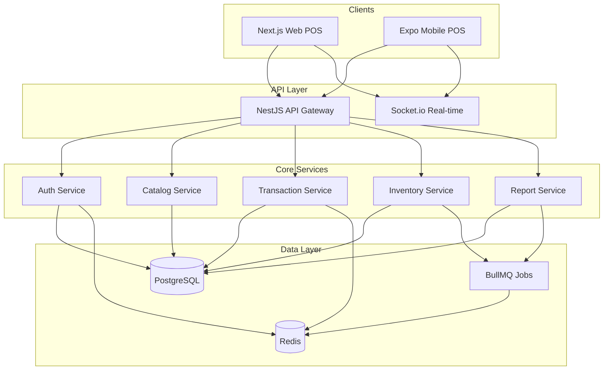

> 📚 [Indeks Dokumentasi](../INDEX.md) | Kategori: Arsitektur | Audience: Fajar, Yoga, semua tim

# Arsitektur Barokah Core POS

## Diagram Sistem



## Struktur Monorepo

```
barokah-pos/
├── apps/
│   ├── api/          # NestJS backend
│   ├── web/          # Next.js web POS
│   └── mobile/       # Expo mobile POS
├── packages/
│   ├── shared/       # Types, utils, constants
│   ├── ui/           # Shared UI components
│   └── database/     # Prisma schema & migrations
├── docs/
├── docker/
└── turbo.json
```

## Prinsip Desain

1. **Offline-first mobile** — IndexedDB/SQLite lokal, sync saat online
2. **Idempotent transactions** — UUID client-side, dedup di server
3. **Event sourcing untuk transaksi** — audit trail lengkap
4. **RBAC granular** — permission per modul & outlet
5. **Multi-tenant ready** — tenant_id di semua tabel bisnis

## Database Schema (Core Entities)

| Entity | Deskripsi |
|--------|-----------|
| tenants | Organisasi / bisnis |
| outlets | Cabang toko |
| users | Pengguna sistem |
| roles / permissions | RBAC |
| products | Master produk |
| categories | Kategori produk |
| inventory_items | Stok per outlet |
| transactions | Header transaksi |
| transaction_items | Detail line item |
| payments | Pembayaran multi-method |
| shifts | Shift kasir |

## API Convention

- Base URL: `/api/v1`
- Auth: `Authorization: Bearer <access_token>`
- Pagination: `?page=1&limit=20`
- Response envelope:

```json
{
  "success": true,
  "data": {},
  "meta": { "page": 1, "total": 100 }
}
```

## Keamanan

- HTTPS wajib production
- Rate limiting per IP & per user
- Input validation (class-validator)
- SQL injection prevention (Prisma parameterized)
- PCI-DSS aware — tidak simpan data kartu mentah
