> 📚 [Indeks Dokumentasi](../INDEX.md) | Kategori: Database | Audience: Fajar

# Relational Design — Barokah Core POS

> **Versi:** 1.0 MVP | **Database:** PostgreSQL 16  
> **Schema source:** `packages/database/prisma/schema.prisma`

---

## 1. Entity-Relationship Diagram

```mermaid
erDiagram
    TENANTS ||--o{ OUTLETS : has
    TENANTS ||--o{ USERS : has
    TENANTS ||--o{ CATEGORIES : has
    TENANTS ||--o{ UNITS : has
    TENANTS ||--o{ SUPPLIERS : has
    TENANTS ||--o{ PRODUCTS : has
    TENANTS ||--o{ PROMO_RULES : has
    TENANTS ||--o{ AUDIT_LOGS : has

    OUTLETS ||--o{ INVENTORY_ITEMS : stocks
    OUTLETS ||--o{ TRANSACTIONS : processes
    OUTLETS ||--o{ SHIFTS : runs
    OUTLETS ||--o{ STOCK_MOVEMENTS : tracks
    OUTLETS ||--o{ HELD_TRANSACTIONS : holds
    OUTLETS ||--o{ USER_OUTLETS : assigned

    USERS ||--o{ USER_OUTLETS : accesses
    USERS ||--o{ TRANSACTIONS : cashes
    USERS ||--o{ SHIFTS : operates
    USERS ||--o{ STOCK_MOVEMENTS : creates
    USERS ||--o{ HELD_TRANSACTIONS : holds
    USERS ||--o{ AUDIT_LOGS : triggers
    USERS ||--o{ TRANSACTION_ADJUSTMENTS : creates
    USERS ||--o{ TRANSACTION_ADJUSTMENTS : approves

    CATEGORIES ||--o{ CATEGORIES : parent_of
    CATEGORIES ||--o{ PRODUCTS : categorizes
    CATEGORIES ||--o{ PROMO_RULES : scopes

    UNITS ||--o{ PRODUCTS : measures
    SUPPLIERS ||--o{ PRODUCTS : supplies

    PRODUCTS ||--o{ INVENTORY_ITEMS : tracked_in
    PRODUCTS ||--o{ TRANSACTION_ITEMS : sold_as
    PRODUCTS ||--o{ STOCK_MOVEMENTS : moved
    PRODUCTS ||--o{ HELD_TRANSACTION_ITEMS : held_as
    PRODUCTS ||--o{ PROMO_RULES : scopes

    TRANSACTIONS ||--|{ TRANSACTION_ITEMS : contains
    TRANSACTIONS ||--|{ PAYMENTS : paid_by
    TRANSACTIONS ||--o{ TRANSACTION_ADJUSTMENTS : adjusted_by
    TRANSACTIONS }o--o| SHIFTS : belongs_to

    HELD_TRANSACTIONS ||--|{ HELD_TRANSACTION_ITEMS : contains

    TENANTS {
        uuid id PK
        string name
        string slug UK
        boolean is_active
        timestamp created_at
        timestamp updated_at
    }

    OUTLETS {
        uuid id PK
        uuid tenant_id FK
        string name
        string code
        string address
        boolean is_active
        timestamp created_at
        timestamp updated_at
    }

    USERS {
        uuid id PK
        uuid tenant_id FK
        string email
        string password_hash
        string full_name
        enum role
        boolean is_active
        timestamp created_at
        timestamp updated_at
    }

    USER_OUTLETS {
        uuid id PK
        uuid user_id FK
        uuid outlet_id FK
    }

    UNITS {
        uuid id PK
        uuid tenant_id FK
        string name
        string symbol
        timestamp created_at
    }

    CATEGORIES {
        uuid id PK
        uuid tenant_id FK
        string name
        uuid parent_id FK
        int sort_order
        timestamp created_at
    }

    SUPPLIERS {
        uuid id PK
        uuid tenant_id FK
        string name
        string phone
        string email
        string address
        boolean is_active
        timestamp created_at
        timestamp updated_at
    }

    PRODUCTS {
        uuid id PK
        uuid tenant_id FK
        uuid category_id FK
        uuid unit_id FK
        uuid supplier_id FK
        string sku
        string barcode
        string name
        decimal price
        decimal cost_price
        boolean tax_inclusive
        boolean is_active
        timestamp created_at
        timestamp updated_at
    }

    INVENTORY_ITEMS {
        uuid id PK
        uuid outlet_id FK
        uuid product_id FK
        decimal quantity
        decimal min_stock
        timestamp updated_at
    }

    STOCK_MOVEMENTS {
        uuid id PK
        uuid outlet_id FK
        uuid product_id FK
        enum type
        decimal quantity
        decimal quantity_before
        decimal quantity_after
        string reference_type
        uuid reference_id
        string notes
        uuid created_by_id FK
        timestamp created_at
    }

    PROMO_RULES {
        uuid id PK
        uuid tenant_id FK
        string name
        enum type
        decimal value
        enum apply_to
        uuid category_id FK
        uuid product_id FK
        decimal min_purchase
        boolean is_active
        timestamp starts_at
        timestamp ends_at
        timestamp created_at
        timestamp updated_at
    }

    TRANSACTIONS {
        uuid id PK
        uuid outlet_id FK
        uuid cashier_id FK
        uuid shift_id FK
        string receipt_no
        uuid client_request_id UK
        enum status
        decimal subtotal
        decimal discount
        decimal tax
        decimal total
        string notes
        timestamp created_at
        timestamp completed_at
    }

    TRANSACTION_ITEMS {
        uuid id PK
        uuid transaction_id FK
        uuid product_id FK
        string product_name
        decimal quantity
        decimal unit_price
        decimal discount
        decimal tax
        decimal subtotal
    }

    TRANSACTION_ADJUSTMENTS {
        uuid id PK
        uuid transaction_id FK
        enum type
        decimal amount
        string reason
        uuid created_by_id FK
        uuid approved_by_id FK
        timestamp created_at
    }

    PAYMENTS {
        uuid id PK
        uuid transaction_id FK
        enum method
        decimal amount
        string reference
        timestamp created_at
    }

    HELD_TRANSACTIONS {
        uuid id PK
        uuid outlet_id FK
        uuid cashier_id FK
        string label
        decimal subtotal
        decimal discount
        decimal tax
        decimal total
        timestamp expires_at
        timestamp created_at
        timestamp updated_at
    }

    HELD_TRANSACTION_ITEMS {
        uuid id PK
        uuid held_transaction_id FK
        uuid product_id FK
        string product_name
        decimal quantity
        decimal unit_price
        decimal discount
        decimal subtotal
    }

    SHIFTS {
        uuid id PK
        uuid outlet_id FK
        uuid cashier_id FK
        decimal opening_cash
        decimal closing_cash
        decimal expected_cash
        decimal difference
        timestamp opened_at
        timestamp closed_at
    }

    AUDIT_LOGS {
        uuid id PK
        uuid tenant_id FK
        uuid user_id FK
        string action
        string entity_type
        uuid entity_id
        json metadata
        string ip_address
        timestamp created_at
    }
```

---

## 2. Relationship Cardinality

| Relationship | Cardinality | Deskripsi |
|--------------|-------------|-----------|
| Tenant → Outlet | 1:N | Satu bisnis punya banyak cabang |
| Tenant → User | 1:N | Satu bisnis punya banyak pengguna |
| Tenant → Product | 1:N | Master produk level tenant |
| User ↔ Outlet | N:M | Via `user_outlets`; kasir bisa di beberapa outlet |
| Category → Category | 1:N | Self-referencing tree (parent → children) |
| Outlet → InventoryItem | 1:N | Stok per produk per outlet |
| Product → InventoryItem | 1:N | Satu produk punya stok di banyak outlet |
| Outlet + Product → InventoryItem | 1:1 | Composite unique `(outlet_id, product_id)` |
| Transaction → TransactionItem | 1:N | Satu transaksi punya banyak line item |
| Transaction → Payment | 1:N | Split payment support |
| Transaction → TransactionAdjustment | 1:N | Void + partial refund |
| Transaction → Shift | N:1 | Banyak transaksi dalam satu shift |
| HeldTransaction → HeldTransactionItem | 1:N | Hold bill dengan banyak item |
| Product → StockMovement | 1:N | Ledger pergerakan stok |
| User → StockMovement | 1:N | Siapa yang memicu movement |

---

## 3. Cascade Rules

| Parent Table | Child Table | onDelete | Alasan |
|--------------|-------------|----------|--------|
| `tenants` | `outlets`, `users`, `products`, dll. | **Restrict** | Lindungi data bisnis; tidak boleh hapus tenant dengan data |
| `outlets` | `inventory_items`, `transactions`, `shifts` | **Restrict** | Outlet dengan histori tidak boleh dihapus |
| `outlets` | `held_transactions` | **Cascade** | Hold bill bersifat transient; ikut terhapus jika outlet dihapus (dev/test) |
| `users` | `user_outlets` | **Cascade** | Junction table cleanup |
| `users` | `audit_logs` | **SetNull** | Pertahankan log meski user di-deactivate |
| `categories` | `products.category_id` | **SetNull** | Produk tetap ada jika kategori dihapus |
| `categories` | `categories.parent_id` | **SetNull** | Sub-kategori jadi root jika parent dihapus |
| `transactions` | `transaction_items` | **Cascade** | Line item tidak exist tanpa header |
| `transactions` | `payments` | **Cascade** | Payment tidak exist tanpa transaksi |
| `transactions` | `transaction_adjustments` | **Restrict** | Adjustment adalah audit record |
| `held_transactions` | `held_transaction_items` | **Cascade** | Item hold ikut terhapus |
| `products` | `transaction_items` | **Restrict** | Produk dengan histori penjualan tidak boleh dihapus hard |
| `products` | `stock_movements` | **Restrict** | Ledger stok immutable |
| `shifts` | `transactions.shift_id` | **SetNull** | Transaksi tetap ada jika shift record di-archive |

---

## 4. Unique Constraints per Aturan Bisnis

| Constraint | Tabel | Kolom | Aturan Bisnis |
|------------|-------|-------|---------------|
| `tenants_slug_key` | tenants | slug | Identifikasi tenant unik global |
| `outlets_tenant_id_code_key` | outlets | tenant_id, code | Kode cabang unik per bisnis |
| `users_tenant_id_email_key` | users | tenant_id, email | Email unik per bisnis |
| `user_outlets_user_id_outlet_id_key` | user_outlets | user_id, outlet_id | Satu assignment per pasangan |
| `units_tenant_id_symbol_key` | units | tenant_id, symbol | Simbol satuan unik per bisnis |
| `products_tenant_id_sku_key` | products | tenant_id, sku | SKU unik per bisnis |
| `inventory_items_outlet_id_product_id_key` | inventory_items | outlet_id, product_id | Satu record stok per pasangan |
| `transactions_outlet_id_receipt_no_key` | transactions | outlet_id, receipt_no | Nomor struk unik per outlet |
| `transactions_client_request_id_key` | transactions | client_request_id | Idempotency checkout mobile |

---

## 5. Table Definitions

### 5.1 tenants

| Column | Type | PK | FK | Nullable | Default | Notes |
|--------|------|:--:|:--:|:--------:|---------|-------|
| id | UUID | ✓ | | NO | uuid() | |
| name | VARCHAR | | | NO | | Nama bisnis |
| slug | VARCHAR | | | NO | | Unique subdomain identifier |
| is_active | BOOLEAN | | | NO | true | Soft delete flag |
| created_at | TIMESTAMPTZ | | | NO | now() | |
| updated_at | TIMESTAMPTZ | | | NO | auto | |

---

### 5.2 outlets

| Column | Type | PK | FK | Nullable | Default | Notes |
|--------|------|:--:|:--:|:--------:|---------|-------|
| id | UUID | ✓ | | NO | uuid() | |
| tenant_id | UUID | | tenants.id | NO | | |
| name | VARCHAR | | | NO | | |
| code | VARCHAR | | | NO | | Unique per tenant |
| address | TEXT | | | YES | | |
| is_active | BOOLEAN | | | NO | true | |
| created_at | TIMESTAMPTZ | | | NO | now() | |
| updated_at | TIMESTAMPTZ | | | NO | auto | |

**Indexes:** `(tenant_id)`, `UNIQUE(tenant_id, code)`

---

### 5.3 users

| Column | Type | PK | FK | Nullable | Default | Notes |
|--------|------|:--:|:--:|:--------:|---------|-------|
| id | UUID | ✓ | | NO | uuid() | |
| tenant_id | UUID | | tenants.id | NO | | |
| email | VARCHAR | | | NO | | Unique per tenant |
| password_hash | VARCHAR | | | NO | | bcrypt/argon2 |
| full_name | VARCHAR | | | NO | | |
| role | ENUM | | | NO | CASHIER | UserRole |
| is_active | BOOLEAN | | | NO | true | |
| created_at | TIMESTAMPTZ | | | NO | now() | |
| updated_at | TIMESTAMPTZ | | | NO | auto | |

**Indexes:** `UNIQUE(tenant_id, email)`, `(tenant_id, role)`

---

### 5.4 user_outlets

| Column | Type | PK | FK | Nullable | Default | Notes |
|--------|------|:--:|:--:|:--------:|---------|-------|
| id | UUID | ✓ | | NO | uuid() | |
| user_id | UUID | | users.id | NO | | CASCADE on user delete |
| outlet_id | UUID | | outlets.id | NO | | CASCADE on outlet delete |

**Indexes:** `UNIQUE(user_id, outlet_id)`

---

### 5.5 units

| Column | Type | PK | FK | Nullable | Default | Notes |
|--------|------|:--:|:--:|:--------:|---------|-------|
| id | UUID | ✓ | | NO | uuid() | |
| tenant_id | UUID | | tenants.id | NO | | |
| name | VARCHAR | | | NO | | e.g. "Pieces" |
| symbol | VARCHAR | | | NO | | e.g. "pcs" |
| created_at | TIMESTAMPTZ | | | NO | now() | |

**Indexes:** `UNIQUE(tenant_id, symbol)`

---

### 5.6 categories

| Column | Type | PK | FK | Nullable | Default | Notes |
|--------|------|:--:|:--:|:--------:|---------|-------|
| id | UUID | ✓ | | NO | uuid() | |
| tenant_id | UUID | | tenants.id | NO | | |
| name | VARCHAR | | | NO | | |
| parent_id | UUID | | categories.id | YES | | Self-ref tree |
| sort_order | INT | | | NO | 0 | Display order |
| created_at | TIMESTAMPTZ | | | NO | now() | |

**Indexes:** `(tenant_id, parent_id)`

---

### 5.7 suppliers

| Column | Type | PK | FK | Nullable | Default | Notes |
|--------|------|:--:|:--:|:--------:|---------|-------|
| id | UUID | ✓ | | NO | uuid() | |
| tenant_id | UUID | | tenants.id | NO | | |
| name | VARCHAR | | | NO | | |
| phone | VARCHAR | | | YES | | |
| email | VARCHAR | | | YES | | |
| address | TEXT | | | YES | | |
| is_active | BOOLEAN | | | NO | true | |
| created_at | TIMESTAMPTZ | | | NO | now() | |
| updated_at | TIMESTAMPTZ | | | NO | auto | |

**Indexes:** `(tenant_id, name)`

---

### 5.8 products

| Column | Type | PK | FK | Nullable | Default | Notes |
|--------|------|:--:|:--:|:--------:|---------|-------|
| id | UUID | ✓ | | NO | uuid() | |
| tenant_id | UUID | | tenants.id | NO | | |
| category_id | UUID | | categories.id | YES | | |
| unit_id | UUID | | units.id | YES | | |
| supplier_id | UUID | | suppliers.id | YES | | |
| sku | VARCHAR | | | NO | | Unique per tenant |
| barcode | VARCHAR | | | YES | | For scan |
| name | VARCHAR | | | NO | | |
| price | DECIMAL(15,2) | | | NO | | Selling price |
| cost_price | DECIMAL(15,2) | | | NO | 0 | HPP |
| tax_inclusive | BOOLEAN | | | NO | true | PPN included flag |
| is_active | BOOLEAN | | | NO | true | |
| created_at | TIMESTAMPTZ | | | NO | now() | |
| updated_at | TIMESTAMPTZ | | | NO | auto | |

**Indexes:** `UNIQUE(tenant_id, sku)`, `(tenant_id, barcode)`, `(tenant_id, category_id)`

---

### 5.9 inventory_items

| Column | Type | PK | FK | Nullable | Default | Notes |
|--------|------|:--:|:--:|:--------:|---------|-------|
| id | UUID | ✓ | | NO | uuid() | |
| outlet_id | UUID | | outlets.id | NO | | |
| product_id | UUID | | products.id | NO | | |
| quantity | DECIMAL(15,3) | | | NO | 0 | Current stock |
| min_stock | DECIMAL(15,3) | | | NO | 0 | Alert threshold |
| updated_at | TIMESTAMPTZ | | | NO | auto | |

**Indexes:** `UNIQUE(outlet_id, product_id)`, `(outlet_id, quantity)`

---

### 5.10 stock_movements

| Column | Type | PK | FK | Nullable | Default | Notes |
|--------|------|:--:|:--:|:--------:|---------|-------|
| id | UUID | ✓ | | NO | uuid() | |
| outlet_id | UUID | | outlets.id | NO | | |
| product_id | UUID | | products.id | NO | | |
| type | ENUM | | | NO | | StockMovementType |
| quantity | DECIMAL(15,3) | | | NO | | +in / -out |
| quantity_before | DECIMAL(15,3) | | | NO | | Snapshot before |
| quantity_after | DECIMAL(15,3) | | | NO | | Snapshot after |
| reference_type | VARCHAR | | | YES | | Polymorphic ref |
| reference_id | UUID | | | YES | | Polymorphic ref |
| notes | TEXT | | | YES | | |
| created_by_id | UUID | | users.id | NO | | |
| created_at | TIMESTAMPTZ | | | NO | now() | Immutable |

**Indexes:** `(outlet_id, product_id, created_at)`, `(reference_type, reference_id)`

---

### 5.11 promo_rules

| Column | Type | PK | FK | Nullable | Default | Notes |
|--------|------|:--:|:--:|:--------:|---------|-------|
| id | UUID | ✓ | | NO | uuid() | |
| tenant_id | UUID | | tenants.id | NO | | |
| name | VARCHAR | | | NO | | |
| type | ENUM | | | NO | | PERCENTAGE / FIXED_AMOUNT |
| value | DECIMAL(15,2) | | | NO | | % or Rp amount |
| apply_to | ENUM | | | NO | ALL | ALL / CATEGORY / PRODUCT |
| category_id | UUID | | categories.id | YES | | Scope |
| product_id | UUID | | products.id | YES | | Scope |
| min_purchase | DECIMAL(15,2) | | | YES | | Minimum subtotal |
| is_active | BOOLEAN | | | NO | true | |
| starts_at | TIMESTAMPTZ | | | YES | | |
| ends_at | TIMESTAMPTZ | | | YES | | |
| created_at | TIMESTAMPTZ | | | NO | now() | |
| updated_at | TIMESTAMPTZ | | | NO | auto | |

**Indexes:** `(tenant_id, is_active)`

---

### 5.12 transactions

| Column | Type | PK | FK | Nullable | Default | Notes |
|--------|------|:--:|:--:|:--------:|---------|-------|
| id | UUID | ✓ | | NO | uuid() | |
| outlet_id | UUID | | outlets.id | NO | | |
| cashier_id | UUID | | users.id | NO | | |
| shift_id | UUID | | shifts.id | YES | | |
| receipt_no | VARCHAR | | | NO | | Unique per outlet |
| client_request_id | UUID | | | YES | | Idempotency key |
| status | ENUM | | | NO | COMPLETED | TransactionStatus |
| subtotal | DECIMAL(15,2) | | | NO | | |
| discount | DECIMAL(15,2) | | | NO | 0 | |
| tax | DECIMAL(15,2) | | | NO | 0 | |
| total | DECIMAL(15,2) | | | NO | | |
| notes | TEXT | | | YES | | |
| created_at | TIMESTAMPTZ | | | NO | now() | |
| completed_at | TIMESTAMPTZ | | | YES | | |

**Indexes:** `UNIQUE(outlet_id, receipt_no)`, `UNIQUE(client_request_id)`, `(outlet_id, created_at)`, `(outlet_id, status)`, `(cashier_id, created_at)`

---

### 5.13 transaction_items

| Column | Type | PK | FK | Nullable | Default | Notes |
|--------|------|:--:|:--:|:--------:|---------|-------|
| id | UUID | ✓ | | NO | uuid() | |
| transaction_id | UUID | | transactions.id | NO | | CASCADE delete |
| product_id | UUID | | products.id | NO | | |
| product_name | VARCHAR | | | NO | | Snapshot |
| quantity | DECIMAL(15,3) | | | NO | | |
| unit_price | DECIMAL(15,2) | | | NO | | Snapshot |
| discount | DECIMAL(15,2) | | | NO | 0 | |
| tax | DECIMAL(15,2) | | | NO | 0 | |
| subtotal | DECIMAL(15,2) | | | NO | | |

**Indexes:** `(transaction_id)`

---

### 5.14 transaction_adjustments

| Column | Type | PK | FK | Nullable | Default | Notes |
|--------|------|:--:|:--:|:--------:|---------|-------|
| id | UUID | ✓ | | NO | uuid() | |
| transaction_id | UUID | | transactions.id | NO | | |
| type | ENUM | | | NO | | VOID / REFUND |
| amount | DECIMAL(15,2) | | | NO | | Full or partial |
| reason | TEXT | | | NO | | |
| created_by_id | UUID | | users.id | NO | | |
| approved_by_id | UUID | | users.id | YES | | Manager approval |
| created_at | TIMESTAMPTZ | | | NO | now() | |

**Indexes:** `(transaction_id)`

---

### 5.15 payments

| Column | Type | PK | FK | Nullable | Default | Notes |
|--------|------|:--:|:--:|:--------:|---------|-------|
| id | UUID | ✓ | | NO | uuid() | |
| transaction_id | UUID | | transactions.id | NO | | CASCADE delete |
| method | ENUM | | | NO | | PaymentMethod |
| amount | DECIMAL(15,2) | | | NO | | |
| reference | VARCHAR | | | YES | | Transfer/QRIS ref |
| created_at | TIMESTAMPTZ | | | NO | now() | |

**Indexes:** `(transaction_id)`

---

### 5.16 held_transactions

| Column | Type | PK | FK | Nullable | Default | Notes |
|--------|------|:--:|:--:|:--------:|---------|-------|
| id | UUID | ✓ | | NO | uuid() | |
| outlet_id | UUID | | outlets.id | NO | | |
| cashier_id | UUID | | users.id | NO | | |
| label | VARCHAR | | | YES | | Customer/table label |
| subtotal | DECIMAL(15,2) | | | NO | 0 | |
| discount | DECIMAL(15,2) | | | NO | 0 | |
| tax | DECIMAL(15,2) | | | NO | 0 | |
| total | DECIMAL(15,2) | | | NO | 0 | |
| expires_at | TIMESTAMPTZ | | | NO | | TTL 30 min default |
| created_at | TIMESTAMPTZ | | | NO | now() | |
| updated_at | TIMESTAMPTZ | | | NO | auto | |

**Indexes:** `(outlet_id, expires_at)`, `(cashier_id)`

---

### 5.17 held_transaction_items

| Column | Type | PK | FK | Nullable | Default | Notes |
|--------|------|:--:|:--:|:--------:|---------|-------|
| id | UUID | ✓ | | NO | uuid() | |
| held_transaction_id | UUID | | held_transactions.id | NO | | CASCADE |
| product_id | UUID | | products.id | NO | | |
| product_name | VARCHAR | | | NO | | |
| quantity | DECIMAL(15,3) | | | NO | | |
| unit_price | DECIMAL(15,2) | | | NO | | |
| discount | DECIMAL(15,2) | | | NO | 0 | |
| subtotal | DECIMAL(15,2) | | | NO | | |

**Indexes:** `(held_transaction_id)`

---

### 5.18 shifts

| Column | Type | PK | FK | Nullable | Default | Notes |
|--------|------|:--:|:--:|:--------:|---------|-------|
| id | UUID | ✓ | | NO | uuid() | |
| outlet_id | UUID | | outlets.id | NO | | |
| cashier_id | UUID | | users.id | NO | | |
| opening_cash | DECIMAL(15,2) | | | NO | | Saldo awal |
| closing_cash | DECIMAL(15,2) | | | YES | | Saldo akhir fisik |
| expected_cash | DECIMAL(15,2) | | | YES | | Saldo sistem |
| difference | DECIMAL(15,2) | | | YES | | Selisih |
| opened_at | TIMESTAMPTZ | | | NO | now() | |
| closed_at | TIMESTAMPTZ | | | YES | | NULL = open |

**Indexes:** `(outlet_id, opened_at)`, `(cashier_id, closed_at)`

---

### 5.19 audit_logs

| Column | Type | PK | FK | Nullable | Default | Notes |
|--------|------|:--:|:--:|:--------:|---------|-------|
| id | UUID | ✓ | | NO | uuid() | |
| tenant_id | UUID | | tenants.id | NO | | |
| user_id | UUID | | users.id | YES | | SetNull on delete |
| action | VARCHAR | | | NO | | e.g. TRANSACTION_VOID |
| entity_type | VARCHAR | | | NO | | e.g. transaction |
| entity_id | UUID | | | YES | | |
| metadata | JSONB | | | YES | | Before/after data |
| ip_address | VARCHAR | | | YES | | |
| created_at | TIMESTAMPTZ | | | NO | now() | Append-only |

**Indexes:** `(tenant_id, created_at)`, `(entity_type, entity_id)`, `(user_id, created_at)`

---

## 6. Enumerations

### UserRole
`OWNER` | `MANAGER` | `CASHIER` | `INVENTORY` | `ACCOUNTANT`

### TransactionStatus
`PENDING` | `COMPLETED` | `VOID` | `REFUNDED`

### PaymentMethod
`CASH` | `TRANSFER` | `QRIS` | `E_WALLET` | `CARD`

### StockMovementType
`SALE` | `PURCHASE` | `ADJUSTMENT` | `TRANSFER_IN` | `TRANSFER_OUT` | `VOID_RESTORE` | `OPNAME`

### AdjustmentType
`VOID` | `REFUND`

### PromoType
`PERCENTAGE` | `FIXED_AMOUNT`

### PromoApplyTo
`ALL` | `CATEGORY` | `PRODUCT`

---

## 7. Referensi

- Analisis database: `docs/database/DATABASE-ANALYSIS.md`
- Data dictionary: `docs/database/DATA-DICTIONARY.md`
- Prisma schema: `packages/database/prisma/schema.prisma`
