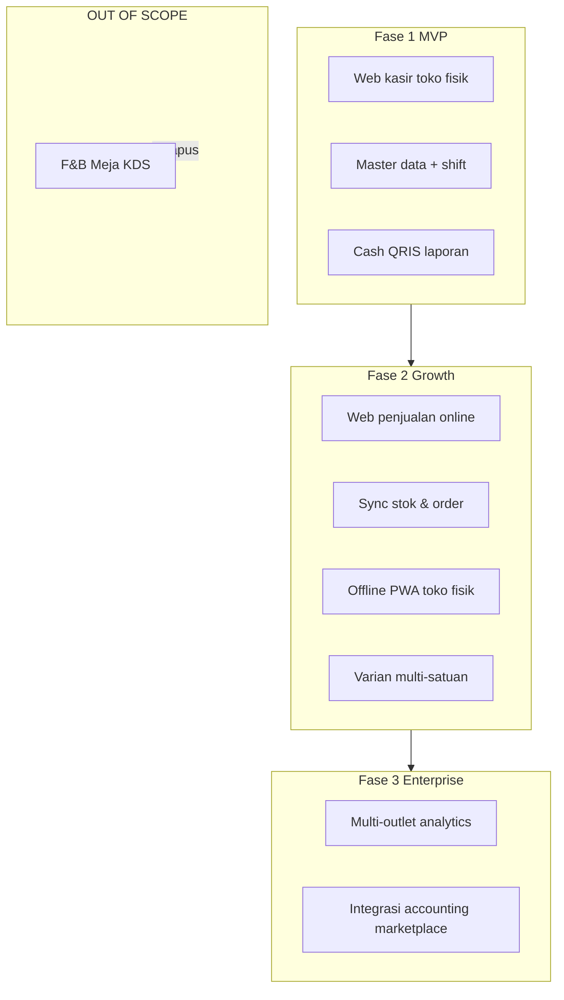

# ADR-003: Scope Produk — Retail Omnichannel (Toko Fisik + Online Web)

> 📚 [Indeks Dokumentasi](../INDEX.md) | Kategori: Keputusan Arsitektur | Audience: semua tim, Pak Zaki

| Field | Nilai |
|-------|-------|
| **Status** | Diterima |
| **Tanggal** | 1 Juni 2026 |
| **Pemutus** | Pak Zaki (pemilik proyek) |
| **Dokumentasi** | CEO Budi Santoso, tim |
| **Amendemen** | Melengkapi [ADR-002](./ADR-002-PAK-ZAKI-CONFIRMATIONS.md) (Q1–Q6) |
| **Referensi** | [VISION-ZAKI-MATURED.md](../requirements/VISION-ZAKI-MATURED.md), [FEATURE-BACKLOG.md](../requirements/FEATURE-BACKLOG.md) |

---

## Konteks

Pak Zaki mengklarifikasi scope produk setelah rapat visi (1 Juni 2026):

> *"Kita ga butuh F&B/meja/KDS. Karena projek ini untuk penjualan retail dan online dengan web dan ada juga offline di toko fisik."*

Proyek Barokah Core POS ditujukan untuk **merchant retail** (vertical pilot: **toko bahan bangunan**), dengan tiga saluran operasi:

1. **Toko fisik** — kasir di lokasi, harus bisa beroperasi saat internet tidak stabil.
2. **Penjualan online** — melalui web (katalog pelanggan + order terintegrasi POS).
3. **Sinkronisasi** — stok dan pesanan konsisten antara kanal online dan toko fisik.

Fitur **F&B** (restoran, meja, antrian, Kitchen Display System) **tidak diperlukan** — bukan prioritas rendah atau Fase 3, melainkan **di luar scope produk selamanya**.

---

## Keputusan

### Di luar scope (OUT OF SCOPE) — permanen

| Area | Contoh fitur | Status |
|------|--------------|--------|
| **F&B / restoran** | Meja, antrian tamu, split bill per meja | **CANCELLED** — tidak direncanakan |
| **KDS** | Kitchen Display System, tiket dapur real-time | **CANCELLED** |
| **Alur restoran** | Course ordering, modifier dapur, tip pooling meja | **CANCELLED** |

Tim **tidak** merencanakan, mendesain wireframe, atau mengalokasikan sprint untuk item di atas — termasuk Fase 3.

### Dalam scope (IN SCOPE)

| Saluran | Definisi | Fase utama |
|---------|----------|------------|
| **Retail POS — toko fisik** | Web kasir di outlet fisik: scan, keranjang, bayar, shift, struk | **Fase 1 MVP** |
| **Penjualan online — web** | Katalog pelanggan + order online terintegrasi backend POS yang sama | **Fase 2** |
| **Offline di toko fisik** | Transaksi tetap jalan tanpa internet; antrian sync saat online kembali | **Fase 2** (prioritas) |
| **Omnichannel sync** | Stok, harga, dan status order selaras online ↔ toko fisik | **Fase 2** |
| **Vertical pilot** | Retail bahan bangunan (semen, cat, pipa, dll.) | Fase 1–2 (Q1 ADR-002) |

### Definisi "online" (selaras arsitektur)

**"Online"** dalam scope Pak Zaki = **penjualan via web**, bukan marketplace pihak ketiga sebagai inti MVP:

| Opsi | Deskripsi | Prioritas |
|------|-----------|-----------|
| **A — Web storefront / e-commerce** | Katalog publik untuk pelanggan, keranjang, checkout online (pickup / delivery), order masuk ke sistem POS yang sama | **Fase 2 — utama** |
| **B — Web kasir (staff)** | Layar kasir Next.js di toko fisik — sudah **Fase 1 MVP** (Q3: web dulu) | **Fase 1** |
| **C — Marketplace sync** | Tokopedia / Shopee ↔ stok POS | **Fase 3** (ADR-002 / visi asli §9.2) |

Arsitektur monorepo tetap: `apps/web` melayani **dashboard owner/manager**, **kasir staff**, dan (Fase 2) **halaman pelanggan / storefront** — kontrak API terpusat di NestJS (`apps/api`).

### Definisi "offline di toko fisik"

Pak Zaki membutuhkan operasi toko fisik **tanpa ketergantungan internet penuh**. Tim merekomendasikan dua jalur teknis; **prioritas** mengikuti keputusan Q3 (web dulu):

| Jalur | Teknologi | Kelebihan | Fase |
|-------|-----------|-----------|------|
| **Prioritas — Web kasir PWA** | Next.js PWA + IndexedDB / local queue + background sync | Satu codebase dengan MVP kasir web; cocok PC/tablet di toko | **Fase 2 — prioritas** |
| **Alternatif — Expo mobile** | SQLite offline queue (sudah direncanakan ADR-002 Q3) | Native mobile, Bluetooth printer; effort terpisah | **Fase 2 — opsional / paralel jika kapasitas** |

**Rekomendasi tim:** implementasi offline toko fisik dimulai dengan **web kasir PWA + antrian sync** (Fase 2), karena Pak Zaki memilih **web kasir MVP dulu** (Q3). Expo mobile offline tetap valid untuk merchant yang ingin HP kasir dedicated — tidak menggantikan prioritas PWA kecuali diputuskan ulang.

**Prinsip sync offline:** transaksi lokal immutable; upload idempotent; konflik stok → kebijakan eksplisit (server wins + manual resolve untuk void) — spec di handoff Eko + Fajar.

---

## Dampak Roadmap

| Fase | Sebelum ADR-003 | Setelah ADR-003 |
|------|-----------------|-----------------|
| **1 — MVP** | Kasir web 1 outlet | **Tidak berubah** — web kasir toko fisik, shift, QRIS, laporan |
| **2 — Growth** | Varian, multi-outlet, Expo offline, loyalty | + **Online sales (web storefront)**, **inventory/order sync**, **offline PWA toko fisik** (prioritas); Expo offline opsional |
| **3 — Enterprise** | F&B/KDS "jika ada permintaan", marketplace, accounting | **Tanpa F&B/KDS**; marketplace, accounting, analytics, API publik |

---

## Koordinasi Tim

---
**Budi** · CEO  
Halo Pak Zaki, scope retail + online + offline toko fisik sudah dikunci di ADR ini. F&B/meja/KDS **dihapus permanen** dari roadmap. Sprint 1 MVP **tidak berubah**.
---

---
**Budi** · CEO → **Rina** · Spesialis POS Domain  
Halo Rina, tolong checklist requirement **retail omnichannel**: toko fisik, order online web, sync stok, pickup/delivery bahan bangunan. **Anti-scope:** jangan sertakan F&B/meja/KDS.
---

---
**Budi** · CEO → **Dewi** · Business Analyst  
Halo Dewi, user story Fase 2: penjualan online web, offline sync toko fisik, status order pickup/delivery. AC konflik sync dan idempotent upload.
---

---
**Budi** · CEO → **Hendra** · Project Planner  
Halo Hendra, replan Fase 2/3: tambah track **Online Sales (Web)** + **Offline PWA toko fisik**; hapus seluruh item F&B dari rencana. Fase 3 = multi-outlet, analytics, integrasi — tanpa restoran.
---

---
**Budi** · CEO → **Dimas** · Senior Frontend Developer  
Halo Dimas, `apps/web` = kasir staff (MVP) + storefront pelanggan (Fase 2). Offline prioritas: **PWA + IndexedDB queue** di toko fisik; Expo mobile offline jalur alternatif Fase 2.
---

---
**Budi** · CEO → **Fajar** · Senior Developer  
Halo Fajar, API Fase 2: online orders, inventory sync antar kanal, webhook payment online (Midtrans) + in-store tetap. Kontrak freeze sebelum Dimas storefront.
---

---
**Budi** · CEO → **Arif** · Integration Specialist  
Halo Arif, payment **online** (Midtrans checkout web) + **in-store** (QRIS kasir) — rekonsiliasi per kanal. Marketplace Tokopedia/Shopee tetap Fase 3.
---

---
**Budi** · CEO → **Eko** · Algorithm Specialist  
Halo Eko, pricing & promo harus **konsisten** online dan offline — satu sumber kebenaran harga per SKU/outlet; spec sync pricing Fase 2.
---

## Handoff Log

| From | To | Task | Deliverable | Parallel OK? | Next action |
|------|-----|------|-------------|--------------|-------------|
| Budi · CEO | Rina · POS | Checklist omnichannel retail | docs/requirements/ (modul online+offline) | Tidak | Rina draft P0/P1 Fase 2 |
| Budi · CEO | Dewi · Analyst | User story online + sync | Backlog Epic J | Tidak — tunggu Rina checklist | AC offline queue |
| Budi · CEO | Hendra · Planner | Replan Fase 2/3 | Roadmap update | Tidak | Hapus F&B dari sprint plan |
| Budi · CEO | Dimas · Frontend | PWA offline + storefront | RFC frontend F2 | Ya setelah API draft Fajar | Spike IndexedDB |
| Budi · CEO | Fajar · Senior Dev | Online order API | OpenAPI draft F2 | Tidak setelah schema | RFC Prisma orders |
| Budi · CEO | Fitri · Docs | Indeks ADR-003 | INDEX.md/json | Ya | Cross-link |

---

## Referensi

- [ADR-002-PAK-ZAKI-CONFIRMATIONS.md](./ADR-002-PAK-ZAKI-CONFIRMATIONS.md) — Q1 retail, Q3 web dulu
- [VISION-ZAKI-MATURED.md](../requirements/VISION-ZAKI-MATURED.md) — § Model Bisnis Operasi
- [FEATURE-BACKLOG.md](../requirements/FEATURE-BACKLOG.md) — Epic J Online Sales; Epic I F&B CANCELLED
- [2026-06-01-VISION-ZAKI-DISCUSSION.md](../meetings/2026-06-01-VISION-ZAKI-DISCUSSION.md) — Lampiran C amendemen

---

*Disusun Budi Santoso · Diindeks Fitri Nugroho · 1 Juni 2026*
