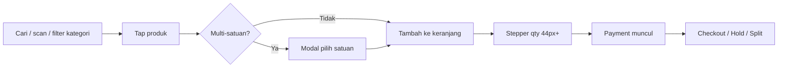

# POS UX Overhaul 2026 — Barokah Core POS

> **Maintained by:** Maya (UI/UX) + Dimas (Frontend Lead)  
> **Date:** 6 Jun 2026  
> **Scope:** Layar kasir `/pos` — touch-first retail building materials

---

## Masalah (feedback Pak Zaki)

| # | Masalah | Dampak ke kasir |
|---|---------|-----------------|
| 1 | Banner biru "Sinkron policy bundle…" | Info teknis sync, bukan operasional |
| 2 | Kartu produk terlalu padat (SKU panjang, policy bundle, multi-satuan verbose) | Cognitive load tinggi saat shift panjang |
| 3 | Search bar & header terlalu dominan | Produk terdorong ke bawah |
| 4 | Sidebar: transaksi terakhir selalu terbuka, payment visible saat keranjang kosong | Fokus checkout terganggu |
| 5 | Multi-satuan langsung add tanpa pilih satuan | Salah satuan / harga |

---

## Keputusan UX (Maya)

### Cashier-first information hierarchy

**Kasir lihat:**
- Nama produk + badge varian (5L, 25L)
- Harga per satuan jual default
- Badge stok ringkas (`12 dus` / `Habis`)
- Label `Multi-satuan` atau `Paket` (1 kata, bukan paragraf policy)

**Disembunyikan dari kasir:**
- Banner sync policy bundle
- Policy tenant/outlet, behavior ALLOW/WARN/BLOCK
- SKU internal panjang → dipendekkan (`formatShortSku`)
- Hint konversi stok `≈ X roll` di kartu (tetap di keranjang)

### Alur kasir (touch-first)



### Sidebar layout

1. **Keranjang** — selalu di atas, prominent saat ada item
2. **Payment** — hanya render jika `cart.length > 0`
3. **Transaksi Terakhir** — accordion, default **collapsed**
4. **Daftar Hold** — accordion, default **collapsed**

### Touch targets

- Search: 44px
- Kartu produk: min 108px tinggi
- Stepper keranjang: 44×44px
- Chip kategori: 44px
- Tab payment: 48px

---

## Implementasi (Dimas)

### Komponen baru

| File | Fungsi |
|------|--------|
| `PosProductGrid.tsx` | Katalog, search compact, filter kategori, kartu produk bersih |
| `PosCartPanel.tsx` | Keranjang, payment conditional, accordion recent/hold |
| `PosUnitPickerModal.tsx` | Pilih satuan jual saat tap produk multi-satuan |
| `PosAccordionSection.tsx` | Section collapsible reusable |
| `pos-types.ts` | Shared types POS |
| `pos-ui-utils.ts` | `formatShortSku`, `resolveDisplaySellUnit`, filter kategori |

### Before / After

| Area | Sebelum | Sesudah |
|------|---------|---------|
| Banner bundle sync | Visible biru di atas katalog | **Dihapus** dari UI kasir |
| Kartu produk | SKU panjang + policy + multi-satuan verbose | Nama, varian, harga/satuan, stok, badge Paket |
| Search | Label besar + placeholder panjang | Inline compact `Cari nama / SKU…` |
| Multi-satuan | Langsung add satuan default | **Modal pilih satuan** bottom sheet |
| Payment kosong | Tab + input tunai + checkout visible | **Hidden** sampai ada item |
| Transaksi terakhir | Always visible, dominasi sidebar | Accordion collapsed default |
| Hold list | Always visible | Accordion collapsed default |

### Fitur yang tidak diubah (regression-safe)

- Checkout tunai / transfer / QRIS / split
- Hold & recall
- Margin warning & stock validation
- Offline PWA + `OfflineBanner`
- Online order badge polling + toast
- Void transaction modal
- Struk digital + thermal print

---

## Verifikasi manual (Pak Zaki)

1. Buka `/pos` — **tidak ada** banner biru sync policy
2. Kartu produk menampilkan nama, varian, harga/satuan, stok — **tanpa** policy text
3. Tap produk multi-satuan → modal pilih satuan muncul
4. Keranjang kosong → **tidak ada** tab payment / checkout
5. Tambah item → payment muncul, total hijau prominent
6. "Transaksi Terakhir" & "Daftar Hold" collapsed — tap untuk expand
7. Regression: checkout tunai, split, hold/recall, void, stok habis

---

## Performa katalog (6 Jun 2026 — P0)

Strategi lengkap: [`docs/standards/PERFORMANCE-CATALOG.md`](../standards/PERFORMANCE-CATALOG.md)

| Area | Strategi |
|------|----------|
| Grid kasir | API slim DTO + TanStack Query 60s + IndexedDB offline |
| Kategori chip | `GET /categories/summary` (terpisah dari produk) |
| Filter >100 SKU | Server `categoryId` + `q` (debounce 300ms) |
| Master produk | Pagination 50/halaman + debounce search |

## Test & quality

```bash
npm run test -w @barokah/web -- --run
npm run typecheck -w @barokah/web
npm run lint -w @barokah/web
```

---

## Handoff

| To | Action |
|----|--------|
| **Citra (QA)** | UAT checklist di atas + regression payment/hold |
| **Fitri (Docs)** | Link dari `docs/INDEX.md` jika diperlukan |
