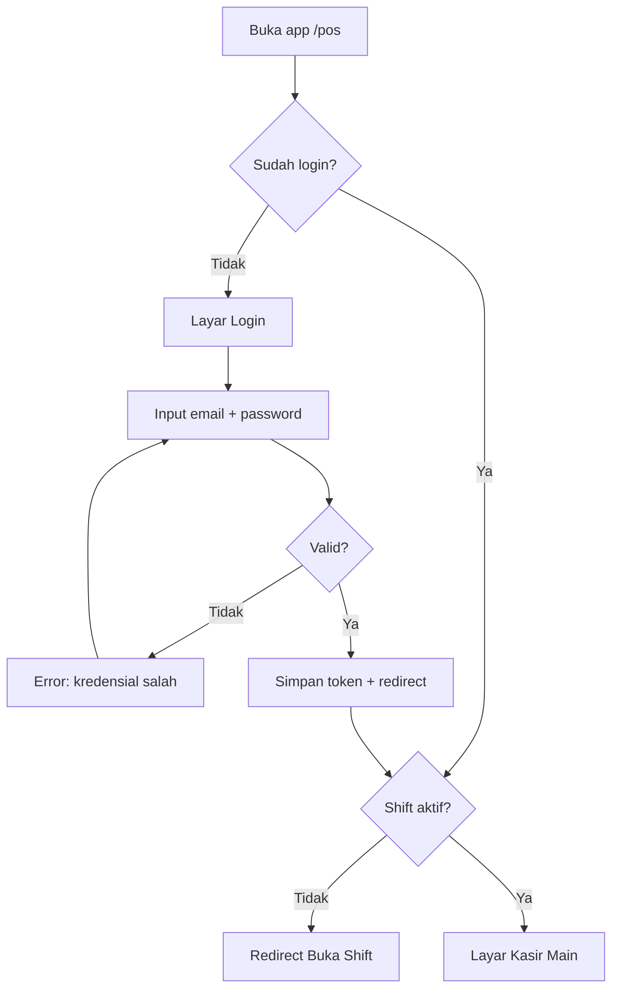
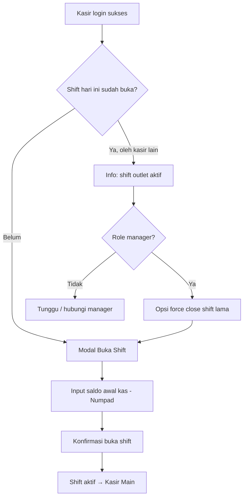
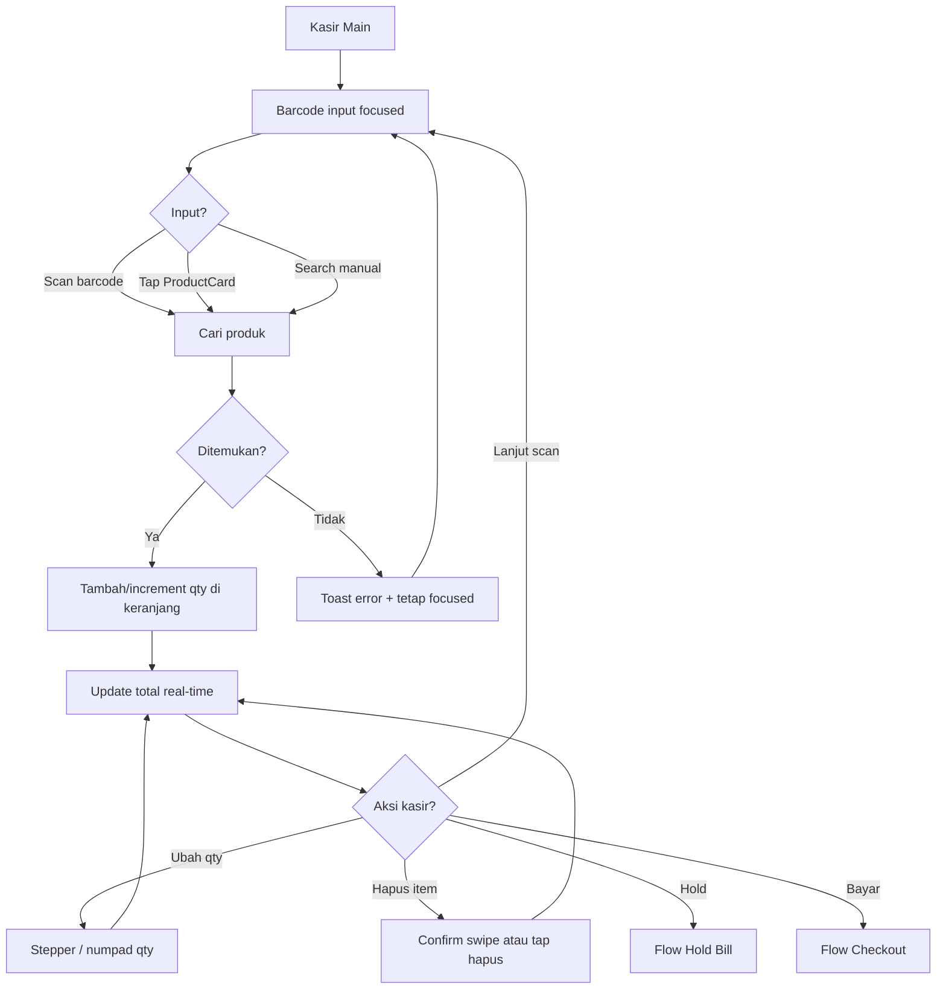
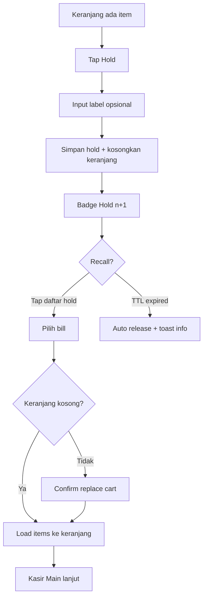
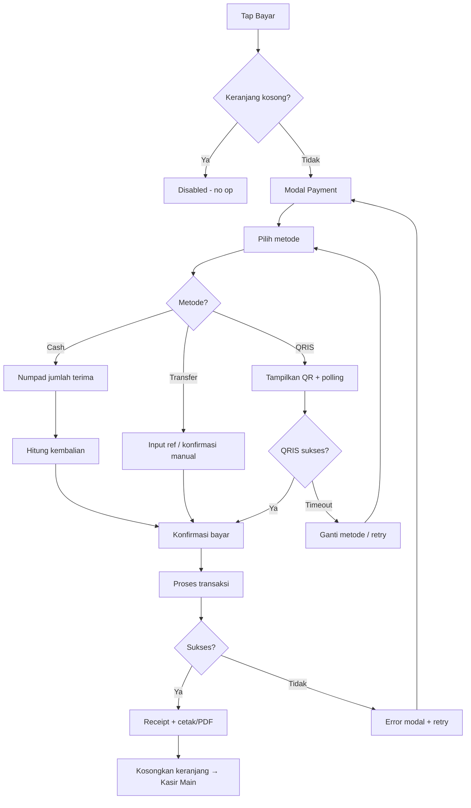
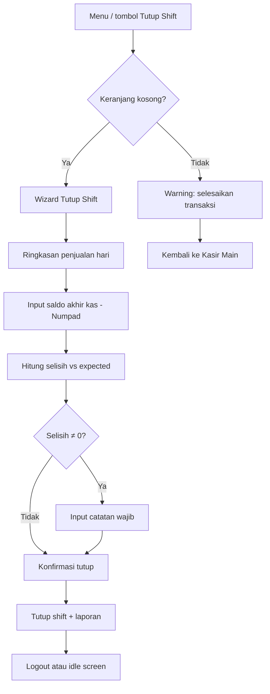
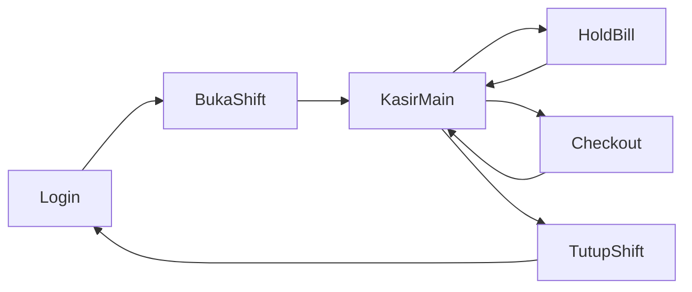

> 📚 [Indeks Dokumentasi](../INDEX.md) | Kategori: Design | Audience: Maya, Dewi, Fajar

# User Flows — Modul Kasir MVP

> Disusun oleh **@ui-ux** | Requirement: `docs/requirements/MVP-CHECKLIST.md`

Alur operasional kasir Barokah POS. Setiap flow dilengkapi daftar layar dan deskripsi wireframe (text-based).

---

## 1. Login

### Screen List — Login

| ID | Nama | Deskripsi Wireframe |
|----|------|---------------------|
| SCR-L01 | Login | Logo Barokah center-top; form email + password; tombol "Masuk" full-width primary; link lupa password (P1) |
| SCR-L02 | Login Error | Inline error di bawah password; shake animation ringan; focus kembali ke field error |

---

## 2. Buka Shift

### Screen List — Buka Shift

| ID | Nama | Deskripsi Wireframe |
|----|------|---------------------|
| SCR-S01 | Buka Shift Modal | Blocking overlay; heading "Buka Shift"; info outlet + tanggal; field saldo awal + numpad 3×4; tombol "Buka Shift" primary |
| SCR-S02 | Shift Conflict | Banner: shift aktif oleh [nama kasir] sejak [jam]; tombol secondary "Hubungi Manager" |
| SCR-S03 | Shift Open Success | Toast hijau "Shift dibuka"; redirect ke kasir main |

---

## 3. Transaksi Kasir (Main Loop)

### Screen List — Transaksi Kasir

| ID | Nama | Deskripsi Wireframe |
|----|------|---------------------|
| SCR-K01 | Kasir Main | Header: outlet, kasir, shift timer, hold badge; kiri: search + grid ProductCard; kanan: CartPanel sticky; hidden barcode input always focused |
| SCR-K02 | Product Not Found | Toast merah "Produk tidak ditemukan"; suggestion chip kategori populer |
| SCR-K03 | Qty Edit | Inline stepper di CartLineItem; long-press qty → numpad modal |
| SCR-K04 | Remove Item | IconButton hapus; confirm jika qty > 5 atau subtotal > Rp 100rb |

---

## 4. Hold Bill

### Screen List — Hold Bill

| ID | Nama | Deskripsi Wireframe |
|----|------|---------------------|
| SCR-H01 | Hold Confirm | Bottom sheet: label opsional (Meja 3); tombol "Tahan Transaksi" |
| SCR-H02 | Hold List Drawer | Side drawer: list hold dengan label, total, countdown TTL; tap = recall |
| SCR-H03 | Replace Cart Confirm | Modal: "Keranjang aktif akan diganti" — Batal / Lanjutkan |

---

## 5. Checkout

### Screen List — Checkout

| ID | Nama | Deskripsi Wireframe |
|----|------|---------------------|
| SCR-P01 | Payment Modal | Total besar; breakdown subtotal/PPN; PaymentMethodPicker tiles |
| SCR-P02 | Cash Payment | Numpad + field terima; kembalian hijau besar; shortcut "Uang pas" |
| SCR-P03 | Transfer Confirm | Checkbox "Transfer diterima"; field catatan opsional |
| SCR-P04 | QRIS | QR center; countdown 120s; status polling; tombol "Batalkan QRIS" |
| SCR-P05 | Split Payment P0 | Tab metode 1 + metode 2; alokasi nominal per metode |
| SCR-P06 | Processing | Skeleton/button loading; non-blocking cancel hanya pre-submit |
| SCR-P07 | Success | Checkmark + no struk; auto-print; tombol "Transaksi Baru" |
| SCR-P08 | Receipt Preview | Layout thermal 58mm; tombol Cetak Ulang / Share PDF |

---

## 6. Tutup Shift

### Screen List — Tutup Shift

| ID | Nama | Deskripsi Wireframe |
|----|------|---------------------|
| SCR-C01 | Pre-close Warning | Modal: item di keranjang / hold aktif — selesaikan dulu |
| SCR-C02 | Shift Summary | Card: total penjualan, per metode bayar, jumlah transaksi |
| SCR-C03 | Cash Reconciliation | Expected cash vs input saldo akhir; selisih merah/hijau |
| SCR-C04 | Close Confirm | Checkbox "Saya yakin data benar"; tombol danger "Tutup Shift" |
| SCR-C05 | Shift Closed | Ringkasan printable; tombol "Logout" |

---

## Cross-Flow Navigation

---

## Handoff

| Tim | Artefak |
|-----|---------|
| @senior-dev | Screen ID → route mapping; component list per SCR-* |
| @docs | User guide kasir per flow; placeholder `[SS: SCR-*]` |
| @analyst | Validasi acceptance criteria vs screen list |
