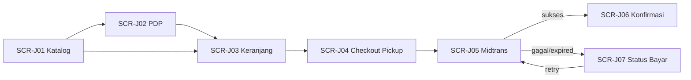

> 📚 [Indeks Dokumentasi](../INDEX.md) | Kategori: Design | Audience: Maya, Dimas, Fajar, Dewi, Citra

# Wireframes Storefront — Epic J (Penjualan Online Web)

> Disusun oleh **Maya Anggraini** · UI/UX Specialist  
> **Tanggal:** 2 Juni 2026  
> **Status:** **Approved untuk handoff Dimas** (gate Sprint 13 Track B)  
> **Design tokens:** [DESIGN-SYSTEM.md](./DESIGN-SYSTEM.md)  
> **User story:** [EPIC-J-USER-STORIES.md](../requirements/EPIC-J-USER-STORIES.md) · **Keputusan:** [ADR-004](../decisions/ADR-004-EPIC-J-DEFAULTS-LOCKED.md)

Wireframe text-based untuk **storefront publik** tenant (guest, mobile-first). Vertical pilot: **toko bahan bangunan**. Alur P0: katalog → PDP → keranjang → checkout **pickup** → **Midtrans** → konfirmasi order.

---

## Ringkasan Keputusan UX (ADR-004)

| Keputusan | Implikasi wireframe |
|-----------|---------------------|
| Q-J01 Pickup P0, delivery P1 | Tab **Pickup** aktif; **Delivery** tidak ditampilkan di MVP (placeholder P1 di catatan) |
| Q-J02 Guest P0 | Tanpa login; tidak ada menu akun di header |
| Q-J03 Midtrans P0 | Layar pembayaran digital wajib setelah checkout valid |
| Q-J04 URL per tenant + pilih outlet | Pilih **cabang pickup** di checkout (bukan subdomain per outlet) |
| Q-J05 Stok real-time + cache | Badge stok + refresh manual; indikator cache ≤ 60 detik |
| Q-J06 Gambar/placeholder wajib | `ProductCard` selalu punya gambar atau placeholder tenant |
| Q-J07 Harga = kasir | Harga di kartu/PDP/keranjang identik POS; tanpa badge “harga online” |

---

## Prinsip Desain Storefront (Bahan Bangunan)

| Prinsip | Aturan |
|---------|--------|
| **Mobile-first** | Layout dioptimalkan lebar **360px**; konten utama terbaca tanpa zoom (AC-J02-6) |
| **Tone retail proyek** | Copy praktis: satuan jelas (sak, batang, galon), MOQ/kelipatan terlihat, pickup di toko |
| **Kepercayaan** | Logo tenant, alamat outlet pickup, nomor order WEB-* menonjol |
| **Guest friction rendah** | Tanpa registrasi; keranjang persist session 24 jam |
| **Stok jujur** | Label **Tersedia** / **Habis**; blok checkout jika stok tidak cukup |
| **Harga transparan** | Subtotal + PPN 11% + total selalu terlihat sebelum bayar |

### Perbedaan dengan Kasir (DESIGN-SYSTEM)

| Aspek | Kasir (`WIREFRAMES-KASIR.md`) | Storefront (dokumen ini) |
|-------|------------------------------|---------------------------|
| Pengguna | Staff (RBAC) | **Guest** publik |
| Mode default | Light/Dark shift | **Light** (browsing siang/malam proyek) |
| Touch target | 48px operasi cepat | **44px** min (scroll katalog); CTA utama **48px** |
| Komponen utama | Barcode, numpad, shift | `ProductCard`, keranjang, form kontak, Midtrans |
| Token warna | Sama — `primary.600` untuk CTA **Beli / Bayar** | |

---

## Alur Layar P0 (Guest)



**Traceability AC:**

| Layar | User story | AC utama |
|-------|------------|----------|
| SCR-J01 | US-J-01 | AC-J01-1 … J01-7 |
| SCR-J02 | US-J-02 | AC-J02-1 … J02-6 |
| SCR-J03 | US-J-03 | AC-J03-1 … J03-6 |
| SCR-J04 | US-J-04 | AC-J04-1 … J04-6 |
| SCR-J05 | US-J-06 | AC-J06-1 … J06-3 |
| SCR-J06 | US-J-06 + J-04 | AC-J04-5, AC-J06-3 |
| SCR-J07 | US-J-06 | AC-J06-4, AC-J06-5 |

---

## Shell Storefront (semua layar)

Header ringan — **bukan** layout kasir:

```
┌─────────────────────────────────────┐
│ [Logo Tenant]  Toko Bangun Jaya      │  ← branding tenant (Q-J04 slug)
│                         🛒 (2)      │  ← badge qty; tap → SCR-J03
├─────────────────────────────────────┤
│         (konten layar)              │
└─────────────────────────────────────┘
```

| Elemen | Spesifikasi |
|--------|-------------|
| Tinggi header | 56px sticky |
| Logo | max 120×40px; fallback inisial tenant |
| Keranjang | `IconButton` 44×44; badge `body.sm` merah jika qty > 0 |
| Footer opsional | © tenant · link “Hubungi toko” (tel: outlet default) — P1 |

**Route suggested:** `/store/[tenantSlug]/...`

---

## SCR-J01 — Katalog Publik (Guest)

**US-J-01** · Prioritas **P0** · Mobile 360px

```
┌─────────────────────────────────────┐
│ [Logo] Toko Bangun Jaya      🛒 (0) │
├─────────────────────────────────────┤
│ 🔍 Cari semen, pipa, SKU...         │  ← SearchInput 48px; debounce 300ms
├─────────────────────────────────────┤
│ [Semua][Semen][Cat][Pipa][Besi]…    │  ← chips horizontal scroll, 40px
├─────────────────────────────────────┤
│ Stok per cabang: Cabang Pusat ▾      │  ← opsional P0: default outlet;
│                          ↻ Perbarui  │     cache TTL; AC-J01-6
├─────────────────────────────────────┤
│ ┌──────────┐ ┌──────────┐           │
│ │ [foto/   │ │ [foto/   │           │
│ │  placeholder]         │           │
│ │ Semen    │ │ Cat Avian│           │
│ │ Gresik   │ │ 25kg     │           │
│ │ 40kg     │ │          │           │
│ │ Rp 65.000│ │ Rp 89.000│           │
│ │ /sak     │ │ /pail    │           │
│ │ ● Tersedia│ │ ○ Habis  │           │  ← dot hijau / abu
│ └──────────┘ └──────────┘           │
│ ┌──────────┐ ┌──────────┐           │
│ │ ...      │ │ ...      │           │
│ └──────────┘ └──────────┘           │
│         (scroll grid 2 kolom)       │
└─────────────────────────────────────┘
```

### Spesifikasi zona

| Zone | Behavior |
|------|----------|
| Grid produk | 2 kolom mobile; `gap: md` (16px); kartu min tinggi 200px |
| `ProductCard` | Gambar 1:1 `md` radius; nama `body.lg` max 2 baris; harga `heading.md` tabular-nums |
| Badge stok | **Tersedia** (`success`) / **Habis** (`text.secondary`); kartu habis: opacity 0.6, tap → PDP readonly |
| Filter kategori | Client/server filter tanpa full reload (AC-J01-3) |
| Pencarian | Nama atau SKU; target ≤ 2 detik (AC-J01-4) |
| Data | Hanya `sellOnline=true`, aktif; **tanpa** HPP/margin (AC-J01-7) |

### Tablet / desktop (≥ 768px)

```
┌──────────────────────────────────────────────────────────┐
│ Header (sama)                                            │
├────────────┬─────────────────────────────────────────────┤
│ Kategori   │  Grid 3–4 kolom                             │
│ vertikal   │  (sidebar 200px)                            │
│ Semen      │                                             │
│ Cat        │                                             │
│ Pipa       │                                             │
└────────────┴─────────────────────────────────────────────┘
```

### Empty / error

```
┌─────────────────────────────────────┐
│  🔍 Tidak ada produk untuk "xyz"    │
│  Coba kata lain atau pilih kategori │
└─────────────────────────────────────┘
```

---

## SCR-J02 — Detail Produk (PDP)

**US-J-02** · Prioritas **P0**

```
┌─────────────────────────────────────┐
│ ← Kembali                    🛒 (2) │
├─────────────────────────────────────┤
│ ┌─────────────────────────────────┐ │
│ │                                 │ │
│ │     [Gambar produk /            │ │
│ │      placeholder tenant]        │ │  ← carousel jika multi gambar P1
│ │                                 │ │
│ └─────────────────────────────────┘ │
│ Semen Gresik PCC 40 kg              │  heading.lg
│ SKU: SMN-GRS-40 · Sak               │  body.md secondary
│ ● Tersedia di Cabang Pusat          │
│                                     │
│ Rp 65.000 / sak                     │  display atau heading.md
│                                     │
│ Varian ukuran:                      │  jika ada varian (AC-J02-1)
│ [40kg ✓] [50kg]                     │  chip selected ring primary.600
│                                     │
│ ℹ Min. order 2 sak · kelipatan 2    │  info banner — MOQ (AC-J02-3)
│                                     │
│ Jumlah:  [ − ]  2  [ + ]            │  QtyStepper 48px
│                                     │
│ ┌─────────────────────────────────┐ │
│ │      T A M B A H  K E  K E R A N J A N G   │  primary CTA 48px
│ └─────────────────────────────────┘ │
│                                     │
│ Deskripsi singkat                   │
│ Semen Portland untuk struktur...    │  body.md, max ~4 baris + "selengkapnya"
└─────────────────────────────────────┘
```

| State | UI |
|-------|-----|
| Stok 0 | CTA disabled + teks "Stok habis di cabang ini" |
| Varian nonaktif | Chip disabled, tidak bisa dipilih (AC-J02-2) |
| MOQ gagal | Toast error Bahasa Indonesia saat tap CTA |
| Harga | Update realtime saat ganti varian (AC-J02-5) |

**Sticky bottom (mobile):** CTA tetap visible saat scroll deskripsi.

---

## SCR-J03 — Keranjang Belanja

**US-J-03** · Guest · Prioritas **P0**

```
┌─────────────────────────────────────┐
│ ← Belanja                    🛒     │
├─────────────────────────────────────┤
│ Keranjang (3 item)                  │  heading.lg
│ ─────────────────────────────────── │
│ Semen Gresik 40kg                   │
│ 2 sak × Rp 65.000                   │  body.md
│ [ − ] 2 [ + ]              Rp 130.000│
│                              [Hapus]│
│ ─────────────────────────────────── │
│ Cat Avian 25kg — Putih              │
│ 1 pail × Rp 89.000                  │
│ [ − ] 1 [ + ]               Rp 89.000│
│ ─────────────────────────────────── │
│                                     │
│ Ringkasan                           │
│ Subtotal                    Rp 219.000│
│ PPN 11%                      Rp 24.090│  ← belum termasuk di subtotal baris
│ ─────────────────────────────────── │
│ TOTAL                       Rp 243.090│  display / bold
│                                     │
│ ┌─────────────────────────────────┐ │
│ │      L A N J U T  C H E C K O U T │  48px primary — ke SCR-J04
│ └─────────────────────────────────┘ │
│                                     │
│ Lanjutkan belanja                   │  ghost link → SCR-J01
└─────────────────────────────────────┘
```

| Validasi | Feedback |
|----------|----------|
| Qty > stok | Toast: "Stok tidak mencukupi. Maksimal X sak." — qty tidak berubah (AC-J03-2) |
| MOQ/kelipatan | Inline merah di baris item (AC-J03-3) |
| Persist | localStorage/sessionStorage 24 jam (AC-J03-4) |
| Delivery P1 | **Tidak** tampilkan opsi delivery di MVP |

### Keranjang kosong

```
┌─────────────────────────────────────┐
│  🛒 Keranjang masih kosong          │
│  Yuk, pilih material untuk proyekmu │
│  [ Lihat katalog ]                  │
└─────────────────────────────────────┘
```

---

## SCR-J04 — Checkout Pickup

**US-J-04** · Prioritas **P0**

```
┌─────────────────────────────────────┐
│ ← Checkout                          │
├─────────────────────────────────────┤
│ Pengambilan di toko                 │  heading.md
│ ◉ Pickup di cabang    ○ Delivery    │  Delivery disabled/hidden MVP
│                                     │
│ Pilih cabang pickup *               │
│ ┌─────────────────────────────────┐ │
│ │ Cabang Pusat — Jl. Raya No. 12 ▾│ │  wajib (AC-J04-1)
│ └─────────────────────────────────┘ │
│ ┌─────────────────────────────────┐ │
│ │ Cabang Timur — Jl. ...          │ │
│ └─────────────────────────────────┘ │
│                                     │
│ Data kontak                         │
│ Nama lengkap *                      │
│ ┌─────────────────────────────────┐ │
│ │ Budi Santoso                    │ │
│ └─────────────────────────────────┘ │
│ No. HP (WhatsApp) *                 │
│ ┌─────────────────────────────────┐ │
│ │ 0812xxxxxxxx                    │ │  mask/format ID
│ └─────────────────────────────────┘ │
│ Catatan order (opsional)            │
│ ┌─────────────────────────────────┐ │
│ │ Warna cat cream, plat B 1234 XY │ │
│ └─────────────────────────────────┘ │
│                                     │
│ Ringkasan pesanan                   │
│ 2× Semen Gresik 40kg      Rp 130.000│
│ 1× Cat Avian 25kg          Rp  89.000│
│ Subtotal                   Rp 219.000│
│ PPN 11%                    Rp  24.090│
│ TOTAL                      Rp 243.090│
│                                     │
│ 📍 Ambil di: Cabang Pusat           │
│    Jl. Raya No. 12, Kota X          │
│ ⏱ Estimasi siap: 2–4 jam kerja       │  teks statis P0 (AC-J04-3)
│                                     │
│ ┌─────────────────────────────────┐ │
│ │   L A N J U T  P E M B A Y A R A N │  → validasi stok final → SCR-J05
│ └─────────────────────────────────┘ │
└─────────────────────────────────────┘
```

### Blok stok tidak cukup (AC-J04-4)

```
┌─────────────────────────────────────┐
│ ⚠ Beberapa item tidak tersedia      │
│ di Cabang Timur:                    │
│ • Semen Gresik 40kg (butuh 2, ada 1)│
│ [ Ubah cabang ] [ Kembali ke keranjang ]│
└─────────────────────────────────────┘
```

| Field | Validasi |
|-------|----------|
| Cabang | Wajib pilih sebelum submit |
| Nama | Min 2 karakter |
| HP | Format Indonesia, wajib |
| Login | **Tidak** diminta (AC-J04-6) |

---

## SCR-J05 — Pembayaran Midtrans

**US-J-06** · Redirect / Snap web · Prioritas **P0**

Setelah checkout valid, order dibuat status **menunggu bayar** → redirect ke Midtrans.

### SCR-J05a — Transisi (loading)

```
┌─────────────────────────────────────┐
│                                     │
│        [spinner]                    │
│   Mengalihkan ke pembayaran...      │
│   Order WEB-20260602-0042           │  mono
│   Jangan tutup halaman ini          │
│                                     │
└─────────────────────────────────────┘
```

### SCR-J05b — Midtrans Snap (hosted / embedded)

> UI utama dikontrol Midtrans. Barokah menampilkan **chrome minimal** jika embedded:

```
┌─────────────────────────────────────┐
│ ← Batalkan                          │
├─────────────────────────────────────┤
│ Bayar pesanan WEB-20260602-0042     │
│ Total: Rp 243.090                   │
│ ─────────────────────────────────── │
│                                     │
│   (iframe / redirect Midtrans)      │
│   QRIS · Virtual Account · E-wallet │
│                                     │
│ ⏱ Selesaikan dalam 59:12            │  TTL default 60 menit (RFC)
│                                     │
└─────────────────────────────────────┘
```

**Metode minimal (AC-J06-2):** QRIS, VA, e-wallet — selaras POC kasir.

---

## SCR-J06 — Konfirmasi Order

**Setelah pembayaran sukses** (webhook `PAID`) atau **order terbuat menunggu bayar** (state awal pre-redirect)

### SCR-J06a — Pembayaran berhasil (AC-J06-3)

```
┌─────────────────────────────────────┐
│            ✓                        │
│   Pembayaran berhasil!              │  success color
│                                     │
│ No. pesanan                         │
│   WEB-20260602-0042                 │  mono, copy button
│                                     │
│ Total dibayar     Rp 243.090        │
│                                     │
│ Ambil di:                           │
│ 📍 Cabang Pusat                     │
│    Jl. Raya No. 12                  │
│    Senin–Sabtu 08:00–17:00          │
│                                     │
│ Bawa saat pickup:                   │
│ • No. pesanan / screenshot ini      │
│ • HP terdaftar: 0812…               │
│                                     │
│ ┌─────────────────────────────────┐ │
│ │      Lihat detail pesanan       │ │  P1 — guest tanpa akun: cukup screenshot
│ └─────────────────────────────────┘ │
│ [ Kembali ke katalog ]              │
└─────────────────────────────────────┘
```

### SCR-J06b — Order dibuat, menunggu pembayaran (pre-redirect snapshot)

Digunakan jika perlu halaman ringkasan sebelum Snap — opsional implementasi:

```
┌─────────────────────────────────────┐
│ Pesanan dibuat                      │
│ WEB-20260602-0042                   │
│ Status: Menunggu pembayaran         │  info badge
│ [ Lanjut bayar ]                    │
└─────────────────────────────────────┘
```

---

## SCR-J07 — Status Pembayaran Gagal / Expired

**US-J-06** · AC-J06-4, AC-J06-5

```
┌─────────────────────────────────────┐
│            ✕                        │
│   Pembayaran gagal / kedaluwarsa    │  error color
│                                     │
│ Order WEB-20260602-0042             │
│ Status: Dibatalkan                  │
│                                     │
│ Stok telah dilepas. Anda bisa       │
│ membuat pesanan baru.               │
│                                     │
│ ┌─────────────────────────────────┐ │
│ │      C O B A  B A Y A R  L A G I  │  jika order masih valid & belum expired
│ └─────────────────────────────────┘ │
│ [ Kembali ke keranjang ]            │
└─────────────────────────────────────┘
```

| State | Aksi |
|-------|------|
| Gagal, order masih `NEW` | **Coba bayar lagi** → SCR-J05 |
| Expired 60 menit | Order `CANCELLED`; hanya katalog/keranjang baru |
| Webhook duplikat | UI idempotent — tidak double toast sukses |

---

## Pola Error & Feedback (Storefront)

### Toast (validasi qty / MOQ)

```
┌──────────────────────────────────────┐
│ ✕  Kelipatan order: 2 sak            │
└──────────────────────────────────────┘
  bottom-center, 3s, border-left error
```

### Banner info (cache stok)

```
┌──────────────────────────────────────┐
│ ℹ Stok diperbarui 14:32 · Perbarui   │
└──────────────────────────────────────┘
  `info` token; sticky bawah search
```

### Skeleton loading (katalog)

```
┌──────────┐ ┌──────────┐
│ ░░░░░░░░ │ │ ░░░░░░░░ │
│ ░░░      │ │ ░░░      │
└──────────┘ └──────────┘
```

---

## Komponen dari DESIGN-SYSTEM (reuse)

| Komponen | Penggunaan storefront |
|----------|----------------------|
| `Button` primary | Tambah keranjang, Lanjut checkout, Bayar |
| `Button` ghost | Kembali, Lanjutkan belanja |
| `SearchInput` | Katalog SCR-J01 |
| `ProductCard` | Katalog grid — tanpa barcode scanner |
| `CartLineItem` + `QtyStepper` | SCR-J03 |
| `TotalDisplay` | Ringkasan PPN + total |
| `Badge` | Stok, status order |
| `Toast` | Validasi |
| `Banner` | Cache stok, error stok checkout |
| `Modal` / `BottomSheet` | Pilih cabang (mobile: bottom sheet) |

**Token wajib:** `primary.600` CTA, `tabular-nums` harga, spacing `md`/`lg`, radius `md` kartu.

---

## Screen → Route Mapping (handoff Dimas)

| Screen ID | Route (suggested) | Layout | Catatan |
|-----------|-------------------|--------|---------|
| SCR-J01 | `/store/[slug]` | Storefront shell | Katalog default |
| SCR-J02 | `/store/[slug]/p/[productId]` | Shell | PDP |
| SCR-J03 | `/store/[slug]/cart` | Shell | Guest cart |
| SCR-J04 | `/store/[slug]/checkout` | Shell | Pickup + kontak |
| SCR-J05 | `/store/[slug]/pay/[orderId]` | Minimal chrome | Midtrans redirect |
| SCR-J06 | `/store/[slug]/order/[orderId]/success` | Shell | Konfirmasi |
| SCR-J07 | `/store/[slug]/order/[orderId]/failed` | Shell | Retry / batal |

**Tenant routing (Q-J04):** satu slug per tenant; `outletId` disimpan di state checkout + order payload.

---

## Di Luar Scope Wireframe P0 (referensi)

| Item | Prioritas | Catatan |
|------|-----------|---------|
| US-J-05 Delivery | P1 | Tab Delivery + form alamat — wireframe terpisah saat unlock |
| US-J-07 Antrian POS kasir | P0 backend | UI kasir/owner — sprint berikutnya (US-J-08) |
| Login / riwayat order | P1 | Q-J02 |
| Bayar di toko saat pickup | P1 | Q-J03 |
| Kelola katalog web | Owner/Manager | Q-J08 — admin, bukan storefront guest |

---

## Handoff Log

| From | To | Task | Deliverable | Parallel OK? | Next action |
|------|-----|------|-------------|--------------|-------------|
| Maya · UI/UX | Dimas · Senior Frontend | Implement skeleton storefront P0 | Route + komponen `@barokah/ui` | Tidak — tunggu kontrak Fajar | SCR-J01…J07 |
| Maya · UI/UX | Fajar · Senior Dev | Review field checkout/order | OpenAPI `online_orders` | Ya | Selaraskan nomor WEB-* |
| Maya · UI/UX | Citra · QA | Kasus UAT dari wireframe | Test plan Epic J | Ya | AC per layar |
| Maya · UI/UX | Fitri · Docs | Indeks + panduan guest | INDEX.md | Ya | — |

---

## Handoff Checklist (Dimas)

- [ ] Mobile 360px: SCR-J01 grid 2 kolom, SCR-J02 sticky CTA
- [ ] Guest cart persist `localStorage` 24 jam
- [ ] PPN 11% breakdown konsisten kasir (Eko)
- [ ] Placeholder gambar tenant jika `imageUrl` null (Q-J06)
- [ ] Checkout: picker cabang + validasi stok blocking
- [ ] Integrasi Midtrans Snap — loading SCR-J05a
- [ ] Halaman sukses/gagal idempotent terhadap webhook
- [ ] **Tidak** implement delivery tab sebelum flag P1

---

*Disusun: Maya Anggraini · 2 Juni 2026 · Gate Sprint 13 Track B Epic J*
