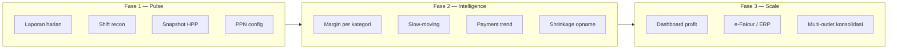

> 📚 [Indeks Dokumentasi](../INDEX.md) | Kategori: Domain | Audience: Rina, Dewi, Budi, Eko

# Keuangan & Ekonomi POS — Domain Barokah Core

> **Penyusun:** Rina Wulandari (@pos-expert)  
> **Audience:** CEO, tim produk, merchant UMKM Indonesia  
> **Versi:** 1.0 | Juni 2026  
> **Skill terkait:** `.cursor/skills/pos-domain-expert/SKILL.md` (section Knowledge Keuangan)  
> **Algoritma:** `.cursor/skills/pos-algorithm/SKILL.md` (Eko — implementasi, bukan duplikasi di sini)

---

## Ringkasan Eksekutif (untuk Budi)

Barokah Core bukan sekadar mesin kasir — visi **POS profesional** adalah memberkahi (*barokah*) pertumbuhan merchant SMB Indonesia dengan:

1. **Visibilitas profitabilitas** — omzet saja tidak cukup; laba kotor, margin kategori, dan biaya tersembunyi (shrinkage, dead stock) harus terbaca dari data POS.
2. **Arus kas harian** — rekonsiliasi shift dan payment mix (cash vs QRIS) sebagai denyut likuiditas toko.
3. **Inventori sebagai investasi** — working capital terbesar UMKM ada di rak; turnover dan slow-moving sama pentingnya dengan penjualan.
4. **Kepatuhan pajak yang tepat** — PKP vs non-PKP, PPN 11%, agregat omzet untuk pelaporan; POS sebagai sumber data, bukan pengganti konsultan pajak.
5. **Insights untuk merchant** — bahasa sederhana ("hari ini vs kemarin", "SKU yang tidak bergerak"), bukan hanya export untuk akuntan.

Roadmap finansial selaras fase produk: **MVP = pulse harian**, **Fase 2 = intelligence**, **Fase 3 = analytics & integrasi accounting**.

---

## Visi & Peta Modul Finansial



| Pilar visi | Modul POS | Owner implementasi |
|------------|-----------|-------------------|
| Penjualan & arus kas | Transaksi, shift, laporan harian | Fajar + Arif (QRIS) |
| Profitabilitas | `cost_price`, laporan laba kotor | Eko (rumus) + Fajar |
| Nilai inventori | Stok, opname, movement ledger | Eko + Fajar |
| Pajak | Tenant PKP flag, PPN di struk, agregat omzet | Eko + Fitri (panduan) |
| Pertumbuhan merchant | Insight cards, break-even hint | Maya + Dewi (AC) |

---

## A. Ekonomi Retail SMB Indonesia

### Struktur margin

| Istilah | Rumus (konsep) | Contoh retail |
|---------|----------------|---------------|
| **Margin kotor (gross margin)** | (Penjualan − HPP) ÷ Penjualan | Minimarket 15–25%, fashion 50–60%, F&B 60–70% (food cost) |
| **Margin bersih (net margin)** | Laba setelah semua biaya operasional | POS tidak hitung sewa/gaji; merchant butuh akuntansi terpisah |

**Implikasi Barokah:** field `cost_price` (harga modal) di master produk wajib didorong untuk merchant yang ingin insight profit; di-copy ke line item saat transaksi (immutable).

### Working capital & inventori

- UMKM sering **kehabisan kas bukan karena tidak laku**, tapi karena overstock.
- POS harus menjawab: *"Berapa rupiah uang saya yang tertahan di rak?"* → nilai stok = Σ (qty × cost).
- **Inventory turnover** (perputaran) tinggi = modal cepat kembali; rendah = risiko dead stock.

### Seasonality

| Periode | Pola umum | Kebutuhan POS |
|---------|-----------|---------------|
| Lebaran / Natal | Spike FMCG, gift | Promo, stok cadangan, laporan banding tahun lalu (P2) |
| Gajian (akhir/bulan awal) | Lonjakan belanja | Laporan per hari dalam bulan |
| Back-to-school | Alat tulis, seragam | Kategori seasonal tag (P2) |

### Inflasi & pricing

- Biaya beli naik, harga jual tertinggal → margin menyusut tanpa merchant sadar.
- Checklist: alert jika margin kategori < threshold; riwayat perubahan harga beli (P2).

### UMKM vs merchant berkembang

| Segmen | Karakteristik | Fitur POS prioritas |
|--------|---------------|---------------------|
| **UMKM tunggal** | Owner = kasir, cash-heavy, non-PKP umum | Sederhana, mobile, laporan harian |
| **Growing chain** | Multi-outlet, manager, accountant role | Konsolidasi, approval void, export pajak |

---

## B. Keuangan Operasional Toko

### Laporan penjualan harian

Minimum yang merchant harus lihat tanpa buka Excel:

- Total omzet & jumlah transaksi
- Rata-rata nilai struk (average basket)
- Pembayaran: cash / QRIS / transfer (%)
- 5 produk terlaris (qty & omzet)
- Perbandingan dengan hari sebelumnya (P2)

### Rekonsiliasi kas & non-cash

**Shift close:**

1. Saldo awal kas + penjualan cash − pengeluaran kas = kas yang diharapkan
2. Kas fisik dihitung manual → selisih dicatat dengan alasan
3. QRIS/transfer: cocokkan dengan laporan settlement aggregator (bukan hanya total POS)

### COGS & laba kotor

- **HPP (Harga Pokok Penjualan)** = cost per unit × qty terjual
- **Laba kotor** = Omzet − HPP (level transaksi, hari, kategori)
- Tanpa HPP di master → fitur laba kotor tidak boleh ditampilkan (anti-pattern)

### Dead stock & slow-moving

- SKU tanpa penjualan dalam X hari (config, default 30–90) = modal menganggur
- Rekomendasi bisnis: diskon, bundle, stop reorder — bukan hanya hapus stok

### Shrinkage (selisih stok)

- Penyebab: pencurian, rusak, input salah, gratis tidak tercatat
- Opname berkala + `stock_movements` ledger → selisih masuk laporan kerugian (P2)

### Break-even harian (edukasi)

Konsep untuk merchant:

```
Break-even harian ≈ Biaya tetap bulanan ÷ Hari operasi dalam bulan
```

Jika omzet harian POS > break-even → merchant menutup biaya tetap hari itu. Barokah bisa tampilkan hint setelah merchant input perkiraan biaya tetap (P2, opsional).

---

## C. Perpajakan Indonesia (lensa bisnis)

> **Penting:** Ambang omzet, tarif, dan ketentuan PKP berubah. Selalu **verifikasi regulasi terbaru** di [DJP](https://www.pajak.go.id/) sebelum fitur hard-code threshold.

### PKP vs non-PKP

| Status | Pungutan PPN di kasir | POS |
|--------|----------------------|-----|
| **PKP** | Wajib pungut PPN 11% (jika barang kena pajak) | Tampilkan DPP + PPN di struk; konfigurasi inclusive/exclusive |
| **Non-PKP** | Tidak memungut PPN | Mode tanpa PPN; label jelas agar tidak menyesatkan pelanggan |

### PPN 11%

- **Inclusive:** harga di label sudah termasuk PPN — umum retail consumer
- **Exclusive:** PPN ditambahkan di kasir — umum B2B / wholesale
- Keputusan **merchant**, disimpan per tenant & per produk (`tax_inclusive`)

### Faktur pajak

- Transaksi ke badan/usaha PKP pembeli sering butuh **Faktur Pajak**
- POS level: capture NPWP, nama pembeli, nilai DPP/PPN; nomor faktur dari sistem e-Faktur (integrasi P2/P3)
- Struk retail B2C umumnya cukup bukti pembayaran, bukan faktur penuh

### Omzet & PPh UMKM (informasi umum)

- **Agregat omzet** per bulan/tahun dari POS = dasar diskusi dengan konsultan pajak
- Skema **PPh final UMKM** vs **PPh badan/normal** bergantung bentuk usaha dan omzet — POS tidak menentukan skema, hanya menyediakan data
- Ambang wajib daftar PKP dan kriteria UMKM: **verify current regulation (PMK/DJP 2024–2026)**

---

## D. KPI yang Harus Didukung POS

| KPI | Bahasa merchant | Sumber data POS |
|-----|-----------------|-----------------|
| Sales per hour | Omzet per jam ramai | Timestamp transaksi + jam buka |
| Average basket | Rata-rata belanja per pelanggan | Omzet ÷ transaksi |
| Items per transaction | Berapa item per struk | Σ qty ÷ transaksi |
| Payment mix | Dominasi cash atau QRIS | `payments` per metode |
| Category margin | Kategori mana yang paling menguntungkan | Kategori × (harga − HPP) |
| Inventory turnover | Seberapa cepat stok berputar | COGS ÷ rata-rata nilai inventori |
| Days of stock | Stok cukup untuk berapa hari | Qty ÷ rata-rata penjualan harian |
| Cash conversion (sederhana) | Berapa lama uang tertahan | Kombinasi days of stock + receivable (P3) |

---

## E. Roadmap Fitur Financial Intelligence

### Fase 1 — MVP (sudah / sedang di checklist)

- [x] Laporan penjualan harian
- [x] Rekonsiliasi shift kas
- [x] Snapshot harga & `cost_price` di schema
- [x] Konfigurasi PPN 11% (algo Eko)
- [ ] Pastikan merchant paham: isi HPP = bisa lihat laba kotor

### Fase 2 — Growth

- [ ] Laba kotor harian & per kategori
- [ ] Slow-moving SKU report
- [ ] Payment mix trend (7 / 30 hari)
- [ ] Shrinkage dari opname
- [ ] Insight: omzet vs rata-rata minggu
- [ ] Break-even hint (input biaya tetap opsional)

### Fase 3 — Enterprise

- [ ] Dashboard profit multi-outlet
- [ ] Integrasi Jurnal / Accurate
- [ ] e-Faktur
- [ ] ABC analysis & forecasting seasonal

---

## F. Koordinasi Tim

| Dari Rina | Ke | Kapan |
|-----------|-----|-------|
| Checklist KPI / margin / pajak bisnis | Dewi | User story + AC |
| Rumus perhitungan | Eko | Spec algorithm |
| QRIS settlement & recon | Arif | Integrasi |
| Panduan PKP untuk merchant | Fitri | Manual / FAQ |
| UI dashboard keuangan | Maya | Sebelum Fajar coding |
| Prioritas backlog finansial | Hendra | Sprint planning |

**Tidak duplikasi:** Jika dokumen ini menyebut rumus PPN atau FIFO, detail implementasi hanya di skill Eko.

---

## Glosarium

| Istilah | Definisi singkat |
|---------|------------------|
| **COGS / HPP** | Biaya langsung barang terjual (harga modal × qty) |
| **Margin kotor** | Persentase atau nilai laba sebelum biaya operasional |
| **Margin bersih** | Laba setelah semua biaya (operasional, pajak, dll.) |
| **Omzet** | Total nilai penjualan (revenue) |
| **Working capital** | Modal kerja; di retail sering tertahan di inventori |
| **Turnover (perputaran stok)** | Seberapa cepat inventori terjual dan diganti |
| **Days of stock** | Estimasi hari stok akan habis pada ritme penjualan sekarang |
| **Dead stock** | Barang tidak laku, modal menganggur |
| **Slow-moving** | Barang laku lambat, risiko dead stock |
| **Shrinkage** | Selisih stok fisik vs sistem (biasanya rugi) |
| **Reconciliation (rekonsiliasi)** | Pencocokan catatan POS dengan kas fisik / bank / aggregator |
| **Average basket** | Rata-rata nilai per transaksi |
| **Payment mix** | Komposisi metode pembayaran |
| **DPP** | Dasar Pengenaan Pajak (dasar hitung PPN) |
| **PKP** | Pengusaha Kena Pajak — wajib/manage PPN |
| **PPN** | Pajak Pertambahan Nilai (11% per konfigurasi proyek) |
| **Break-even** | Titik di mana omzet = total biaya (tidak rugi/laba) |
| **Snapshot** | Salinan harga/HPP saat transaksi; tidak berubah jika master di-update |

---

## Anti-patterns yang Dihindari Barokah

1. Dashboard omzet besar tanpa angka laba — merchant overconfidence
2. Mengabaikan rekonsiliasi QRIS — selisih tunai digital tidak ketahuan
3. Opname tanpa analisis shrinkage — kerugian berulang
4. Satu mode PPN untuk semua tenant — salah regulasi & salah ekspektasi
5. Fitur akuntansi penuh di MVP — scope creep; fokus **financial pulse** dulu

---

## Dokumen Terkait

- [MVP-CHECKLIST.md](../requirements/MVP-CHECKLIST.md)
- [DATABASE-ANALYSIS.md](../database/DATABASE-ANALYSIS.md) — `cost_price`, `stock_movements`, role ACCOUNTANT
- [KNOWLEDGE-BASE.md](../team/KNOWLEDGE-BASE.md) — indeks tim
- [AGENTS.md](../../AGENTS.md) — visi perusahaan
