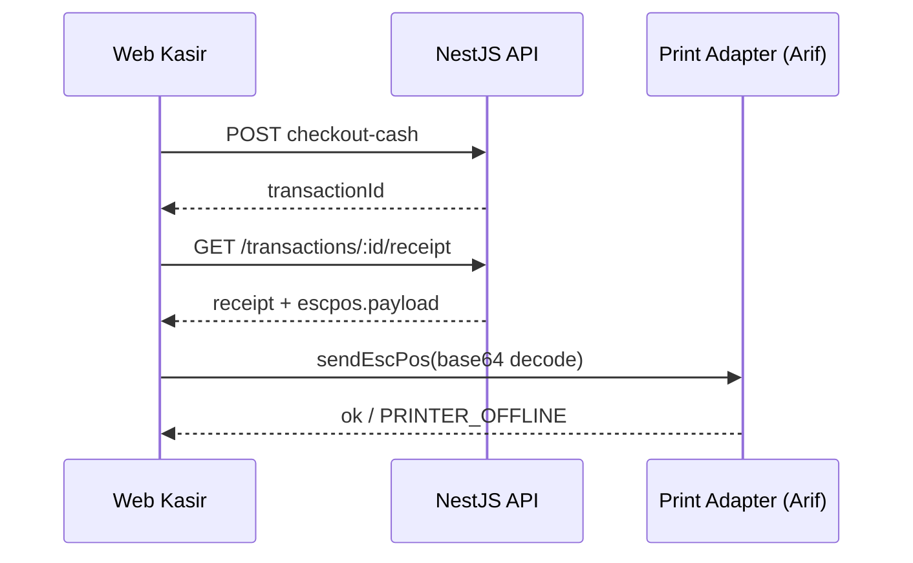

> 📚 [Indeks Dokumentasi](../INDEX.md) | Kategori: Integrasi | Audience: Arif, Fajar, Dimas, Pak Zaki

# Integrasi Thermal Printer — ESC/POS (Stub MVP)

> **Owner spec:** Arif Hidayat (Integration)  
> **Owner API:** Fajar Ramadhan  
> **Status:** Stub MVP — driver hardware Fase 2

---

## Ringkasan

Struk fisik dicetak ke printer thermal 58mm/80mm via perintah **ESC/POS**. Backend menyediakan:

1. **Struk digital** — JSON terstruktur untuk preview web/PWA.
2. **Stub ESC/POS** — byte stream UTF-8 di-encode **base64** dari `GET /api/v1/transactions/:id/receipt` field `escpos`.

Frontend/mobile **tidak** meng-generate template sendiri; konsumsi dari API agar satu sumber kebenaran dengan laporan harian.

---

## Alur Integrasi



---

## Response API (cuplikan)

```json
{
  "success": true,
  "data": {
    "receipt": {
      "receiptNo": "TRX-1717312345678",
      "tenantName": "Barokah Toko Bangunan",
      "outlet": { "name": "Cabang Utama", "code": "MAIN" },
      "items": [{ "name": "Semen Portland 40kg", "quantity": 2, "unitPrice": 75000, "subtotal": 150000 }],
      "netTotal": 150000
    },
    "escpos": {
      "format": "escpos",
      "encoding": "base64",
      "width": 32,
      "payload": "G0AbAC4uLi4=",
      "commands": ["INIT", "TEXT", "CUT"]
    }
  }
}
```

---

## Perintah ESC/POS (MVP stub)

| Byte | Fungsi |
|------|--------|
| `ESC @` (`\x1B\x40`) | Initialize printer |
| `GS V 0` (`\x1D\x56\x00`) | Full cut |

Production driver (Arif) akan menambah:

- `ESC a 1` — center align header/logo
- `GS ! n` — double height untuk total
- Code page **CP437** / **PC858** untuk karakter Latin extended (jika diperlukan)

---

## Error Handling

| Kondisi | HTTP / Client |
|---------|----------------|
| Printer offline | Map ke `ErrorCodes.PRINTER_OFFLINE` (client) |
| Transaksi belum selesai | API 422 `INVALID_INPUT` |
| Reprint | Same `GET receipt` — idempotent |

---

## Referensi Implementasi

- Builder stub: `apps/api/src/modules/transactions/receipt.util.ts`
- Service: `TransactionsService.getReceipt()`
- Hardware POC backlog: marketplace adapter USB/BT (Fase 2)

---

## Handoff ke Dimas

Setelah checkout sukses, panggil `GET /transactions/{id}/receipt` dan tampilkan `receipt` di modal preview. Tombol **Cetak** decode `escpos.payload` dan kirim ke adapter (WebUSB / native bridge) saat driver siap.
