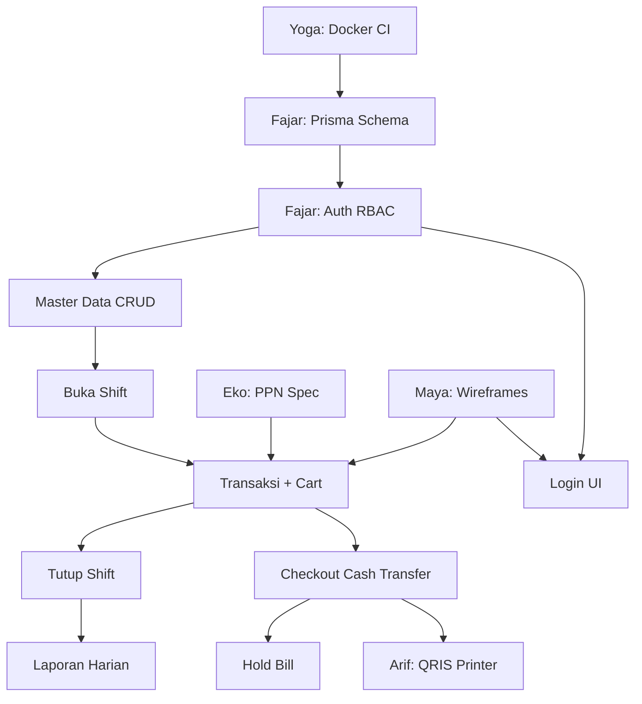

> 📚 [Indeks Dokumentasi](../INDEX.md) | Kategori: Requirements | Audience: Hendra, Dewi, Budi

# Feature Backlog — Barokah Core POS

> **Sumber:** Rapat Kickoff + Visi Pak Zaki — [2026-06-01-KICKOFF-MEETING.md](../meetings/2026-06-01-KICKOFF-MEETING.md), [VISION-ZAKI-MATURED.md](./VISION-ZAKI-MATURED.md)  
> **Maintainer:** Dewi Kartika · Review: Hendra Pratama  
> **Versi:** 1.3 | 1 Juni 2026 (konfirmasi Q1–Q6 + scope retail omnichannel ADR-003)  
> **ADR:** [ADR-002](../decisions/ADR-002-PAK-ZAKI-CONFIRMATIONS.md) · [ADR-003](../decisions/ADR-003-SCOPE-RETAIL-ONLINE-OFFLINE.md)

---

## Legenda

| MoSCoW | Arti |
|--------|------|
| **Must** | Wajib MVP — Sprint 1–4 |
| **Should** | Penting tapi bisa Sprint 4 atau awal post-MVP |
| **Could** | Nice-to-have MVP / awal Fase 2 |
| **Won't** | Di luar scope fase ini |

| Phase | Timeline |
|-------|----------|
| **1 — MVP** | Sprint 1–4 (8 minggu) |
| **2 — Growth** | +6 minggu post-MVP |
| **3 — Enterprise** | +8 minggu |

| Tag | Arti |
|-----|------|
| **Visi Pak Zaki** | Fitur dari [`.cursor/dokument rencana zaki.md`](../../.cursor/dokument%20rencana%20zaki.md), disetujui tim [2026-06-01-VISION-ZAKI-DISCUSSION.md](../meetings/2026-06-01-VISION-ZAKI-DISCUSSION.md) |
| **Bahan bangunan** | Relevan untuk vertical pilot retail bahan bangunan (semen, cat, pipa, dll.) — [VISION-ZAKI-MATURED.md](./VISION-ZAKI-MATURED.md) § Domain |
| **Sprint 5** | Minggu 9–10 Fase 2 — varian prioritas (Q6 Pak Zaki) |
| **CANCELLED** | Dibatalkan permanen — OUT OF SCOPE (ADR-003) |
| **Omnichannel** | Toko fisik + online web + sync (ADR-003) |

---

## Epic A: Foundation & Auth

| Feature | User Story Stub | MoSCoW | Phase | Sprint | Owner | Dependencies |
|---------|-----------------|--------|-------|--------|-------|--------------|
| Dev environment | Sebagai developer, saya ingin `docker compose up` menjalankan PG + Redis + API + Web agar bisa develop lokal | Must | 1 | 1 | Yoga | — |
| Database schema MVP | Sebagai developer, saya ingin schema Prisma 22 tabel MVP ter-migrate agar modul backend bisa dikembangkan | Must | 1 | 1 | Fajar | Yoga Docker |
| Tenant & outlet seed | Sebagai owner, saya ingin bisnis dan outlet default terdaftar saat onboarding agar kasir bisa login | Must | 1 | 1 | Fajar | Schema |
| Login / logout | Sebagai kasir, saya ingin login dengan email/password agar bisa mengakses POS | Must | 1 | 1 | Fajar | Auth API |
| JWT + refresh token | Sebagai sistem, saya ingin access token expire + refresh agar sesi aman | Must | 1 | 1 | Fajar | Auth module |
| RBAC 3 role | Sebagai owner, saya ingin role Owner/Manager/Kasir dengan akses berbeda agar operasi terkontrol | Must | 1 | 1 | Fajar | Users table |
| CI pipeline | Sebagai tim, kami ingin CI lint+test+build otomatis agar regresi terdeteksi early | Must | 1 | 1 | Yoga | Monorepo setup |

---

## Epic B: Master Data & Shift

| Feature | User Story Stub | MoSCoW | Phase | Sprint | Owner | Dependencies |
|---------|-----------------|--------|-------|--------|-------|--------------|
| CRUD kategori | Sebagai manager, saya ingin kelola kategori produk agar katalog terorganisir | Must | 1 | 2 | Fajar | Auth, Schema |
| CRUD satuan | Sebagai manager, saya ingin definisi satuan (sak, batang, m², kg, liter, dus) agar produk konsisten | Must | 1 | 2 | Fajar | Auth · **Bahan bangunan** |
| CRUD produk | Sebagai manager, saya ingin tambah/edit produk (SKU, barcode, harga, cost_price) agar kasir bisa jual | Must | 1 | 2 | Fajar | Kategori, Satuan · **Bahan bangunan** |
| Grid produk kasir | Sebagai kasir, saya ingin lihat grid produk + filter kategori agar input cepat tanpa scan | Must | 1 | 2 | Fajar + Maya | CRUD produk, Wireframe SCR-K01 |
| Buka shift | Sebagai kasir, saya ingin buka shift dengan saldo awal kas agar penjualan tercatat per shift | Must | 1 | 2 | Fajar | Auth, Outlet |
| Shift conflict handling | Sebagai manager, saya ingin resolve shift aktif kasir lain agar outlet tidak double shift | Should | 1 | 2 | Fajar | Buka shift |
| Supplier master (basic) | Sebagai manager, saya ingin catat supplier agar produk punya referensi pemasok | Could | 1 | 2 | Fajar | Schema |
| Import produk CSV | Sebagai manager, saya ingin import produk bulk agar onboarding cepat | Could | 1 | Post-MVP | Fajar | CRUD produk |
| Pencarian fuzzy (pg_trgm) | Sebagai kasir, saya ingin cari produk toleran typo agar input cepat | Could | 1 | Post-MVP | Fajar | **Visi Pak Zaki** §1.6 |
| Catatan per transaksi | Sebagai kasir, saya ingin catat instruksi khusus order agar tidak salah | Should | 1 | 3 | Fajar | **Visi Pak Zaki** §3.9 |
| CRM field opsional (nama/HP) | Sebagai kasir, saya ingin catat pelanggan walk-in tanpa program poin | Could | 1 | Post-MVP | Fajar | **Visi Pak Zaki** §5.1 |

---

## Epic C: Transaksi Core

| Feature | User Story Stub | MoSCoW | Phase | Sprint | Owner | Dependencies |
|---------|-----------------|--------|-------|--------|-------|--------------|
| Scan barcode | Sebagai kasir, saya ingin scan barcode menambah item ke keranjang agar checkout cepat | Must | 1 | 3 | Fajar | Produk + barcode index |
| Input SKU manual | Sebagai kasir, saya ingin cari SKU/nama manual jika barcode rusak | Must | 1 | 3 | Fajar | Produk |
| Keranjang (qty +/-) | Sebagai kasir, saya ingin ubah qty dan hapus item di keranjang | Must | 1 | 3 | Fajar + Maya | Wireframe SCR-K01 |
| Checkout cash | Sebagai kasir, saya ingin terima cash + hitung kembalian agar transaksi selesai | Must | 1 | 3 | Fajar | Shift aktif, Eko PPN spec |
| Checkout transfer | Sebagai kasir, saya ingin konfirmasi transfer manual agar non-cash tercatat | Must | 1 | 3 | Fajar | Shift aktif |
| PPN 11% perhitungan | Sebagai merchant PKP, saya ingin PPN 11% dihitung benar (inclusive/exclusive) agar struk compliant | Must | 1 | 3 | Eko + Fajar | Tenant tax config |
| Struk digital preview | Sebagai kasir, saya ingin preview struk setelah bayar agar bisa share PDF | Must | 1 | 3 | Fajar | Checkout |
| Payments array API | Sebagai sistem, saya ingin API terima multi-payment agar split payment Sprint 4 ready | Should | 1 | 3 | Fajar | Checkout |
| Stok habis warning | Sebagai kasir, saya ingin warning jika stok habis tapi tetap bisa jual (config) | Should | 1 | 3 | Fajar | inventory_items |
| Duplicate scan increment | Sebagai kasir, scan barcode sama increment qty otomatis | Must | 1 | 3 | Fajar | Scan barcode |

---

## Epic D: Payment Advanced & Close Loop

| Feature | User Story Stub | MoSCoW | Phase | Sprint | Owner | Dependencies |
|---------|-----------------|--------|-------|--------|-------|--------------|
| Hold bill | Sebagai kasir, saya ingin tahan transaksi dengan label agar dilanjut nanti | Must | 1 | 4 | Fajar | Keranjang |
| Hold recall + TTL 30m | Sebagai kasir, saya ingin recall hold sebelum expire 30 menit (✅ Q2 Pak Zaki) | Must | 1 | 4 | Fajar | Hold bill · **Bahan bangunan** |
| QRIS Midtrans | Sebagai kasir, saya ingin terima QRIS via Midtrans agar pelanggan bayar digital | Must | 1 | 4 | Arif + Fajar | Arif POC, Checkout API |
| Split payment | Sebagai kasir, saya ingin split cash + QRIS agar fleksibel | Must | 1 | 4 | Fajar + Arif | payments[], QRIS |
| Thermal printer ESC/POS | Sebagai kasir, saya ingin cetak struk thermal otomatis | Must | 1 | 4 | Arif + Fajar | Struk template |
| Printer fallback PDF | Sebagai kasir, saya ingin PDF jika printer offline | Must | 1 | 4 | Arif + Fajar | Struk digital |
| Tutup shift | Sebagai kasir, saya ingin tutup shift dengan input saldo akhir kas | Must | 1 | 4 | Fajar | Buka shift, Transaksi |
| Rekonsiliasi kas | Sebagai kasir, saya ingin lihat selisih expected vs fisik + catatan | Must | 1 | 4 | Fajar + Rina | Tutup shift |
| Laporan harian | Sebagai owner, saya ingin lihat omzet, jumlah transaksi, payment mix hari ini | Must | 1 | 4 | Fajar + Rina | Transaksi |
| Laba kotor (conditional) | Sebagai owner, saya ingin lihat laba kotor jika cost_price diisi | Should | 1 | 4 | Eko + Fajar | cost_price, Laporan |
| Audit log | Sebagai owner, saya ingin jejak audit void/refund dan aksi sensitif | Must | 1 | 4 | Fajar | Auth RBAC |
| Void transaksi | Sebagai manager, saya ingin void transaksi dengan approval | Could | 1 | Post-MVP | Fajar | Audit log, RBAC |
| Refund partial | Sebagai manager, saya ingin refund sebagian item | Could | 1 | Post-MVP | Fajar | Void pattern |

---

## Epic E: Financial Intelligence (Fase 2+)

| Feature | User Story Stub | MoSCoW | Phase | Sprint | Owner | Dependencies |
|---------|-----------------|--------|-------|--------|-------|--------------|
| Margin per kategori | Sebagai owner, saya ingin lihat margin per kategori | Won't (MVP) | 2 | — | Eko + Fajar | cost_price, Laporan |
| Slow-moving SKU | Sebagai owner, saya ingin SKU tidak laku 30+ hari | Won't (MVP) | 2 | — | Eko | **Visi Pak Zaki** §6.2 |
| Payment mix trend 7/30 hari | Sebagai owner, saya ingin trend QRIS vs cash | Won't (MVP) | 2 | — | Fajar | Laporan harian |
| Produk paling untung (margin) | Sebagai owner, saya ingin ranking SKU by margin bukan hanya qty | Won't (MVP) | 2 | — | Eko | **Visi Pak Zaki** §6.2 |
| Laporan kinerja kasir | Sebagai manager, saya ingin metrik void/diskon per kasir per shift | Won't (MVP) | 2 | — | Rina + Fajar | **Visi Pak Zaki** §6.3 |
| Kartu stok nilai rupiah | Sebagai owner, saya ingin nilai stok (qty × HPP) per SKU | Won't (MVP) | 2 | — | Fajar | **Visi Pak Zaki** §6.4 |
| Dashboard owner real-time | Sebagai owner, saya ingin widget omzet live di mobile | Won't (MVP) | 2 | — | Dimas + Fajar | **Visi Pak Zaki** §6.6, Socket.io |
| Export Excel/PDF terjadwal | Sebagai owner, saya ingin laporan otomatis tiap malam | Won't (MVP) | 2–3 | — | Fitri + Fajar | **Visi Pak Zaki** §6.7 |
| Promo / diskon engine | Sebagai owner, saya ingin promo otomatis | Won't (MVP) → **MVP admin CRUD (Web P3)** | 2 | — | Eko + Fajar | CRUD `/dashboard/promotions` · apply di kasir Fase 4 |
| Multi-outlet sync | Sebagai owner chain, saya ingin sync stok antar outlet | Won't (MVP) | 2 | — | Fajar + Arif | **Visi Pak Zaki** §8.3 |
| Offline toko fisik (PWA queue) | Sebagai kasir toko fisik, saya ingin jual saat offline via web PWA + sync antrian | Won't (MVP) | 2 | — | Dimas + Fajar | **ADR-003** · prioritas offline |
| Offline mobile queue (Expo) | Sebagai kasir mobile, saya ingin jual saat offline (Expo **Fase 2 opsional** — Q3) | Won't (MVP) | 2 | — | Dimas + Fajar | **Visi Pak Zaki** §8.2 · alternatif |
| Integrasi Jurnal/Accurate | Sebagai accountant, saya ingin sync ke accounting | Won't (MVP) | 3 | — | Arif | **Visi Pak Zaki** §9.3 |
| e-Faktur | Sebagai PKP, saya ingin data e-Faktur | Won't (MVP) | 3 | — | Arif + Eko | Compliance |
| Prediksi stok AI | Sebagai owner, saya ingin rekomendasi reorder berbasis histori | Won't (MVP) | 3 | — | Eko | **Visi Pak Zaki** §2.6 |

---

## Epic F: Catalog Advanced — Visi Pak Zaki (Fase 2)

| Feature | User Story Stub | MoSCoW | Phase | Sprint | Owner | Dependencies |
|---------|-----------------|--------|-------|--------|-------|--------------|
| Produk induk + flag varian | Sebagai manager, saya ingin produk induk tidak dijual langsung jika punya varian | Should | 2 | **5** | Fajar | Schema RFC · **Bahan bangunan** · **Sprint 5** |
| Multi varian (atribut + SKU) | Sebagai manager, saya ingin kombinasi ukuran/warna/volume jadi SKU unik (prioritas Q6) | Should | 2 | **5** | Fajar + Maya | **Visi Pak Zaki** §1.2 · **Sprint 5** |
| Multi satuan jual + konversi | Sebagai kasir, saya ingin jual sak/dus/m² dengan stok base unit otomatis | Should | 2 | 5–6 | Eko + Fajar | **Visi Pak Zaki** §1.3 · **Bahan bangunan** |
| Bundling fixed | Sebagai manager, saya ingin paket renovasi (semen+cat) dengan stok komponen atomik | Could | 2 | **6+** | Eko + Fajar | **Visi Pak Zaki** §1.4 · **setelah varian** |
| Bundling flexible / terjadwal / BXGY | Sebagai owner, saya ingin promo bundle lanjutan | Won't (MVP) | 2–3 | 7+ | Eko | **Visi Pak Zaki** §1.4 |
| Kategori nested + drag sort | Sebagai manager, saya ingin urutan kategori di grid kasir | Won't (MVP) | 2 | — | Maya + Fajar | **Visi Pak Zaki** §1.5 |
| Shortcut / favorit produk | Sebagai kasir, saya ingin pin produk terlaris di atas grid | Could | 1–2 | Post-MVP | Maya | **Visi Pak Zaki** §10.4 |

---

## Epic G: Inventory & Stok Lanjutan — Visi Pak Zaki (Fase 2)

| Feature | User Story Stub | MoSCoW | Phase | Sprint | Owner | Dependencies |
|---------|-----------------|--------|-------|--------|-------|--------------|
| Multi lokasi (store/warehouse/display/transit) | Sebagai manager, saya ingin stok per tipe lokasi | Won't (MVP) | 2 | — | Fajar | Multi-outlet |
| Transfer stok antar lokasi | Sebagai manager, saya ingin pindah stok gudang→toko dengan status transit | Won't (MVP) | 2 | — | Fajar | **Visi Pak Zaki** §2.2 |
| **Transfer stok antar cabang (Jun 2026)** | UI + API atomik OUT/IN per cabang | **Done (P0 Jun 2026)** | 2 | — | Fajar + Dimas | `/dashboard/inventory` tab Transfer, `POST /inventory/transfer` |
| **Laporan stok dashboard (Jun 2026)** | Ringkasan SKU, low stock, nilai HPP | **Done (P0 Jun 2026)** | 1 | — | Fajar + Dimas | `GET /reports/stock`, widget `/dashboard` |
| Alert stok minimum in-app | Sebagai owner, saya ingin notifikasi stok kritis | Could | 1–2 | Post-MVP | Fajar | **Visi Pak Zaki** §2.3 |
| Alert stok via WhatsApp | Sebagai owner, saya ingin WA saat stok minimum | Won't (MVP) | 2 | — | Arif | WA API |
| Opname digital (scan + adjust) | Sebagai petugas, saya ingin hitung fisik dari HP | Won't (MVP) | 2 | — | Fajar + Maya | **Visi Pak Zaki** §2.4 |
| **Manajemen stok MVP (Jun 2026)** | List/adjust/opname/riwayat per cabang | **Done (P0 Jun 2026)** | 1 | — | Rina + Fajar + Dimas | `/dashboard/inventory`, movements API |
| **CRUD cabang MVP (Jun 2026)** | Owner tambah/edit/nonaktifkan outlet | **Done (P0 Jun 2026)** | 1 | — | Fajar + Dimas | `/dashboard/outlets`, `OutletsModule` |
| **Produk aktif/stok awal (Jun 2026)** | Nonaktifkan produk, stok awal simple/multi-unit, filter list | **Done (P0 Jun 2026)** | 1 | — | Dimas | `/master/products` |
| Purchase Order supplier | Sebagai manager, saya ingin PO dan penerimaan barang update HPP | **Done (P0 Jun 2026)** | 2 | — | Rina + Fajar + Dimas | [DISTRIBUTOR-ORDER-FLOW.md](../domain/DISTRIBUTOR-ORDER-FLOW.md) |
| Retur PO distributor | Sebagai manager, saya ingin retur barang diterima & batalkan sisa order | **Done (P0 Jun 2026)** | 2 | — | Rina + Fajar + Dimas | PO receive, stok, cetak retur |

---

## Epic H: Transaksi, Promo & Loyalty — Visi Pak Zaki (Fase 2)

| Feature | User Story Stub | MoSCoW | Phase | Sprint | Owner | Dependencies |
|---------|-----------------|--------|-------|--------|-------|--------------|
| Diskon transaksi + limit role | Sebagai kasir, diskon melebihi batas minta PIN supervisor | Won't (MVP) | 2 | — | Eko + Fajar | **Visi Pak Zaki** §3.4 |
| Diskon per item | Sebagai kasir, saya ingin diskon nominal/persen per line | Won't (MVP) | 2 | — | Eko | **Visi Pak Zaki** §3.1 |
| Voucher & kupon | Sebagai kasir, saya ingin input kode voucher | Won't (MVP) | 2 | — | Eko + Fajar | **Visi Pak Zaki** §3.5 |
| Promo terjadwal (happy hour) | Sebagai owner, saya ingin promo aktif otomatis by jam/hari | Won't (MVP) | 2 | — | Eko | **Visi Pak Zaki** §3.6, BullMQ |
| Program poin loyalitas | Sebagai pelanggan, saya ingin kumpul/tukar poin via HP | Won't (MVP) | 2 | — | Eko + Fajar | **Visi Pak Zaki** §5.2 |
| Segmentasi pelanggan otomatis | Sebagai owner, saya ingin segmen loyal/lapsed untuk kampanye | Won't (MVP) | 2 | — | Eko | **Visi Pak Zaki** §5.3 |
| Broadcast promo WhatsApp | Sebagai owner, saya ingin blast promo ke segmen | Won't (MVP) | 2 | — | Arif | **Visi Pak Zaki** §5.4 |
| Struk digital via WA/email | Sebagai pelanggan, saya ingin struk otomatis setelah bayar | Won't (MVP) | 2 | — | Arif | **Visi Pak Zaki** §5.5 |
| Pembayaran EDC kartu | Sebagai kasir, saya ingin kirim nominal ke mesin EDC | Won't (MVP) | 2 | — | Arif | **Visi Pak Zaki** §4.2 |
| Bayar dengan poin | Sebagai pelanggan, saya ingin tukar poin sebagai pembayaran | Won't (MVP) | 2 | — | Eko | Loyalty |
| PIN/biometrik aksi sensitif | Sebagai supervisor, void/diskon butuh verifikasi biometrik | Won't (MVP) | 2 | — | Dimas | **Visi Pak Zaki** §7.2 |
| Session timeout kasir | Sebagai owner, layar kasir kunci setelah idle | Won't (MVP) | 2 | — | Dimas | **Visi Pak Zaki** §7.5 |
| Indikator offline + sync queue | Sebagai kasir, saya ingin banner offline dan jumlah pending sync | Won't (MVP) | 2 | — | Dimas | **Visi Pak Zaki** §10.5 |

---

## Epic I: F&B — CANCELLED (OUT OF SCOPE)

> **Keputusan Pak Zaki (ADR-003, 1 Jun 2026):** F&B, meja, KDS **tidak diperlukan** — dibatalkan permanen, bukan ditunda ke Fase 3.

| Feature | User Story Stub | MoSCoW | Phase | Sprint | Owner | Status |
|---------|-----------------|--------|-------|--------|-------|--------|
| Manajemen meja & antrian | Sebagai kasir F&B, saya ingin grid meja real-time | — | — | — | — | **CANCELLED** · ADR-003 |
| Split bill per meja | Sebagai kasir, saya ingin bagi tagihan antar tamu | — | — | — | — | **CANCELLED** · ADR-003 |
| Kitchen Display System (KDS) | Sebagai dapur, saya ingin lihat order masuk tanpa tiket kertas | — | — | — | — | **CANCELLED** · ADR-003 |

---

## Epic J: Online Sales (Web) — Omnichannel Retail (Fase 2)

> **Status Epic J:** **UNLOCKED** — Track B ACTIVE Sprint 13 ([ADR-004](../decisions/ADR-004-EPIC-J-DEFAULTS-LOCKED.md) · Opsi 1 Pak Zaki, 2 Jun 2026)  
> **ADR-003:** penjualan online via web terintegrasi POS; sync stok/order dengan toko fisik.  
> **User stories P0:** [EPIC-J-USER-STORIES.md](./EPIC-J-USER-STORIES.md) (US-J-01 … US-J-07)

| Feature | User Story | MoSCoW | Phase | Sprint | Owner | Dependencies |
|---------|------------|--------|-------|--------|-------|--------------|
| Katalog web pelanggan | US-J-01 | **Must** | 2 | 13 (wireframe) → 14 (build) | Dimas + Maya | [ADR-004](../decisions/ADR-004-EPIC-J-DEFAULTS-LOCKED.md) Q-J05/06/07 |
| Detail produk (PDP) | US-J-02 | **Must** | 2 | 14 | Dimas + Maya | US-J-01, varian |
| Keranjang belanja | US-J-03 | **Must** | 2 | 14 | Dimas | US-J-01 |
| Checkout pickup | US-J-04 | **Must** | 2 | 14 | Dimas + Fajar | Q-J01 pickup P0 |
| Checkout delivery | US-J-05 | Should (P1) | 2 | 15+ | Dimas + Fajar | Q-J01 delivery P1 |
| Pembayaran online (Midtrans) | US-J-06 | **Must** | 2 | 14 | Arif + Fajar | Q-J03 · Midtrans web |
| Order online → POS backend | US-J-07 | **Must** | 2 | 14 | Fajar + Dimas | [ONLINE-ORDERS-RFC.md](../api/ONLINE-ORDERS-RFC.md) (DRAFT) |
| Status order pickup/delivery | US-J-08 (stub) | **Must** | 2 | 15 | Fajar + Dimas | US-J-07 |
| Sync inventori online + toko fisik | US-J-09 (stub) | **Must** | 2 | 14–15 | Fajar + Eko | Q-J05 · OFFLINE-SYNC |
| Harga konsisten online/offline | — | **Must** | 2 | 14 | Eko + Fajar | Q-J07 locked |
| Offline toko fisik (PWA + queue) | — | **Must** | 2 | 11–13 Track A | Dimas + Fajar | Sprint 13 Track A |
| Notifikasi order online ke kasir | US-J-10 (stub) | Could → **Done (Web P3)** | 2 | 16+ | Dimas + Fajar | Socket.io + polling fallback · [WEB-COMPLETION-PLAN](../sprint/WEB-COMPLETION-PLAN.md) |

---

## Epic K: Enterprise & Integrasi — Fase 3

| Feature | User Story Stub | MoSCoW | Phase | Sprint | Owner | Dependencies |
|---------|-----------------|--------|-------|--------|-------|--------------|
| Sinkronisasi Tokopedia/Shopee | Sebagai owner, stok marketplace sync dengan POS fisik | Won't (MVP) | 3 | — | Arif | **Visi Pak Zaki** §9.2 |
| WhatsApp Business API terpusat | Struk, alert, promo, laporan harian via WA | Won't (MVP) | 2–3 | — | Arif | **Visi Pak Zaki** §9.1 |
| Deteksi anomali transaksi | Sebagai owner, saya ingin alert pola void/diskon mencurigakan | Won't (MVP) | 3 | — | Eko | **Visi Pak Zaki** §7.4 |
| API publik partner | Sebagai partner, saya ingin integrasi via API | Won't (MVP) | 3 | — | Fajar | AGENTS.md F3 |

---

## Dependency Graph (MVP Critical Path)

---

## Sprint Allocation Summary

| Sprint | Epics | Story Points (est.) |
|--------|-------|---------------------|
| 1 | A (Foundation) | ~38 SP |
| 2 | B (Master + Shift) — [SPRINT-2-PLAN](./SPRINT-2-PLAN.md) | ~45 SP |
| 3 | C (Transaksi Core) | ~45 SP |
| 4 | D (Payment + Close) | ~48 SP |
| **5** | F (Varian — **prioritas Q6**) | ~40 SP |
| **6+** | F (Bundling) + J (Online sales) | TBD |

---

## Handoff

| To | Action |
|----|--------|
| Hendra | Sprint breakdown → [SPRINT-1-PLAN.md](./SPRINT-1-PLAN.md), [SPRINT-2-PLAN.md](./SPRINT-2-PLAN.md) |
| Fajar | Technical dependency review pre-Sprint 1 |
| Fitri | Link backlog di docs index |

---

*Terakhir diupdate: 6 Juni 2026 — Web Phase 1: transfer cabang, laporan stok dashboard, transaksi filter*
