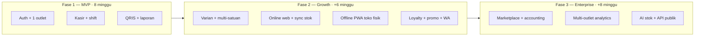

> 📚 [Indeks Dokumentasi](../INDEX.md) | Kategori: Requirements | Audience: Pak Zaki, Budi, semua tim

# Visi Produk Matang — Barokah Core POS

> **Status:** Disetujui tim (rapat 1 Juni 2026)  
> **Pemilik visi:** Pak Zaki  
> **Dokumen sumber asli:** [`.cursor/dokument rencana zaki.md`](../../.cursor/dokument%20rencana%20zaki.md)  
> **Notulen rapat:** [2026-06-01-VISION-ZAKI-DISCUSSION.md](../meetings/2026-06-01-VISION-ZAKI-DISCUSSION.md)  
> **Gap analysis:** [2026-06-01-VISION-ZAKI-GAP-ANALYSIS.md](../meetings/2026-06-01-VISION-ZAKI-GAP-ANALYSIS.md)  
> **Versi:** 1.2 | 1 Juni 2026 (konfirmasi Q1–Q6 + scope retail omnichannel ADR-003)  
> **ADR konfirmasi:** [ADR-002-PAK-ZAKI-CONFIRMATIONS.md](../decisions/ADR-002-PAK-ZAKI-CONFIRMATIONS.md) · [ADR-003-SCOPE-RETAIL-ONLINE-OFFLINE.md](../decisions/ADR-003-SCOPE-RETAIL-ONLINE-OFFLINE.md)

---

## Executive Summary

Barokah Core POS adalah sistem Point of Sale **profesional** untuk merchant **retail bahan bangunan** (building materials store) di Indonesia — bukan sekadar mesin kasir, melainkan platform **omnichannel retail**: penjualan di **toko fisik** (web kasir, offline-capable), **penjualan online via web**, dan **sinkronisasi stok/pesanan** antar kanal. Platform memberi **denyut keuangan harian** (omzet, arus kas, margin) dan fondasi operasional yang dapat berkembang ke multi-cabang, loyalty, dan integrasi ekosistem (WhatsApp, marketplace, akuntansi).

**OUT OF SCOPE (permanen, ADR-003):** F&B, manajemen meja, KDS, dan alur restoran — **tidak** di roadmap mana pun.

Visi lengkap Pak Zaki mencakup **10 modul** (produk, stok, transaksi, pembayaran, pelanggan, laporan, keamanan, operasional, integrasi, UX kasir). Tim menyetujui visi ini sebagai **north star**, dengan implementasi realistis **3 fase (~22 minggu)** tanpa mengorbankan MVP 8 minggu yang sudah dikunci di kickoff.

**Penyesuaian teknis resmi:** backend **NestJS + Prisma + PostgreSQL** (bukan Supabase BaaS di dokumen sumber); frontend **Next.js 15 + Expo 52** (ADR-001); realtime **Socket.io**.

---

## Product Vision & Mission

| | |
|---|---|
| **Visi** | Setiap merchant SMB Indonesia punya POS yang memberkahi (*barokah*) pertumbuhan bisnis — terlihat omzet, kas, margin, dan stok tanpa Excel rumit. |
| **Misi** | Menyediakan kasir cepat (touch-first), data keuangan terpercaya (immutable transaksi, audit), dan jalur upgrade terukur dari 1 outlet → multi-cabang → integrasi enterprise. |
| **Perusahaan** | Barokah Core |
| **Produk** | Barokah Core POS (Web kasir + web penjualan online + API; mobile opsional Fase 2) |

---

## Target Users & Market

| Segmen | Persona | Kebutuhan utama | Prioritas fase |
|--------|---------|-----------------|----------------|
| **Toko bahan bangunan (pilot)** | Owner + kasir + kontraktor walk-in | SKU berat/volume, multi-satuan (sak, batang, m²), barcode, bulk qty | Fase 1–2 |
| **UMKM tunggal** | Owner = kasir, non-PKP umum | Kasir sederhana, laporan harian, cash + QRIS | Fase 1 |
| **Toko berkembang** | Owner + manager + beberapa kasir | Shift recon, RBAC, margin jika HPP diisi | Fase 1 |
| **Retail multi-SKU** | Manager inventory | Varian (ukuran/warna), multi-satuan, stok multi-lokasi | Fase 2 *(varian minggu 9–10)* |
| **Chain / multi-outlet** | Owner pusat | Konsolidasi laporan, sync stok | Fase 2 |
| **Kontraktor / B2B** | Akun pelanggan korporat | Harga tier by qty, kredit tempo | Fase 2 *(Eko)* |
| ~~**F&B**~~ | — | Meja, KDS, split bill meja | **OUT OF SCOPE** (ADR-003) |
| **Merchant omnichannel** | Owner retail + online | Web storefront + toko fisik + sync stok | Fase 2 |
| **Merchant digital** | Owner marketplace | Sync Tokopedia/Shopee + POS | Fase 3 |

**Geografi:** Indonesia — pembayaran QRIS, PPN 11%, bahasa Indonesia di UI merchant.

---

## Business Model

Dokumen sumber Pak Zaki tidak mendetailkan harga/langganan; tim mengasumsikan model **SaaS multi-tenant** (satu `tenant` = satu bisnis):

| Aspek | Asumsi tim (untuk perencanaan) |
|-------|--------------------------------|
| Monetisasi | **Satu paket MVP** dulu; tier Basic/Growth/Enterprise setelah validasi pilot |
| Tenant isolation | `tenant_id` di semua data (sudah di schema) |
| Onboarding | Seed 1 outlet; import CSV produk P1 |
| White-label | Fase 3 (AGENTS.md roadmap) |

**Konfirmasi Pak Zaki (Q4, 1 Jun 2026):** satu paket MVP dulu — tier lanjutan setelah merchant pilot bahan bangunan stabil.

---

## Model Bisnis Operasi (ADR-003)

> **Keputusan Pak Zaki (1 Jun 2026):** fokus **retail + online web + offline di toko fisik** — bukan F&B.

| Saluran | Deskripsi | Teknologi / Fase |
|---------|-----------|------------------|
| **Toko fisik** | Kasir di outlet: scan, keranjang, bayar, shift, struk thermal | Web kasir Next.js — **Fase 1 MVP** |
| **Offline toko fisik** | Jualan tetap jalan tanpa internet; antrian sync saat online | **Web kasir PWA + IndexedDB** — **Fase 2 prioritas**; Expo mobile offline opsional Fase 2 |
| **Penjualan online** | Katalog pelanggan, order web, pickup/delivery, bayar digital | Web storefront terintegrasi API POS — **Fase 2** |
| **Sinkronisasi** | Stok, harga, status order selaras online ↔ toko fisik | API + jobs — **Fase 2** |

**Vertical pilot tetap:** toko **bahan bangunan** (semen, cat, pipa, keramik, alat) — bukan fashion, bukan restoran.

### Opsi offline di toko fisik (rekomendasi tim)

| Opsi | Implementasi | Prioritas |
|------|--------------|-----------|
| **A — Web PWA** | Service worker + IndexedDB queue + sync idempotent | **Utama** (selaras Q3 web dulu) |
| **B — Expo mobile** | SQLite offline queue | Alternatif Fase 2 jika merchant butuh HP dedicated |

Detail keputusan: [ADR-003-SCOPE-RETAIL-ONLINE-OFFLINE.md](../decisions/ADR-003-SCOPE-RETAIL-ONLINE-OFFLINE.md).

---

## Core Modules (Prioritas P0–P3)

Legenda: **P0** = MVP Sprint 1–4 · **P1** = awal post-MVP / akhir Fase 1 · **P2** = Fase 2 Growth · **P3** = Fase 3 Enterprise

### Modul 1 — Manajemen Produk

| Fitur (dari visi Pak Zaki) | Prioritas | Sprint/Fase | Catatan |
|----------------------------|-----------|-------------|---------|
| Produk dasar (nama, kategori, satuan, barcode, harga, HPP) | P0 | MVP S2 | Flat `products` |
| Kategori (1 level MVP; nested F2) | P0 | MVP S2 | |
| Soft delete / is_active | P0 | MVP S2 | |
| Multi varian + SKU kombinasi | P2 | **Fase 2 Sprint 5** (minggu 9–10) | `product_skus`, attributes — **sebelum bundling** |
| Multi satuan jual + konversi stok | P2 | Fase 2 | `sku_units` — kritis bahan bangunan (sak, batang, m²) |
| Bundling (fixed/flexible/terjadwal/BXGY) | P2 | Fase 2 **setelah varian** | Transaksi atomik |
| Pencarian fuzzy / pg_trgm | P1 | Post-MVP | MVP: search + scan |
| Grid kasir + filter kategori | P0 | MVP S2–3 | |

### Modul 2 — Manajemen Stok

| Fitur | Prioritas | Sprint/Fase | Catatan |
|-------|-----------|-------------|---------|
| Stok per outlet (`inventory_items`) | P0 | MVP S3 | Warning habis, allow sell |
| Ledger `stock_movements` | P0 | MVP S3+ | |
| Multi lokasi (store/warehouse/display/transit) | P2 | Fase 2 | |
| Transfer antar lokasi + transit | P2 | Fase 2 | |
| Alert stok minimum (in-app) | P1 | Post-MVP | |
| Alert WA/email | P2 | Fase 2 | |
| Opname digital | P2 | Fase 2 | |
| Prediksi stok AI | P3 | Fase 3 | |

### Modul 3 — Transaksi & Kasir

| Fitur | Prioritas | Sprint/Fase | Catatan |
|-------|-----------|-------------|---------|
| Keranjang dinamis | P0 | MVP S3 | |
| Hold & recall | P0 | MVP S4 | TTL 30 menit |
| Split payment | P0 | MVP S4 | |
| Kembalian otomatis | P0 | MVP S3 | |
| Validasi stok/diskon/total | P0 | MVP S3 | Diskon = F2 |
| Diskon transaksi + PIN supervisor | P2 | Fase 2 | |
| Voucher & kupon | P2 | Fase 2 | |
| Promo terjadwal | P2 | Fase 2 | |
| Void/refund + window waktu | P1 | Post-MVP | |
| Catatan transaksi | P0 | MVP S3 | |

### Modul 4 — Pembayaran

| Fitur | Prioritas | Sprint/Fase | Catatan |
|-------|-----------|-------------|---------|
| Cash + transfer manual | P0 | MVP S3 | |
| QRIS (Midtrans) | P0 | MVP S4 | |
| Rekap per metode (tutup shift) | P0 | MVP S4 | |
| EDC kartu langsung | P2 | Fase 2 | |
| Bayar dengan poin loyalty | P2 | Fase 2 | |

### Modul 5 — Pelanggan & Loyalitas

| Fitur | Prioritas | Sprint/Fase |
|-------|-----------|-------------|
| CRM lite (nama, HP) | P1 | Post-MVP |
| Program poin | P2 | Fase 2 |
| Segmentasi otomatis | P2 | Fase 2 |
| Broadcast promo WA | P2 | Fase 2 |
| Struk digital WA/email | P2 | Fase 2 |

### Modul 6 — Laporan & Analitik

| Fitur | Prioritas | Sprint/Fase |
|-------|-----------|-------------|
| Laporan penjualan harian + payment mix | P0 | MVP S4 |
| Laba kotor (jika HPP diisi) | P0 | MVP S4 |
| Produk terlaris / paling untung | P2 | Fase 2 |
| Kinerja kasir per shift | P2 | Fase 2 |
| Kartu stok nilai rupiah | P2 | Fase 2 |
| Dashboard owner real-time | P2 | Fase 2 |
| Export Excel/PDF + jadwal WA | P2–P3 | F2/F3 |

### Modul 7 — Keamanan & Kontrol

| Fitur | Prioritas | Sprint/Fase |
|-------|-----------|-------------|
| RBAC (Owner, Manager, Kasir) | P0 | MVP S1 |
| Audit log append-only | P0 | MVP S4 |
| PIN/biometrik aksi sensitif | P2 | Fase 2 |
| Deteksi anomali transaksi | P3 | Fase 3 |
| Session timeout kasir | P2 | Fase 2 |
| Backup PG + PITR | P0–P2 | Staging S2, prod S4 |

### Modul 8 — Operasional & Shift

| Fitur | Prioritas | Sprint/Fase |
|-------|-----------|-------------|
| Buka/tutup shift + rekonsiliasi kas | P0 | MVP S2–4 |
| Cetak struk thermal | P0 | MVP S4 |
| Multi kasir satu outlet | P0 | MVP |
| Multi cabang | P2 | Fase 2 |
| Offline toko fisik (PWA queue) | P2 | **Fase 2 — prioritas** (ADR-003) |
| Offline mobile (Expo) | P2 | Fase 2 opsional (Q3) |
| ~~Meja & antrian F&B~~ | — | **OUT OF SCOPE** (ADR-003) |
| ~~Kitchen Display System~~ | — | **OUT OF SCOPE** (ADR-003) |

\*Vertical prioritas: **retail bahan bangunan** (Q1). \*F&B/meja/KDS: **bukan deferred — dibatalkan permanen** (ADR-003).

### Modul 9 — Integrasi Eksternal

| Fitur | Prioritas | Sprint/Fase |
|-------|-----------|-------------|
| WhatsApp Business API | P2 | Fase 2 |
| Tokopedia / Shopee / WooCommerce | P3 | Fase 3 |
| Jurnal.id / Accurate | P3 | Fase 3 |
| Supplier & Purchase Order | P2 | Fase 2 |

### Modul 10 — UX Kasir

| Fitur | Prioritas | Sprint/Fase |
|-------|-----------|-------------|
| Grid produk + gambar | P0 | MVP S2–3 |
| Numpad qty/nominal | P0 | MVP S3 |
| Indikator online/offline + sync queue | P2 | Fase 2 (PWA toko fisik) |
| Katalog & order online (web storefront) | P2 | Fase 2 (ADR-003) |
| Shortcut / favorit produk | P1–P2 | Post-MVP / F2 |
| Layout adaptif per role | P2 | Fase 2 |

---

## Financial Intelligence Features

Selaras [FINANCE-ECONOMICS-POS.md](../domain/FINANCE-ECONOMICS-POS.md) dan visi Pak Zaki:

| Capability | Fase | Sumber visi |
|------------|------|-------------|
| Omzet harian + jumlah transaksi + payment mix | MVP | §6.1, kickoff |
| Rekonsiliasi shift kas (selisih + catatan) | MVP | §8.1 |
| `cost_price` + laba kotor conditional | MVP | §6.5 |
| PPN 11% PKP/non-PKP | MVP | Domain + § transaksi |
| Margin per kategori / slow-moving | Fase 2 | §6.2, FINANCE doc |
| Kinerja kasir (void count, diskon) | Fase 2 | §6.3 |
| Nilai stok (qty × HPP) | Fase 2 | §6.4 |
| Dashboard owner real-time | Fase 2 | §6.6 |
| Break-even hint | Fase 2+ | FINANCE doc |

---

## Technical Constraints (Stack Approved)

| Layer | Teknologi | Catatan vs dokumen sumber |
|-------|-----------|---------------------------|
| Runtime | Node.js 22 LTS | |
| API | NestJS 11 modular monolith | Menggantikan Supabase sebagai application layer |
| ORM / DB | Prisma 6 + PostgreSQL 16 | Data tetap di PG; bukan Supabase client-first |
| Cache / Queue | Redis 7 + BullMQ | Promo terjadwal, jobs |
| Web | Next.js 15 App Router | Dashboard owner/manager |
| Mobile | Expo SDK 52 | **Fase 2** — MVP kasir **web dulu** (konfirmasi Q3) |
| Realtime | Socket.io 4 | Menggantikan Supabase Realtime |
| Auth | JWT + refresh, RBAC | |
| Monorepo | Turborepo + **npm** workspaces | Dokumen sumber menyebut pnpm — tidak migrasi MVP |
| Shared | `@barokah/shared`, `@barokah/ui` | |
| Payments | Midtrans QRIS (sandbox → prod) | |
| Printer | ESC/POS thermal | |

**Prinsip transaksi:** immutable setelah `COMPLETED`; void/refund via `transaction_adjustments`; operasi stok/bundle/transfer wajib **database transaction**.

---

## Phase Roadmap & Timeline

| Fase | Periode (indikatif) | Goal bisnis | Milestone teknis |
|------|---------------------|-------------|------------------|
| **1 — MVP** | Jun–Jul 2026 | Merchant 1 outlet: **web kasir toko fisik** + tutup shift + laporan | Login → Shift → Transaksi → QRIS → Tutup shift |
| **2 — Growth** | Agu–Sep 2026 | **Online web** + **offline PWA toko fisik** + sync stok/order; varian multi-SKU | Storefront, PWA queue, varian minggu 9–10 |
| **3 — Enterprise** | Okt–Nov 2026 | Multi-outlet, analytics, marketplace & accounting — **tanpa F&B** | WA blast, Jurnal, Tokopedia adapter |

**Sprint 1 (2–15 Jun 2026) tidak berubah** — lihat [SPRINT-1-PLAN.md](./SPRINT-1-PLAN.md).

---

## Success Metrics (KPI)

| KPI | Target MVP | Target Fase 2 | Owner ukur |
|-----|------------|---------------|------------|
| Checkout latency (p95) | < 200 ms server persist | < 200 ms | Fajar |
| Uptime staging/prod | 99% bulan pertama prod | 99.5% | Yoga |
| Search produk kasir | < 500 ms MVP | < 300 ms fuzzy | Dimas |
| Shift recon akurasi | Merchant bisa tutup shift tanpa selisih tidak terjelaskan | | Rina |
| Adoption laporan harian | Owner buka laporan ≥ 1×/hari | | Product |
| NPS merchant pilot | Baseline di UAT Sprint 4 | ≥ 40 Fase 2 | Budi |

---

## Konfirmasi Pak Zaki (Q1–Q6) — ✅ CONFIRMED

> **Tanggal konfirmasi:** 1 Juni 2026 · **Pemutus:** Pak Zaki · **ADR:** [ADR-002-PAK-ZAKI-CONFIRMATIONS.md](../decisions/ADR-002-PAK-ZAKI-CONFIRMATIONS.md)

| # | Pertanyaan | Jawaban Pak Zaki | Status | Dampak roadmap |
|---|------------|------------------|--------|----------------|
| Q1 | Vertical prioritas: retail vs F&B | **Retail — toko bahan bangunan** | ✅ CONFIRMED | Katalog bahan bangunan; **F&B/meja/KDS OUT OF SCOPE** (ADR-003) |
| Q2 | Hold bill TTL | **TTL 30 menit** | ✅ CONFIRMED | `expires_at` wajib di hold bill; AC Sprint 4 |
| Q3 | Mobile Expo vs web kasir | **Web dulu; Expo Fase 2** | ✅ CONFIRMED | Dimas fokus Next.js MVP S2–4; Expo setelah API stabil |
| Q4 | Model bisnis SaaS | **Satu paket MVP dulu** | ✅ CONFIRMED | Tanpa tier/billing kompleks di MVP |
| Q5 | NestJS + Prisma backend | **Ya** — sesuai scaffold | ✅ CONFIRMED | Tidak migrasi Supabase; logic di NestJS |
| Q6 | Varian vs bundling minggu 9–10 | **Varian sebelum bundling** | ✅ CONFIRMED | Sprint 5 area: varian dulu; bundling Sprint 6+ |
| — | Scope omnichannel (amendemen ADR-003) | **Retail + online web + offline toko fisik; tanpa F&B** | ✅ CONFIRMED | Fase 2: online sales + PWA offline prioritas |

---

## Domain Spesifik — Retail Bahan Bangunan (Rina)

> **Input:** Rina Wulandari · Spesialis POS Domain · 1 Juni 2026  
> **Vertical pilot:** toko bahan bangunan (semen, cat, pipa, alat, keramik, dll.)

### Implikasi Katalog & Master Data

| Aspek | Kebutuhan domain | Fase |
|-------|------------------|------|
| **Satuan jual** | sak, batang, m², kg, liter, dus, roll — bukan hanya pcs | MVP: master `units` + 1 satuan/produk; F2: multi-satuan + konversi |
| **Qty desimal** | Cat per liter, keramik per m², besi per batang (0,5 / 2,5) | MVP: qty `Decimal` di transaksi; validasi min step per satuan |
| **SKU / barcode** | Barcode produsen + internal SKU; pola panjang bervariasi | MVP: index barcode; scan + manual fallback |
| **Berat / volume** | Item berat — tidak wajib di struk MVP, opsional flag `is_heavy` | P1: label kasir "barang berat" |
| **Kategori** | Semen & mortar, cat & coating, pipa & fitting, kayu & besi, keramik, alat, saniter | MVP: 1 level kategori seed contoh |
| **Varian** | Ukuran (5 kg / 20 kg / 40 kg sak semen), warna cat, diameter pipa | **Fase 2 Sprint 5** (minggu 9–10) — prioritas Q6 |
| **Bundling** | Paket renovasi (semen + pasir + cat) | **Setelah varian** — Fase 2 Sprint 6+ |
| **Harga tier by qty** | Grosir: beli ≥10 sak harga berbeda | Fase 2 + **Eko** (price tier algo) |
| **Pelanggan B2B** | Kontraktor dengan akun kredit / PO | Fase 2 — CRM lite + payment terms |

### Implikasi Operasional Kasir

- Grid produk: kategori besar (bukan fashion size-color picker dulu).
- Input qty: numpad desimal untuk m² dan liter; default integer untuk sak/batang.
- Hold bill: TTL **30 menit** — kontraktor sering bolak-balik ambil barang; data hygiene tetap penting.
- Stok habis: warning + allow sell (config) — barang bangunan sering pre-order.
- Struk: satuan harus jelas (mis. "Semen Gresik 40 kg × 3 sak").

### Implikasi Stok & Laporan

- `cost_price` per SKU penting untuk margin (HPP naik mengikuti supplier).
- Slow-moving: sak semen musim hujan vs cat musim kering — laporan Fase 2.
- Multi-lokasi: gudang belakang vs etalase toko — Fase 2 setelah 1 outlet MVP stabil.

### Anti-patterns (bahan bangunan)

- Memaksa semua produk satuan `pcs` saja.
- Varian fashion (S/M/L) sebagai default UX — gunakan ukuran/volume/warna material.
- Bundling promo sebelum varian SKU stabil di schema.

---

## Referensi

- Dokumen sumber: [`.cursor/dokument rencana zaki.md`](../../.cursor/dokument%20rencana%20zaki.md)
- [FEATURE-BACKLOG.md](./FEATURE-BACKLOG.md)
- [2026-06-01-KICKOFF-MEETING.md](../meetings/2026-06-01-KICKOFF-MEETING.md)
- [FINANCE-ECONOMICS-POS.md](../domain/FINANCE-ECONOMICS-POS.md)
- [DATABASE-ANALYSIS.md](../database/DATABASE-ANALYSIS.md)
- [ADR-001-REACT-STACK.md](../decisions/ADR-001-REACT-STACK.md)
- [ADR-002-PAK-ZAKI-CONFIRMATIONS.md](../decisions/ADR-002-PAK-ZAKI-CONFIRMATIONS.md)
- [ADR-003-SCOPE-RETAIL-ONLINE-OFFLINE.md](../decisions/ADR-003-SCOPE-RETAIL-ONLINE-OFFLINE.md)
- [SPRINT-2-PLAN.md](./SPRINT-2-PLAN.md)

---

*Disetujui tim rapat visi · Konfirmasi Q1–Q6 + ADR-003 Pak Zaki · Maintainer: Fitri Nugroho · 1 Juni 2026 (v1.2)*
