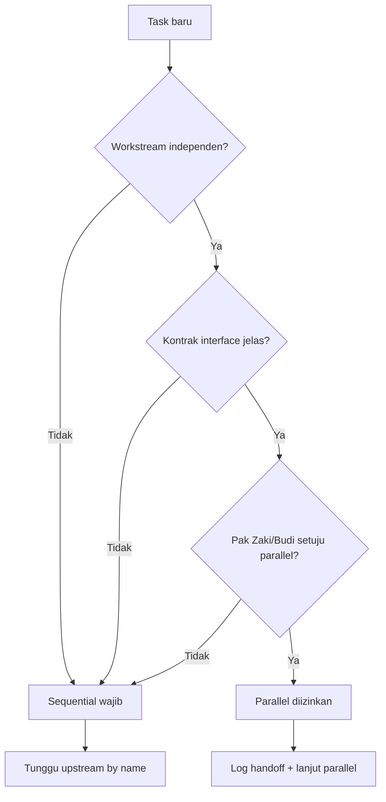
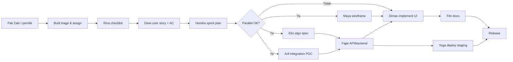
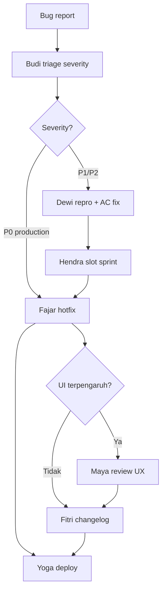
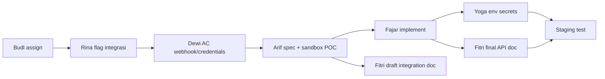
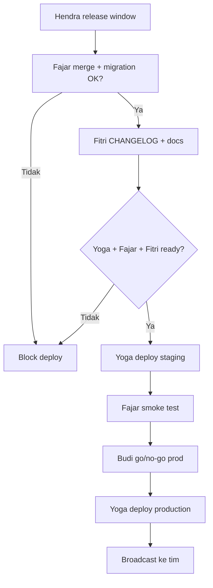
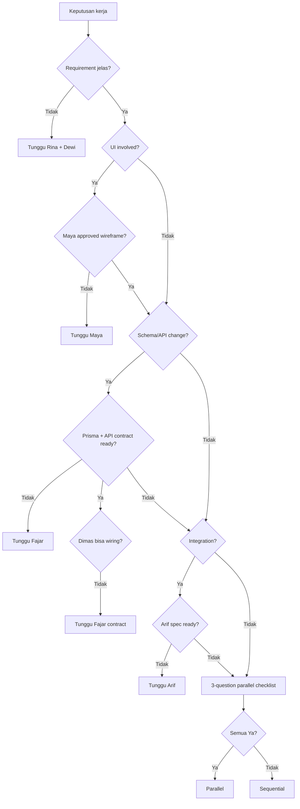
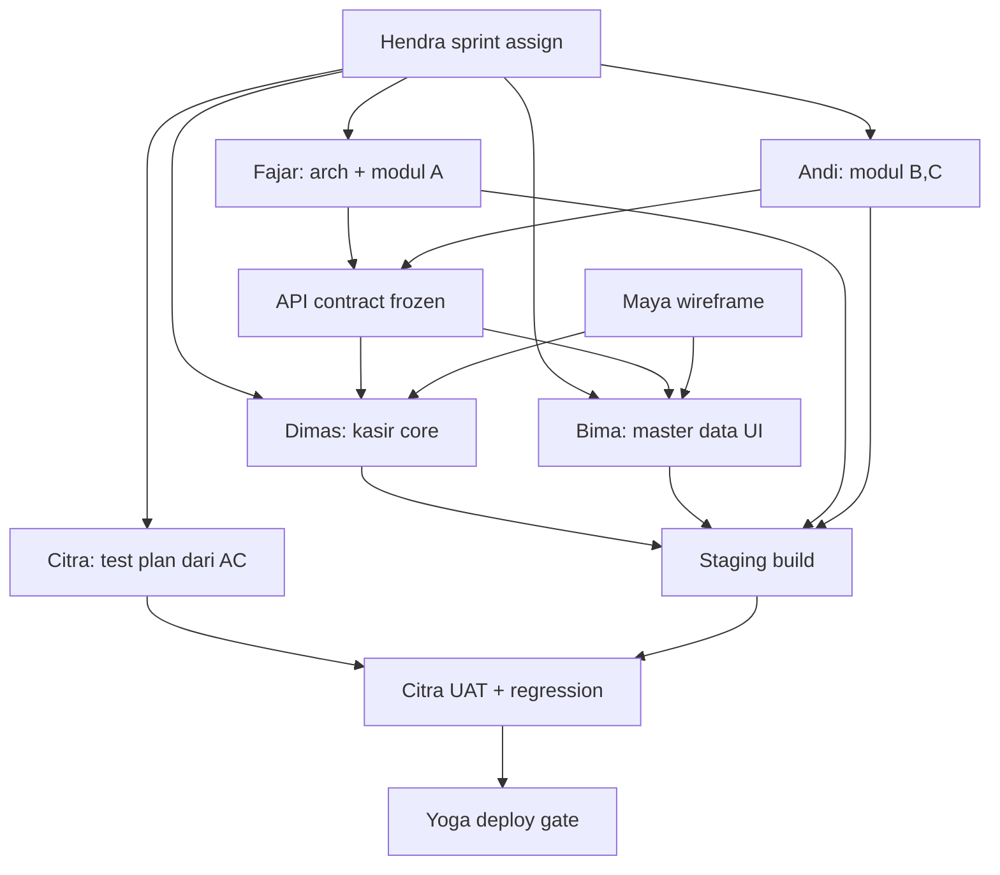

> 📚 [Indeks Dokumentasi](../INDEX.md) | Kategori: Tim | Audience: semua agent

# Playbook Koordinasi Tim — Barokah Core POS

Panduan operasional koordinasi antar agent tim Barokah Core. **Koordinasi = default; parallel = exception.**

Referensi: `AGENTS.md` (Protokol Koordinasi Tim), `.cursor/rules/team-communication.mdc`

> **Bahasa:** Semua output ke pemilik proyek (**Pak Zaki**) **wajib Bahasa Indonesia** — termasuk contoh percakapan multi-agent di playbook ini. CEO **Budi** mengoordinasi tim dan melaporkan ke Pak Zaki. Kode, commit messages, dan API docs teknis tetap English.

---

## Prinsip Utama

1. **Tidak ada silo** — setiap agent notify rekan terkait **by name**.
2. **Budi (CEO)** orchestrate assign + track handoff.
3. **Sequential default** — parallel hanya jika 3 pertanyaan checklist = Ya (lihat bawah).
4. **Gate wajib:** Rina→Dewi→Hendra (req), Maya→Dimas/Bima (UI), Fajar schema/API contract (DB), Citra QA (UAT/regression), Yoga+Fajar+Fitri+Citra (deploy).
5. **Lane parallel (post-freeze):** Backend Fajar+Andi, Frontend Dimas+Bima, QA Citra — lihat [Skenario 5](#skenario-5-parallel-development-lanes).

---

## Checklist 3 Pertanyaan (Parallel vs Sequential)



| # | Pertanyaan | Jika Tidak |
|---|------------|------------|
| 1 | Workstream independen? | Sequential |
| 2 | API spec / schema / wireframe approved? | Sequential |
| 3 | Budi atau Hendra konfirmasi? | Sequential |

---

## Skenario 1: Fitur Baru



**Urutan wajib (tidak boleh skip):**
1. Budi assign owner
2. Rina → Dewi → Hendra (sequential)
3. Maya handoff ke Dimas **sebelum** kode UI
4. Fajar migration/API contract freeze sebelum Dimas wiring client
5. Yoga + Fajar + Fitri sebelum production

---

## Skenario 2: Bug Fix



**Koordinasi bug:**
- **P0:** Budi → Fajar langsung; notify Yoga + Fitri parallel hanya untuk deploy/docs setelah fix merged.
- **UI bug:** Dimas **wajib** notify Maya sebelum merge layar kasir; Fajar jika terkait API contract.
- **Integration bug:** Arif + Fajar sequential (root cause vendor vs app).

---

## Skenario 3: Integration Task



**Gate:** Fajar tidak implement webhook sebelum **Arif** spec (signature, idempotency, retry).

**Parallel valid:** Fitri draft doc + Yoga env prep **setelah** endpoint contract frozen Arif.

---

## Skenario 4: Deploy Release



**Tidak parallel production deploy** dengan migration belum di-verify Fajar di staging.

---

## Pohon Keputusan: Parallel vs Sequential



---

## Skenario 5: Parallel Development Lanes

**Prasyarat (semua wajib):** Rina → Dewi → Hendra selesai; Hendra assign modul/halaman ke lane; kontrak API **Fajar** frozen; wireframe **Maya** approved untuk item UI.



### Lane Backend (Fajar + Andi)

| Peran | Tanggung jawab |
|-------|----------------|
| **Fajar** | Arsitektur, Prisma migration, API contract freeze, review semua PR API |
| **Andi** | Implement modul NestJS assigned + unit/integration tests |

**Parallel OK:** modul berbeda (mis. `reports` vs `inventory`) setelah shared schema untuk kedua modul merged.

**Sequential wajib:** satu migration; satu modul yang sama; **Eko/Arif** spec belum selesai.

### Lane Frontend (Dimas + Bima)

| Peran | Tanggung jawab |
|-------|----------------|
| **Dimas** | Pola integrasi, kasir P0, review PR UI |
| **Bima** | Halaman/komponen assigned web + mobile |

**Parallel OK:** route/screen berbeda setelah API contract + wireframe OK.

**Sequential wajib:** **Bima** tidak coding tanpa wireframe **Maya**; tidak wiring API sebelum **Fajar** freeze.

### Lane QA (Citra — quality gate)

| Fase | Aktivitas |
|------|-----------|
| Sprint start | Test plan dari AC **Dewi** (parallel dengan dev OK) |
| Mid-sprint | Smoke per feature di staging |
| Sprint end | Full regression + UAT sign-off |
| Pre-prod | Critical path kasir + tenant isolation |

**Block deploy** jika P0 open atau AC P0 belum tested.

### Doni (Junior full-stack)

Hanya task **≤ 3 SP**, scoped, AC jelas. Setiap PR: review **Fajar** (jika sentuh API) + **Dimas** (jika sentuh UI). Tidak assign ke kasir P0 atau migration.

---

## Format Handoff Log

```markdown
## Handoff Log

| Field | Isi |
|-------|-----|
| **From** | [Nama] · [Jabatan] |
| **To** | [Nama] · [Jabatan] |
| **Task** | [1 kalimat] |
| **Deliverable** | [path/file] |
| **Blocked by** | — / [Nama + alasan] |
| **Parallel OK?** | Ya (alasan) / Tidak — tunggu [Nama] |
| **Next action** | [Aksi penerima] |
```

---

## Contoh Percakapan Multi-Agent Terkoordinasi

**Konteks:** User minta modul split bill.

```
---
**Budi** · CEO
Halo Pak Zaki, request split bill saya assign ke Rina untuk checklist domain.
Handoff berikutnya: Rina → Dewi → Hendra. Parallel: belum — tunggu requirement chain.
---

---
**Rina** · Spesialis POS Domain
Halo Dewi, checklist split bill P0 sudah lengkap (proporsi tax, void partial, manager override).
Deliverable: docs/requirements/split-bill-checklist.md
Parallel OK? Tidak — Dewi butuh checklist final.
Next action: User story + AC untuk P0.
---

🗣️ **Dewi (Analyst)** → **Hendra (Planner):**
Halo Hendra, 3 user story split bill dari checklist Rina siap. UI complex — perlu Maya.
Parallel OK? Ya — Maya boleh wireframe parallel setelah AC UI frozen (US-002).
Next action: Estimasi sprint, assign Dimas (UI) + Fajar (API) setelah Maya handoff.
---

🗣️ **Hendra (Planner)** → **Maya (UI/UX)** + **Eko (Algorithm):**
Halo Maya dan Eko, sprint 4: split bill 8 SP.
Maya: wireframe payment modal (parallel OK).
Eko: spec proporsi tax split (parallel OK).
Dimas: tunggu Maya wireframe; Fajar: tunggu Eko spec untuk API.
---

---
**Maya** · UI/UX Specialist
Halo Dimas, wireframe split bill + payment modal approved.
Deliverable: docs/design/WIREFRAMES-KASIR.md#split-bill
Parallel OK? Tidak — Dimas tunggu handoff ini untuk UI.
Next action: Implement modal; notify Maya untuk UX review pre-demo.
---

---
**Eko** · Algorithm Specialist
Halo Fajar, spec proporsi tax per item split bill attached.
Parallel OK? Tidak untuk coding — review spec dulu.
Next action: Unit test edge cases rounding rupiah.
---

---
**Fajar** · Senior Developer
Halo Yoga dan Fitri, split bill merged ke main — siap deploy staging.
To: Yoga (deploy), Fitri (API doc + changelog).
Parallel OK? Ya — Yoga staging sementara Fitri update docs.
Next action: Smoke test setelah staging up.
---
```

---

## Eskalasi ke Budi

Eskalasi jika:
- Blocked > 1 iterasi
- Konflik prioritas sprint
- Keputusan parallel/sequential unclear
- Scope creep vs milestone

```
---
**[Nama]** · [Jabatan]
Halo Budi, blocked menunggu [Nama] — [alasan].
Opsi: A) [sequential tunggu] B) [parallel dengan risiko X]
Butuh keputusan CEO.
---
```

---

## Quick Reference: Rantai Koordinasi

| Fase | Chain | Parallel exception |
|------|-------|-------------------|
| Requirement | Rina → Dewi → Hendra | — |
| Design + spec | Maya → Dimas/Bima; Eko/Arif → Fajar | Eko + Maya + Arif setelah US frozen |
| Implement UI | Dimas + Bima (+ review Maya) | Halaman berbeda; web + mobile setelah API contract |
| Implement API | Fajar + Andi → Dimas/Bima consumer | Modul berbeda setelah schema frozen |
| QA | Citra ← Dewi AC | Test plan parallel dev; UAT setelah staging |
| Junior tasks | Doni → Fajar + Dimas review | ≤3 SP only |
| Docs | Fitri ← Fajar/Maya/Arif | Draft doc jika spec frozen |
| Deploy | Yoga + Fajar + Fitri + Citra → Budi (prod) | Staging smoke; Citra sign-off |

---

*Terakhir diupdate: 2 Jun 2026 — rekrutmen Andi, Bima, Citra, Doni; lane parallel Backend/Frontend/QA.*
